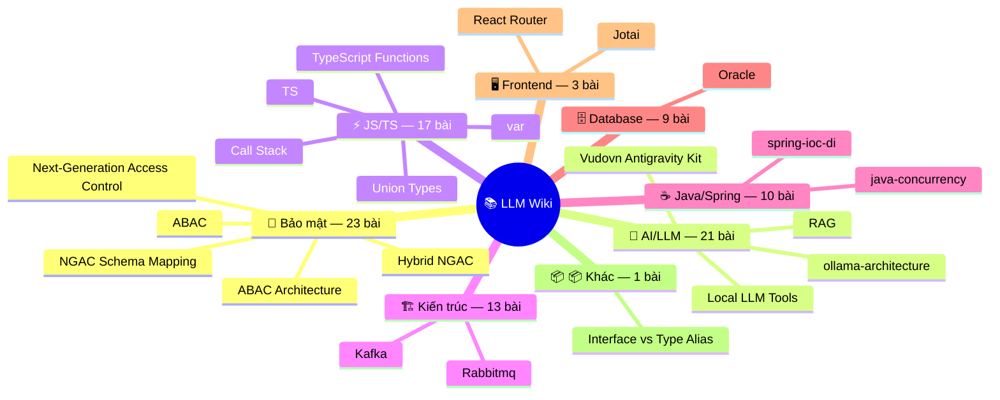

# 🧠 Second Brain của Tôi

> Hệ thống quản lý kiến thức cá nhân được vận hành bởi AI, dựa trên **Phương pháp Karpathy LLM Wiki**. Tại đây, các AI agent sẽ tự động viết, cấu trúc và bảo trì một wiki trên Obsidian từ các dữ liệu thô mà tôi thu thập.

## 🌟 Tổng Quan

Đây là kho lưu trữ kiến thức cá nhân của tôi. Thay vì tự tay ghi chép và sắp xếp mọi thứ, tôi đóng vai trò là "người thu thập" (curator), còn AI sẽ làm những việc nặng nhọc như đọc hiểu, tổng hợp và liên kết thông tin.

Vòng lặp cốt lõi:

1. **Tôi nạp nguồn** (bài viết, paper, tweet, video) vào thư mục `raw/`.
2. **AI biên dịch** chúng thành các bài wiki có cấu trúc, liên kết chặt chẽ trong thư mục `wiki/`.
3. **Tôi hỏi đáp** với kho kiến thức này, và AI sẽ trả lời dựa trên chính những gì tôi đã lưu trữ.
4. **Kiến thức tích lũy** — mỗi chu kỳ giúp hệ thống ngày càng thông minh và phong phú hơn.

## 🎯 Chủ Đề & Triết Lý

**Các Trụ Cột Kiến Thức (Pillars):**
Kho lưu trữ này không chứa các ghi chú ngẫu nhiên, mà được tổ chức chặt chẽ xoay quanh 4 trụ cột kỹ thuật cốt lõi:
1. **Kiến trúc & Hệ thống (Architecture & Systems):** System Design, Design Patterns (DI, Command, State, Repository), Message Brokers (Kafka, RabbitMQ) và Kiến trúc Cơ sở dữ liệu (Oracle, ACID).
2. **Nền tảng Ngôn ngữ & Đa luồng:** Giải phẫu cơ chế lõi (under-the-hood) của **JavaScript/TypeScript** (Event Loop, Memory, Type System) và **Java** (Multithreading, Virtual Threads, Immutability).
3. **Bảo mật & Kiểm soát Truy cập (Security & Access Control):** Phân tích chuyên sâu các mô hình ủy quyền và phân quyền (ABAC, RBAC, DAC, MAC, NGAC).
4. **Hệ sinh thái Frameworks:** Các triết lý thiết kế đằng sau Spring Boot (IoC, Validation, Metaprogramming) và kiến trúc giao diện (React, RxJS, NgRx).

**Triết Lý & Phong Cách (Style & Tone):**
Kiến thức tại đây được đúc kết từ sự giao thoa giữa tư duy học thuật và thực chiến **(Academic + Pragmatic)**:
- **Chuẩn mực Bách khoa:** Khách quan, trung lập và có hệ thống. Thông tin được đào sâu đến tận bản chất (cách máy ảo JVM hay V8 hoạt động) thay vì chỉ dừng ở các hướng dẫn "How-to" bề mặt.
- **Góc nhìn Kỹ sư (Pragmatic):** Không sa đà vào lý thuyết suông. Mọi khái niệm đều được mổ xẻ dưới lăng kính Đánh đổi (Trade-off), các bài viết so sánh điểm mạnh/yếu (A vs B), và bối cảnh áp dụng thực tế để giải quyết bài toán thiết kế phần mềm.

## 📂 Kiến Trúc Thư Mục

```text
Second-brain/
├── raw/                 ← Tài liệu gốc. AI KHÔNG BAO GIỜ chỉnh sửa thư mục này.
├── wiki/                ← Kiến thức đã biên dịch. AI duy trì 100%.
├── outputs/             ← Các báo cáo, tóm tắt và nội dung do AI tạo ra.
├── sessions/            ← Nhật ký hội thoại (chat sessions) từ các dự án.
└── AGENTS.md            ← Sổ tay vận hành và bộ quy tắc cốt lõi cho các AI Agent.
```

## 🔄 Các Workflow Chính

Hệ thống của tôi được trang bị các workflow tự động sau:

| Lệnh            | Chức Năng                                                                                            |
| --------------- | ---------------------------------------------------------------------------------------------------- |
| `/ingest`       | Nạp tài liệu gốc (URL, file) vào `raw/` với frontmatter chuẩn.                                       |
| `/compile`      | Đọc tài liệu gốc và biên dịch thành bài wiki. Có hệ thống **phát hiện mâu thuẫn**.                   |
| `/ask`          | Hỏi đáp dựa trên kiến thức trong wiki.                                                               |
| `/save`         | **Chat-to-Wiki**: Trích xuất những insight hay từ cuộc trò chuyện và lưu thẳng vào wiki.             |
| `/cleanup`      | Kiểm tra sức khỏe wiki (giọng văn, cấu trúc, liên kết) và quét các mâu thuẫn tồn đọng.               |
| `/breakdown`    | Quét wiki tìm các khái niệm còn thiếu và đề xuất tạo bài mới.                                        |
| `/autoresearch` | **Nghiên cứu tự động**: Tự động tìm kiếm web, đánh giá nguồn, nạp và tổng hợp báo cáo về một chủ đề. |

## 🛡️ Tiêu Chuẩn Chất Lượng

Để wiki không biến thành một "bãi rác" thông tin, AI phải tuân thủ các quy tắc nghiêm ngặt trong `AGENTS.md`:

- **Phát hiện mâu thuẫn:** AI không bao giờ âm thầm ghi đè thông tin xung đột. Nó sẽ giữ lại cả hai luồng thông tin và đặt cảnh báo `[!warning]` để tôi duyệt.
- **Đọc lại trước khi cập nhật:** AI bắt buộc phải đọc toàn bộ bài viết trước khi chỉnh sửa.
- **Giới hạn kích thước:** Các bài viết được giữ ở độ dài 15-120 dòng. Chủ đề nào quá lớn sẽ được tách ra bài riêng.
- **Giọng văn Bách khoa toàn thư:** Viết khách quan, trung lập, luôn có dẫn chứng nguồn, không dùng ngôn ngữ "blog" hay bình luận cá nhân.


## 🗺️ Bản Đồ Kiến Thức

<!-- WIKI-MAP:START -->


> **97** bài wiki · **288** liên kết chéo · Cập nhật: 2026-05-05

| Cluster | Bài | Hub Articles |
|---------|-----|-------------|
| 🔐 Bảo mật & Kiểm soát Truy cập | 23 | **ABAC** (7↩), **Next-Generation Access Control** (5↩), **Hybrid NGAC** (5↩) |
| 🤖 AI & LLM | 21 | **ollama-architecture** (9↩), **Vudovn Antigravity Kit** (5↩), **RAG** (4↩) |
| ⚡ JavaScript & TypeScript | 17 | **TS** (7↩), **Call Stack** (5↩), **var** (4↩) |
| 🏗️ Kiến trúc & Hệ thống | 13 | **Kafka** (5↩), **Rabbitmq** (4↩) |
| ☕ Java & Spring | 10 | **spring-ioc-di** (6↩), **java-concurrency** (4↩) |
| 🗄️ Cơ sở dữ liệu | 9 | **Oracle** (6↩) |
| 🖥️ Frontend | 3 | — |
| 📦 Khác | 1 | — |
<!-- WIKI-MAP:END -->

## 🛠️ Công Nghệ Sử Dụng

- **[Obsidian](https://obsidian.md/)**: Giao diện chính để tôi xem, tìm kiếm và điều hướng qua các file Markdown.
- **LLM Agents**: Gemini / Claude / Cursor đóng vai trò như bộ não để xử lý, viết và duy trì nội dung.

---

_Đây là một bộ não thứ hai "sống" — nó đang học hỏi và phát triển mỗi ngày cùng với tôi._
