INCITS 565-2020

**Developed by** 


Where IT all begins


American National Standard for Information Technology –

Next Generation Access Control (NGAC)

Secretariat

**Information Technology Industry Council**

Approved April 10, 2020

**American National Standards Institute, Inc.**

#### **Abstract**

Next Generation Access Control (NGAC) is a fundamental reworking of traditional access control to meet the needs of the modern, distributed, interconnected enterprise. NGAC follows an attribute-based construction in which characteristics or properties of entities are used to describe and manage policy and govern access. The NGAC framework is flexible and can provide access control services for different types of resources, accessed by different types of applications and users. The design is scalable, capable of supporting multiple policies simultaneously, and manageable in the face of changing technology, organizational restructuring, and increasing data volumes.

This standard specifies the architecture, security model, and interfaces of the NGAC framework at a level of detail necessary to ensure its realization in different types of implementation environments at a range of scalability levels. The standard also specifies key implementation aspects that enable functional entities within the architecture to operate in a correct, effective, cooperative, and accordant manner.

# American National Standard

Approval of an American National Standard requires review by ANSI that the requirements for due process, consensus, and other criteria for approval have been met by the standards developer.

Consensus is established when, in the judgement of the ANSI Board of Standards Review, substantial agreement has been reached by directly and materially affected interests. Substantial agreement means much more than a simple majority, but not necessarily unanimity. Consensus requires that all views and objections be considered, and that a concerted effort be made towards their resolution.

The use of American National Standards is completely voluntary; their existence does not in any respect preclude anyone, whether he has approved the standards or not, from manufacturing, marketing, purchasing, or using products, processes, or procedures not conforming to the standards.

The American National Standards Institute does not develop standards and will in no circumstances give an interpretation of any American National Standard. Moreover, no person shall have the right or authority to issue an interpretation of an American National Standard in the name of the American National Standards Institute. Requests for interpretations should be addressed to the secretariat or sponsor whose name appears on the title page of this standard.

**CAUTION NOTICE:** This American National Standard may be revised or withdrawn at any time. The procedures of the American National Standards Institute require that action be taken periodically to reaffirm, revise, or withdraw this standard. Purchasers of American National Standards may receive current information on all standards by calling or writing the American National Standards Institute.

**CAUTION:** The developers of this standard have requested that holders of patents that may be required for the implementation of the standard disclose such patents to the publisher. However, neither the developers nor the publisher have undertaken a patent search in order to identify which, if any, patents may apply to this standard. As of the date of publication of this standard and following calls for the identification of patents that may be required for the implementation of the standard, no such claims have been made. No further patent search is conducted by the developer or publisher in respect to any standard it processes. No representation is made or implied that licenses are not required to avoid infringement in the use of this standard.

Published by

**American National Standards Institute, Inc. 25 West 43rd Street, New York, NY 10036**

Copyright © 2020 by Information Technology Industry Council (ITI) All rights reserved.

No part of this publication may be reproduced in any form, in an electronic retrieval system or otherwise, without prior written permission of ITI, 700 K Street NW, Suite 600, Washington, DC 20001.

Printed in the United States of America

## **Table of Contents**

| <u>Topic</u> |            |                                                   | <u>Page</u>                             |  |  |
|--------------|------------|---------------------------------------------------|-----------------------------------------|--|--|
| In           | trod       | uction                                            | x                                       |  |  |
| 1 Scope      |            |                                                   |                                         |  |  |
| 2            | Nor        | mative references                                 | 2                                       |  |  |
| 3            | Defi       | initions, symbols, abbreviations, and conventions | 3                                       |  |  |
|              | 3.1        | Definitions                                       |                                         |  |  |
|              | 3.2        | Symbols and acronyms                              |                                         |  |  |
|              | 3.3        | Keywords                                          |                                         |  |  |
|              | 3.4        | Conventions                                       | 8                                       |  |  |
| 4            | Ref        | erence architecture                               | 10                                      |  |  |
|              | 4.1        | Functional architecture                           | 10                                      |  |  |
|              | 4.2        | Information flows                                 | 11                                      |  |  |
| 5            | Fun        | nctional entity descriptions and requirements     | 16                                      |  |  |
|              | 5.1        | Background                                        | 16                                      |  |  |
|              | 5.2        | Common requirements                               |                                         |  |  |
|              | 5.3        | PEP requirements                                  | 18                                      |  |  |
|              | 5.4        | PDP requirements                                  |                                         |  |  |
|              | 5.5        | EPP requirements                                  |                                         |  |  |
|              | 5.6        | PAP requirements                                  |                                         |  |  |
|              | 5.7<br>5.8 | PIP requirementsRAP requirements                  |                                         |  |  |
| 6            |            | curity model                                      |                                         |  |  |
| Ū            |            | ·                                                 |                                         |  |  |
|              | 6.1        |                                                   |                                         |  |  |
|              | 6.3        | Basic elements                                    |                                         |  |  |
|              | 6.4        | Administrative commands                           |                                         |  |  |
|              | 6.5        | Access adjudication                               |                                         |  |  |
| 7            | Inte       | erface specifications                             |                                         |  |  |
|              |            | Background                                        |                                         |  |  |
|              | 7.1<br>7.2 | Interface descriptions                            |                                         |  |  |
|              |            | PDP interfaces                                    | - 4                                     |  |  |
|              |            | EPP interface                                     | ••••••••••••••••••••••••••••••••••••••• |  |  |
|              |            | PAP interfaces                                    |                                         |  |  |
| 8            | lmp        | elementation considerations                       | 63                                      |  |  |
|              | 8.1        | Interoperation of functional entities             | કર                                      |  |  |
|              | 8.2        | Policy                                            |                                         |  |  |
|              | 8.3        | •                                                 |                                         |  |  |
|              | 8.4        | Collocated functional entities                    |                                         |  |  |
| Α            | nnex       | A (informative) Pattern and response grammars     | 67                                      |  |  |
|              | A.1        | Overview                                          | 67                                      |  |  |
|              |            | Event pattern grammar                             |                                         |  |  |
|              | A.3        | Event response grammar                            | 69                                      |  |  |
|              |            | Grammar considerations                            |                                         |  |  |
| Α            | nnex       | 74                                                |                                         |  |  |
|              | B 1        | Overview                                          | 74                                      |  |  |
|              | ۱ . ت      | OTOLTION                                          |                                         |  |  |

| B.2                                                                 | Chinese wall                                              | 74 |
|---------------------------------------------------------------------|-----------------------------------------------------------|----|
|                                                                     | Role-based access control                                 |    |
| B.4                                                                 | Bibliography                                              | 84 |
| Annex                                                               | C (informative) Policy computations                       | 85 |
| C.1                                                                 | Introduction                                              | 85 |
|                                                                     | Background                                                |    |
| C.3                                                                 | Algorithm details                                         | 86 |
| C.4                                                                 | Algorithm variants                                        | 93 |
| Annex                                                               | D (informative) Accommodation of environmental attributes | 94 |
| D.1                                                                 | Introduction                                              | 94 |
| D.2                                                                 | Approach                                                  | 94 |
| D.3                                                                 | Example policy                                            | 95 |
| Annex E (informative) Delegation of administrative responsibilities |                                                           |    |
| E.1                                                                 | Introduction                                              | 97 |
|                                                                     | Policy domain definition                                  |    |

## **List of Figures**

| Figure                                                             | Page |
|--------------------------------------------------------------------|------|
| Figure 1: NGAC Functional Architecture11                           |      |
| Figure 2: Resource Access Information Flow12                       |      |
| Figure 3: Administration Access Information Flow13                 |      |
| Figure 4: Event Context Information Flow14                         |      |
| Figure 5: Interfaces Between Functional Entities53                 |      |
| Figure B.1: Example Chinese Wall Policy76                          |      |
| Figure B.2: RBAC Policy Configuration80                            |      |
| Figure B.3: Roles and Role Hierarchy Representation81              |      |
| Figure B.4: Permission Assignment Representation81                 |      |
| Figure B.5: User Assignment Representation82                       |      |
| Figure B.6: Complete NGAC Policy Representation83                  |      |
| Figure C.1: Simple Bank Policy Representation86                    |      |
| Figure C.2: Source Association Nodes87                             |      |
| Figure C.3: Destination Association Nodes88                        |      |
| Figure C.4: Objects of Interest89                                  |      |
| Figure C.5: Depth-First Search from Object l11 to Policy Classes90 |      |
| Figure C.6: Depth-First Search from Object a11 to Polciy Classes90 |      |
| Figure D.1: Bank Policy Adjusted for Environmental Attributes95    |      |
| Figure E.1: Policy Domains and Subdomains97                        |      |
| Figure E.2: Policy Element Diagram with Multiple Domains98         |      |
| Figure E.3: Policy Element Diagram with Highlighted Domains99      |      |
| List of Tables                                                     |      |
| Table                                                              | Page |
| Table 1: Access Request Adjudication Interface55                   |      |
| Table 2: Event Response Evaluation Interface56                     |      |
| Table 3: Event Context Processing Interface56                      |      |
| Table 4: Policy Inquiry Interface58                                |      |
| Table 5: Policy Adjustment Interface59                             |      |

### **Foreword** (This foreword is not part of American National Standard INCITS 565-2020.)

Technical Committee CS1 of Accredited Standards Committee INCITS developed this standard during 2018-2019. The standards approval process started in 2019.

Next Generation Access Control (NGAC) is a fundamental reworking of traditional access control into a form suited to the needs of the modern, distributed, interconnected enterprise. NGAC is based on a flexible infrastructure that can provide access control services for different types of resources, accessed by different types of applications and users. NGAC is designed to be scalable, support multiple policies simultaneously, and remain tractable in the face of changing technology, organizational restructuring, and increasing data volumes. Functional components of the reference architecture can be supported by products from different manufacturers.

NGAC diverges from traditional approaches to access control in that it defines a generic architecture separate from any particular type of policy. NGAC is not an extension or adaption of any existing access control model, but rather a redefinition of access control in terms of a fundamental and reusable set of data abstractions and functions. NGAC provides a unifying framework capable of supporting not only current access control approaches but also novel types of policy that have been conceived yet never implemented due to the lack of a suitable means of expression and enforcement.

NGAC follows an attribute-based construction in which characteristics or properties are used to control access to resources and to describe and manage policy. NGAC accommodates combinations of different policies and can support several types of policies concurrently in a manner that is both deterministic and manageable. NGAC is also suitable for applications in which some information is stored locally and some is stored in a grid or cloud, since different policies can be asserted in each context. Even more generally, NGAC supports situations in which policy determined by a central organization is able to operate concurrently with a local, specific, and more ad hoc policy.

Least privilege is an established administrative practice of assigning users and processes the minimal authorization necessary for the performance of their job function. NGAC supports the concept of least privilege by allowing different authorizations for a user or its processes to become available at different times for the performance of different tasks. Processes acting for a user within the user's session can be restricted to a subset of the user's authorization, allowing them to be attenuated at a granularity below that of the user.

Through its support of access control policies, NGAC is also able to protect data services such as e-mail, workflow, and records management. Support for data services is realized through the use of NGAC access control information to mediate data service operations.

This standard specifies the architecture, security model, and interfaces of the NGAC framework at a level of detail necessary to ensure its realization in different types of implementation environments at a range of scalability levels.

This standard contains the following items:

- a) descriptions of the functional architecture and of the information flows between entities of the architecture;
- b) requirements for the functional entities of the architecture;
- c) detailed specifications of the abstract data structures needed to compose policy;

iv

- d) a detailed description of the adjudication of access requests based on the abstract data structures used to express policy;
- e) detailed descriptions of generic commands needed to establish and maintain authorizations;
- f) descriptions of the interfaces between entities of the functional architecture;
- g) implementation considerations for functional entities;
- h) an informative annex containing an example of formal grammars to specify the pattern and response components of an obligation;
- i) an informative annex containing examples of representing common access control methods;
- j) an informative annex containing an efficient algorithm for policy computations;
- k) an informative annex describing the treatment of environmental attributes; and
- l) an informative annex describing the delegation of administrative responsibilities.

Users of this standard are encouraged to determine if there are standards in development or new versions of this standard that may extend or clarify technical information contained herein.

Requests for interpretation, suggestions for improvement and addenda, or defect reports are welcome. They should be sent to the INCITS Secretariat, InterNational Committee for Information Technology Standards, Information Technology Institute, 700 K Street NW, Suite 600, Washington, DC 20001.

This standard was processed and approved for submittal to ANSI by the InterNational Committee for Information Technology Standards (INCITS). Committee approval of the standard does not necessarily imply that all committee members voted for its approval. At the time it approved this standard, INCITS had the following members:

Laura Lindsay, Chair Donald Deutsch, Vice-Chair Jennifer Garner, Secretary

| Organization Represented                   | Name of Representative   |
|--------------------------------------------|--------------------------|
| Adobe Systems, IncScott Foshee             |                          |
| AIM Global, IncSteve Halliday              |                          |
|                                            | Mary Lou Bosco (Alt.)    |
|                                            | Chuck Evanhoe (Alt.)     |
| Amazon Web Services, IncOliver Bell        |                          |
|                                            | Sean Estrada (Alt.)      |
| AppleHelene Workman                        |                          |
|                                            | David Singer (Alt.)      |
|                                            | Anna Weinberg (Alt.)     |
| CA TechnologiesRon Doyle                   |                          |
| Department of Commerce - NISTMichael Hogan |                          |
|                                            | Lisa Carnahan (Alt.)     |
|                                            | Wo Chang (Alt.)          |
|                                            | Sal Francomacaro (Alt.)  |
|                                            | Suzanne Radell (Alt.)    |
| Farance, IncFrank Farance                  |                          |
|                                            | Timothy Schoechle (Alt.) |
| Futurewei Technologies, IncWael Diab       |                          |
|                                            | Wilbert Adams (Alt.)     |
|                                            | Timothy Jeffries (Alt.)  |
|                                            |                          |

| Organization Represented                                      | Name of Representative                        |
|---------------------------------------------------------------|-----------------------------------------------|
| Google Catherine Nelson                                       |                                               |
| GS1GO Steven Keddie                                           | Tommy Ward (Alt.)                             |
|                                                               | Edward Merrill (Alt.)                         |
| HP, Inc Karen Higginbottom                                    | Dan Mullen (Alt.)                             |
|                                                               | Will Allen (Alt.)                             |
|                                                               | Paul Jeran (Alt.)<br>Lonnie Mandigo (Alt.)    |
| IBM Corporation Steve Holbrook                                |                                               |
| Intel Corporation Philip Wennblom                             | Alexander Tarpinian (Alt.)                    |
|                                                               | Grace Wei (Alt.)                              |
| Microsoft Corporation Laura Lindsay                           | John Calhoon (Alt.)                           |
| Oracle Donald Deutsch                                         |                                               |
|                                                               | Anish Karmarkar (Alt.)                        |
|                                                               | Michael Kavanaugh (Alt.)<br>Jim Melton (Alt.) |
|                                                               | Jan-Eike Michels (Alt.)                       |
| Qualcomm, Inc Michael Atlass                                  | Elaine Newton (Alt.)                          |
|                                                               | Mazen Chmaytelli (Alt.)                       |
|                                                               | Marta Karczewicz (Alt.)                       |
| Telecommunications Industry Association (TIA) Florence Otieno | Farrokh Khatibi (Alt.)                        |
| United States Dept. of Defense -                              |                                               |
| Joint Artificial Intelligence Center Steven Harrison          | Sunmin Kim (Alt.)                             |
|                                                               | Alka Patel (Alt.)                             |
| VMware, Inc Eric Betts                                        | Mary Brett (Alt.)                             |
|                                                               | Michene Tang (Alt.)                           |
|                                                               |                                               |

Technical Committee CS1 on Cyber Security, which reviewed this standard, had the following members:

Eric Hibbard, Chair Sal Francomacaro, Vice-Chair Laura Lindsay, International Representative

| Organization Represented<br>Amazon Web Services, Inc Sean Estrada | Name of Representative<br>Mark Becker (Alt.)<br>Oliver Bell (Alt.)<br>Matthew Campagna (Alt.)<br>Anastasia Strebkova (Alt.)<br>Luis Urena (Alt.) |
|-------------------------------------------------------------------|--------------------------------------------------------------------------------------------------------------------------------------------------|
| Apple David Singer                                                |                                                                                                                                                  |
|                                                                   | Lanpeng Chen (Alt.)<br>Shawn Geddis (Alt.)                                                                                                       |
|                                                                   | Nick Kucera (Alt.)                                                                                                                               |
|                                                                   | Huarui Liang (Alt.)                                                                                                                              |
|                                                                   | Fiona Pattinson (Alt.)                                                                                                                           |
|                                                                   | Yannick Sierra (Alt.)                                                                                                                            |
| BCG Platinion Nadya Bartol                                        | Blake Zimmerman (Alt.)                                                                                                                           |
|                                                                   | Kris Winkler (Alt.)                                                                                                                              |
| Booz Allen & Hamilton, Inc Michelle Moss                          |                                                                                                                                                  |
|                                                                   | Maria Tsitrin (Alt.)                                                                                                                             |

vi

| Organization Represented                      | Name of Representative        |
|-----------------------------------------------|-------------------------------|
| Cisco Systems, IncPeter Schulz                |                               |
|                                               | Kelvin Desplanque (Alt.)      |
|                                               | Ken Dill (Alt.)               |
|                                               | Jonathan Fox (Alt.)           |
|                                               | Alka Jarvis (Alt.)            |
|                                               | Jonathan Kessler (Alt.)       |
|                                               | Ken Stavinoha (Alt.)          |
|                                               | Mike Tibodeau (Alt.)          |
| Department of Commerce - NISTSal Francomacaro |                               |
|                                               | Christine Abruzzi (Alt.)      |
|                                               | Katie Boeckl (Alt.)           |
|                                               | Jon Boyens (Alt.)             |
|                                               | Ramaswamy Chandramouli (Alt.) |
|                                               | Wo Chang (Alt.)               |
|                                               | Lily Chen (Alt.)              |
|                                               | Frederic de Vaulx (Alt.)      |
|                                               | Randall Easter (Alt.)         |
|                                               | Michael Fagin (Alt.)          |
|                                               | David Ferraiolo (Alt.)        |
|                                               | Hildegard Ferraiolo (Alt.)    |
|                                               | Serban Gavrila (Alt.)         |
|                                               | Michael Hogan (Alt.)          |
|                                               | Michaela Iorga (Alt.)         |
|                                               | Wayne Jansen (Alt.)           |
|                                               | Naomi Lefkovitz (Alt.)        |
|                                               | Suzanne Lightman (Alt.)       |
|                                               | Amy Mahn (Alt.)               |
|                                               | Katerina Megas (Alt.)         |
|                                               | Ketan Mehta (Alt.)            |
|                                               | Ellen Nadeau (Alt.)           |
|                                               | Danna O'Rourke (Alt.)         |
|                                               | Victoria Pillitteri (Alt.)    |
|                                               | Andrew Regenscheid (Alt.)     |
|                                               | Allen Roginsky (Alt.)         |
|                                               | Ron Ross (Alt.)               |
|                                               | Matthew Smith (Alt.)          |
|                                               | Annie Sokol (Alt.)            |
|                                               | David Temoshok (Alt.)         |
|                                               | David Waltermire (Alt.)       |
| DXC Technology Services LLCLogan Browne       |                               |
| Futurewei Technologies, IncJohn Strasser      |                               |
|                                               | Wael Diab (Alt.)              |
|                                               | Barry Leiba (Alt.)            |
| Gemalto, a Thales CompanyNeville Pattinson    |                               |
|                                               | Mike Neumann (Alt.)           |
| GoogleCatherine Nelson                        |                               |
|                                               | Heather Beatty (Alt.)         |
|                                               | Christina Cheng (Alt.)        |
|                                               | Inayat Kaur (Alt.)            |
|                                               | Dion Seymour (Alt.)           |
|                                               | Shruti Sridhar (Alt.)         |
|                                               | Nataliya Stanetsky (Alt.)     |
|                                               | Prasanna Vaithiswaran (Alt.)  |
| Hitachi VantaraSherif Fares                   |                               |
| Intel CorporationGrace Wei                    |                               |
|                                               | Josh Dembling (Alt.)          |
|                                               | David Grawrock (Alt.)         |
|                                               | DJ Johnston (Alt.)            |
|                                               | Rafael Misoczki (Alt.)        |
|                                               | David Novick (Alt.)           |
|                                               | Mary Rossell (Alt.)           |
|                                               |                               |

vii

| Organization Represented                                                                                                                            | Name of Representative                                                                                                                                                                                                                                                                                                                                                               |
|-----------------------------------------------------------------------------------------------------------------------------------------------------|--------------------------------------------------------------------------------------------------------------------------------------------------------------------------------------------------------------------------------------------------------------------------------------------------------------------------------------------------------------------------------------|
| International Council on System Engineering (INCOSE) Kenneth Kepchar                                                                                | John Brtis (Alt.)<br>Tom McDermott (Alt.)<br>Keith Willett (Alt.)<br>Kenneth Zemrowski (Alt.)                                                                                                                                                                                                                                                                                        |
| Microsoft Corporation Laura Lindsay                                                                                                                 | Roger French (Alt.)<br>Jill Friar (Alt.)<br>Craig Gehre (Alt.)<br>Shaun Gilmore (Alt.)<br>Mikyung Gioanni (Alt.)<br>Mike Grimm (Alt.)<br>Ralph Hood (Alt.)<br>Babak Jahromi (Alt.)<br>Mike Lai (Alt.)<br>Orit Levin (Alt.)<br>Alex Li (Alt.)<br>Jorge Lopez (Alt.)<br>Kimberly Lucy (Alt.)<br>Anthony Nadalin (Alt.)<br>Jed Pickel (Alt.)<br>Almut Sidow (Alt.)<br>Rob Spiger (Alt.) |
| Oracle Elaine Newton                                                                                                                                | Duncan Harris (Alt.)<br>Meghan Hester (Alt.)<br>Bruce Lowenthal (Alt.)                                                                                                                                                                                                                                                                                                               |
| Plum Hall, Inc Thomas Plum<br>PrivSec Consulting LLC Eric Hibbard                                                                                   | Ian Hibbard (Alt.)<br>Eva Kuiper (Alt.)                                                                                                                                                                                                                                                                                                                                              |
| Raytheon Company Randall Brooks                                                                                                                     | Andrew Nielsen (Alt.)<br>Noel Johnson (Alt.)                                                                                                                                                                                                                                                                                                                                         |
| Schneider Electric IT Corporation Jay Taylor<br>SecureRF Corporation Derek Atkins<br>Software Engineering Institute/                                | Paul Vazquez (Alt.)<br>Louis Parks (Alt.)                                                                                                                                                                                                                                                                                                                                            |
| CERT. a division of Carnegie Mellon University Mary Wilson                                                                                          | Art Manion (Alt.)<br>Katie Moussouris (Alt.)<br>Sheila Rosenthal (Alt.)<br>Robin Ruefle (Alt.)                                                                                                                                                                                                                                                                                       |
| Sylint Group Serge Jorgensen                                                                                                                        | Charly Shugg (Alt.)<br>Steven Teppler (Alt.)                                                                                                                                                                                                                                                                                                                                         |
| The Aerospace Corporation Kenneth Elliott III<br>United States Dept. of Defense Alok Shastry<br>United States Dept. of Defense - NSA Nick Gajcowski | Don Davidson (Alt.)<br>Rampersaud Ramnarayan (Alt.)<br>George Coker (Alt.)<br>Rich Davis (Alt.)<br>Jessica Fitzgerald-McKay (Alt.)<br>Dianne Hale (Alt.)<br>Michael Jenkins (Alt.)                                                                                                                                                                                                   |
| VISA Adam Clark                                                                                                                                     | Kristina Breen (Alt.)<br>Pasan Hapuarachchi (Alt.)                                                                                                                                                                                                                                                                                                                                   |
| VMware, Inc Eric Betts                                                                                                                              | Stephen Diamond (Alt.)<br>Lawrence Lamers (Alt.)<br>Andrew Nielsen (Alt.)                                                                                                                                                                                                                                                                                                            |

viii

CS1 Ad Hoc on Next Generation Access Control, which developed and reviewed this standard, had the following members:

Sal Francomacaro, Chair Wayne Jansen, Editor

| Organization Represented                     | Name of Representative |
|----------------------------------------------|------------------------|
| Department of Commerce - NISTDavid Ferraiolo |                        |
|                                              | Sal Francomacaro       |
|                                              | Wayne Jansen           |
|                                              | Annie Sokol            |
| Microsoft CorporationLaura Lindsay           |                        |
|                                              | Anthony Nadalin        |
| PrivSec Consulting LLCEric Hibbard           |                        |

### **Introduction**

Next Generation Access Control (NGAC) is a fundamental reworking of traditional access controls to meet the needs of the modern, distributed, and interconnected enterprise. NGAC provides a unifying framework capable of supporting both current and novel types of access control policies simultaneously. It also defines access control in terms of a fundamental and reusable set of data abstractions and functions, following an attribute-based access control model in which authorizations are defined in terms of attributes. Security-relevant properties of users, processes, and objects (e.g., role, sensitivity, affiliation, and class), and also of the computational environment (e.g., time of day and threat level) can be expressed as attributes.

The NGAC standard specifies the architecture, functions, operations, and interfaces necessary to enable conforming implementations to interact in a correct, effective, and accordant manner.

The NGAC standard is divided into the following clauses and annexes:

Clause 1 defines the scope of this standard;

Clause 2 enumerates the normative references that apply to this standard;

Clause 3 defines the terms, symbols, abbreviations, and notation used in this standard;

Clause 4 describes the NGAC reference architecture and the function of its constituents;

Clause 5 defines the behaviors and requirements of the functional entities of the reference architecture;

Clause 6 gives a formal description of the NGAC security model;

Clause 7 provides interface specifications for NGAC functional entities;

Clause 8 highlights important implementation considerations for the NGAC;

Annex A describes formal grammars for obligation event patterns and responses;

Annex B describes NGAC policy expressions that capture two well-known access control policies;

Annex C describes an efficient algorithm for processing NGAC policy;

Annex D describes the accommodation of environmental attributes;

Annex E describes the delegation of administrative responsibilities.

## American National Standard for Information Technology –

# Next Generation Access Control (NGAC)

## <span id="page-14-0"></span>**1 Scope**

Next Generation Access Control (NGAC) is a reinvention of traditional access control into a form that suits the needs of the modern, distributed, interconnected enterprise. NGAC is designed to be scalable, support a wide range of access control policies, enforce different types of policies simultaneously, provide access control services for different types of resources, and remain manageable in the face change.

NGAC follows an attribute-based construction in which characteristics or properties are used to control access to resources and to describe and manage policy. This standard specifies the architecture, security model, and interfaces of the NGAC framework necessary to ensure its realization in different types of implementation environments at a range of scalability levels and to obtain the requisite level of cohesion and functionality to operate correctly and effectively at the system level.

## <span id="page-15-0"></span>**2 Normative references**

The following ANSI and ISO standards contain provisions that, by reference in the text, constitute provisions of this standard. At the time of publication, the editions listed were valid. All standards are subject to revision, and parties to agreements based on this standard are encouraged to investigate the possibility of applying the most recent editions of the standards listed below.

Copies of the documents may be obtained from ANSI, an ISO member organization:

Approved ANSI standards; approved international and regional standards (ISO and IEC); and approved foreign standards (including JIS and DIN).

For further information, contact the ANSI Customer Service Department:

Phone: +1 212-642-4900 Fax: +1 212-302-1286 Web: [http://www.ansi.org](http://www.ansi.org/) E-mail: [ansionline@ansi.org](mailto:ansionline@ansi.org)

or the InterNational Committee for Information Technology Standards (INCITS):

Phone 202-737-8888 Web: [http://www.incits.org](http://www.incits.org/) E-mail: [incits@itic.org](mailto:incits@itic.org)

The following are approved references that pertain to this standard:

**FAM:** ISO/IEC 29146:2016, Information technology – *Security techniques – A framework for access management*

**ZNOT:** ISO/IEC 13568:2002, Information technology – *Z formal specification notation – Syntax, type system and semantics*

Note that the status of the referenced American National Standards and ISO standards may have changed since the time of publication. For information about the current status or availability of a document contact the relevant standards body.

## <span id="page-16-0"></span>**3 Definitions, symbols, abbreviations, and conventions**

## <span id="page-16-1"></span>**3.1 Definitions**

For the purposes of this document the terms and definitions below apply.

## **3.1.1 Foundational terms**

### **3.1.1.1 Real system**

A set of one or more computers, associated software, peripheral equipment, terminals, human operators, physical processes, and means of communication that form an autonomous whole capable of performing information processing or information transfer or both. [Source: ISO/IEC 2382:2015]

## **3.1.1.2 Resource**

An accessible unit of data, services, components, or other logical or physical assets of a *real system*.

### **3.1.1.3 Access control**

The prevention of the unsanctioned use of *resources*, including their use in an unwarranted manner.

### **3.1.1.4 System environment**

An abstraction of the *real system*.

### **3.1.1.5 Entity**

Something that exists and can be identified within a *system environment*.

#### **3.1.1.6 Identifier**

A descriptor that unambiguously distinguishes an *entity* from other *entities*.

#### **3.1.1.7 Policy**

A set of criteria that governs the behavior of *entities* within a *system environment*.

### **3.1.1.8 Security model**

A formal description of the properties required of a *system environment* to mediate access as dictated by *policy*.

### **3.1.1.9 Policy information**

A distinct, distinguishable aspect of *policy*.

### **3.1.1.10 Authorization**

An allocation of authority to *entities* by way of *policy* which enables one or more modes of access.

#### **3.1.1.11 Authorization state**

The current *authorization* based on the prevailing *policy*.

## **3.1.1.12 Authorized**

Explicitly allowed through *authorization*.

### **3.1.2 Basic policy-oriented terms**

## **3.1.2.1 Policy entity**

An *entity* (3.1.1.5) that is used to depict an item or detail of *policy* (3.1.1.7).

### **3.1.2.2 User**

A *policy entity* that represents a distinct functional capacity in a *real system* (3.1.1.1), which is customarily ascribed to a human being.

## **3.1.2.3 Object**

A *policy entity* that represents a *resource* (3.1.1.2).

### **3.1.2.4 User attribute**

A *policy entity* that represents a characteristic or property of a *user*.

## **3.1.2.5 Object attribute**

A *policy entity* that represents a characteristic or property of an *object*.

### **3.1.2.6 Policy class**

A *policy entity* that characterizes the *users*, *objects*, *user attributes*, and *object attributes* associated with a *policy* (3.1.1.7) or some aspect of a *policy* (3.1.1.7).

### **3.1.2.7 Attribute**

A designator that represents either a *user attribute* or an *object attribute*.

#### **3.1.2.8 Container**

A designator that represents either an *attribute* or a *policy class*.

#### **3.1.2.9 Policy element**

A designator that represents any of the following *policy entities*: *user*, *object*, *user attribute*, *object attribute*, or *policy class*.

### **3.1.2.10 Access right**

A *policy entity* that denotes a unit or measure of authority suitable for *authorization* (3.1.1.10).

### **3.1.2.11 Access right set**

A *policy entity* that represents a group of selected *access rights*.

### **3.1.2.12 Operation**

A *policy entity* that denotes a mode of access to an *object* or *policy information* (3.1.1.9).

#### **3.1.3 Advanced policy-oriented terms**

#### **3.1.3.1 Configured relation**

A component of *policy* (3.1.1.7) that describes a significant relationship among *policy entities* (3.1.2.1).

4

## **3.1.3.2 Assignment relation**

A *configured relation* that defines a structural ordering of *policy elements* (3.1.2.9).

### **3.1.3.3 Assignment**

A member of the *assignment relation*, which denotes an ordering or directional link between two *policy elements* (3.1.2.9), from the first *policy element* (3.1.2.9) to the second.

## **3.1.3.4 Path**

A sequence of *policy elements* (3.1.2.9) in which every pair of consecutive *policy elements* (3.1.2.9) in the sequence constitutes an *assignment*.

### **3.1.3.5 Path length**

The number of *policy elements* (3.1.2.9) in the *path* minus one.

### **3.1.3.6 Containment**

A relationship between two *policy elements* (3.1.2.9) in which a *path* exists from the first *policy element* (3.1.2.9) to the second.

### **3.1.3.7 Ascendant**

A *policy element* (3.1.2.9) that is on a *path* leading to another *policy element* (3.1.2.9).

## **3.1.3.8 Immediate ascendant**

An *ascendant* whose *path length* is one.

#### **3.1.3.9 Descendant**

A *policy element* (3.1.2.9) that is on a *path* originating from another *policy element* (3.1.2.9).

#### **3.1.3.10 Immediate descendant**

A *descendant* whose *path length* is one.

#### **3.1.3.11 Referent**

An *attribute* (3.1.2.7) that is used in a *configured relation* as a designator for itself and all of its *ascendants*.

### **3.1.3.12 Attribute set**

A *policy entity* (3.1.2.1) that represents a group of like *referents* (i.e., all *object attributes* (3.1.2.5) or *user attributes* (3.1.2.4)).

## **3.1.3.13 Policy element diagram**

A representation of the *assignment relation* as a directed graph in which each *policy element* (3.1.2.9) is a node of the graph, and each *assignment* is a directed edge between *policy elements* (3.1.2.9).

### **3.1.3.14 Association relation**

A *configured relation* that defines an allocation of *access rights* (3.1.2.10) among *policy elements* (3.1.2.9) that enables certain modes of access.

### **3.1.3.15 Association**

A member of the *association relation*, which represents a specific aspect of the *access rights* (3.1.2.10) asserted among *policy elements* (3.1.2.9).

### **3.1.3.16 Prohibition relation**

A *configured relation* that defines an allocation of *access rights* (3.1.2.10) among *policy elements* (3.1.2.9) that disables certain modes of access.

#### **3.1.3.17 Prohibition**

A member of the *prohibition relation***,** which represents a specific aspect of the *access rights* (3.1.2.10) suppressed among *policy elements* (3.1.2.9).

### **3.1.3.18 Obligation relation**

A *configured relation* that defines conditions under which *policy* (3.1.1.7) needs to be dynamically altered on behalf of a *user* (3.1.2.2) due to an event occurrence.

### **3.1.3.19 Event response**

A *policy entity* (3.1.2.1) that specifies preconceived adjustments to *policy* (3.1.1.7).

## **3.1.3.20 Event pattern**

A *policy entity* (3.1.2.1) that specifies the conditions under which an associated *event response* needs to be carried out.

### **3.1.3.21 Obligation**

A member of the *obligation relation*, which associates an *event pattern* and *event response* with the defining *user* (3.1.2.2).

### **3.1.3.22 Derived relation**

A relationship that is defined in terms of one or more *configured relations*.

#### **3.1.3.23 Privilege relation**

A *derived relation* in which each member denotes an *access right* (3.1.2.10) that a *policy element* (3.1.2.9) holds for a *policy element* (3.1.2.9).

#### **3.1.3.24 Restriction relation**

A *derived relation* in which each member denotes an *access right* (3.1.2.10) that a *policy element* (3.1.2.9) may hold for a *policy element* (3.1.2.9) but cannot utilize.

### **3.1.4 Functionally oriented terms**

#### **3.1.4.1 Trusted entity**

An *entity* (3.1.1.5) in which confidence exists that it can be relied upon to behave as expected.

#### **3.1.4.2 Functional entity**

A *trusted entity* that participates in enabling, maintaining, and upholding *policy* (3.1.1.7).

## **3.1.4.3 Functional architecture**

A reference model that specifies the way in which *functional entities* regard one another and act jointly toward a common purpose (viz., *access control* (3.1.1.3)).

### **3.1.4.4 Client Application (CA)**

A computer program that is designed to access *resources* (3.1.1.2) or *policy information* (3.1.1.9).

## **3.1.4.5 Process**

A *policy entity* (3.1.2.1) that represents an instance of a *client application* executing on behalf of a *user* (3.1.2.2).

### **3.1.4.6 Access attempt**

A mode of access initiated by a *process*, which pertains to an *object* (3.1.2.3) or *policy information* (3.1.1.9).

### **3.1.4.7 Access request**

Detailed information about a pending *access attempt*.

### **3.1.4.8 Access decision**

A determination of whether the modes of access of an *access request* or an *event resp*onse (3.1.3.19) comply with the *authorization state* (3.1.1.11).

### **3.1.4.9 Event context**

Detailed information about a successfully completed *access request*.

#### **3.1.4.10 Policy Decision Point (PDP)**

A *functional entity* (3.1.4.2) that renders *access decisions* and, for favorable decisions on accesses that pertain to *policy information* (3.1.1.9), carries them out.

### **3.1.4.11 Policy Enforcement Point (PEP)**

A *functional entity* (3.1.4.2) that submits *access requests* to a *PDP* for adjudication and effectuates the *access decisions* rendered.

### **3.1.4.12 Event Processing Point (EPP)**

The *functional entity* (3.1.4.2) that matches the *event contexts* it receives against the *event patterns* (3.1.3.20) of *obligations* (3.1.3.21) and conveys the *event response* (3.1.3.19) of a matched *event pattern* (3.1.3.20) to the *PDP* for adjudication and further processing.

#### **3.1.4.13 Policy Information Point (PIP)**

The *functional entity* that persists the *policy entities* (3.1.2.1) and *configured relations* (3.1.2.1) that constitute *policy* (3.1.1.7).

### **3.1.4.14 Policy Administration Point (PAP)**

The *functional entity* that provides the only means of access to *policy information* (3.1.1.9).

### **3.1.4.15 Resource Access Point (RAP)**

A *functional entity* that provides the only means of access to the *resources* (3.1.1.2) in its charge.

## **3.1.4.16 Session**

A period during which an interactive information interchange or dialogue occurs between the *processes* of a *user* (3.1.2.2) and a *PEP*.

NOTE - The term "subject" is not used in NGAC, with both "user" and "process" being used instead as more precise terms. The term "process" can, but does not necessarily, refer to an operating system process.

## <span id="page-21-0"></span>**3.2 Symbols and acronyms**

| Symbol / |                                               |
|----------|-----------------------------------------------|
| Acronym  | Meaning                                       |
| ACID     | Atomicity, Consistency, Isolation, Durability |
| BNF      | Backus-Naur Form                              |
| CA       | Client Application                            |
| DSD      | Dynamic Separation of Duty                    |
| DAG      | Directed Acyclic Graph                        |
| EPP      | Event Processing Point                        |
| MLS      | Multilevel Security                           |
| NGAC     | Next Generation Access Control                |
| PAP      | Policy Administration Point                   |
| PDP      | Policy Decision Point                         |
| PEP      | Policy Enforcement Point                      |
| PIP      | Policy Information Point                      |
| RAP      | Resource Access Point                         |
| RBAC     | Role Based Access Control                     |
| SoD      | Separation of Duty                            |

## <span id="page-21-1"></span>**3.3 Keywords**

**Mandatory:** A keyword indicating an item that is required to be implemented as defined in this standard to claim compliance with this standard.

**May:** A keyword that indicates flexibility of choice with no implied preference.

**Optional:** A keyword that describes features that are not required to be implemented by this standard. However, if any optional feature defined by this standard is implemented, it shall be implemented as defined in this standard.

**Shall:** A keyword indicating a mandatory requirement. All such requirements are required to be implemented to ensure conformance with this standard.

**Should:** A keyword indicating flexibility of choice with a preferred alternative; equivalent to the phrase "it is recommended".

## <span id="page-21-2"></span>**3.4 Conventions**

Certain words and terms used in this American National Standard have a specific meaning beyond the common English meaning. These words and terms are defined either in clause 3 or in the text where they first appear.

8

A numeric list of items (e.g., 1, 2, 3) indicates the items in the list are ordered (i.e., item 1 shall occur or complete before item 2).

An alphabetic list of items (e.g., a, b, c or A, B, C) indicates the items in the list are unordered.

The mathematical notation used in this standard in consonance with the Z formal specification notation defined in ISO/IEC 13568:2002 (see ZNOT) but is specific to this work.

In the event of conflicting information, the precedence for requirements defined in this standard is as follows:

- 1) mathematical notation;
- 2) text;
- 3) tables; and
- 4) figures.

## <span id="page-23-0"></span>**4 Reference architecture**

## <span id="page-23-1"></span>**4.1 Functional architecture**

The NGAC Functional Architecture (FA) can be viewed as a conceptual model of the basic processing functionality and interactions for access control. It identifies key functional components and their relationships to each other and serves as a template for the characteristics required of a conformant implementation. The functional architecture can be implemented in a number of ways, and it allows different types of access control schemes to be realized using a common set of services.

The NGAC functional architecture shall comprise the following functional entities:

- a) one or more Policy Enforcement Points (PEPs);
- b) one or more Policy Decision Points (PDPs);
- c) zero or one Event Processing Point (EPP);
- d) one Policy Administration Point (PAP);
- e) one Policy Information Point (PIP); and
- f) one or more Resource Access Points (RAPs).

Functional entities are described in terms of their behavior to allow for flexibility of implementation. The interfaces between functional entities enable implementations to provide adequate cohesion and coupling at the system level. NGAC does not specify how functional entities should be grouped or packaged together in an implementation.

The functional architecture incorporates the following interfaces:

- a) A PEP exposes an interface for use by instances of NGAC-aware applications (i.e., processes) to access resources and policy information;
- b) A PDP exposes an interface for use by a PEP to obtain an adjudication and other information regarding the treatment of an access request and another interface for use by the EPP, if present, to obtain an adjudication and other information regarding the treatment of the event response of a matched obligation;
- c) The EPP exposes an interface for use by a PEP or a PDP to communicate the details of an event that has occurred (i.e., an event context) and possibly trigger one or more defined obligations;
- d) The PAP exposes interfaces for use by a PDP to examine and administer policy for the adjudication and treatment of access requests and event contexts and by the EPP, if present, to analyze and interpret policy when processing the event contexts it receives against the event pattern of defined obligations;
- e) The PIP exposes an interface for use by the PAP to search and manipulate policy information persisted at the PIP;
- f) A RAP exposes an interface for a PEP to access resources and transfer data as necessary to and from those resources; and
- g) A resource exposes an interface for use by a RAP to access its contents.

The NGAC functional architecture is illustrated in Figure 1, in which functional entities are portrayed as rectangles, and points of interaction between entities are represented by arrows. To gain access to resources or policy information, processes acting on behalf of a user need to engage with the functional architecture as depicted in Figure 1.

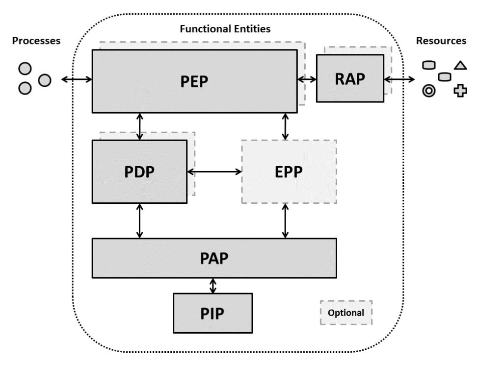

**Figure 1 – NGAC Functional Architecture**

## <span id="page-24-0"></span>**4.2 Information flows**

## **4.2.1 Introduction**

There are three main types of information flows in the NGAC functional architecture:

- 1) a resource access flow (see 4.2.2);
- 2) an administration access flow (see 4.2.3); and
- 3) an optional event context flow (see 4.2.4).

The first two information flows listed above correspond respectively to the two kinds of accesses supported by NGAC: resource access and administration access. A resource access is the only means by which users may gain access to resources governed by NGAC. Similarly, an administration access is the only means by which users may gain access to policy information. The third information flow, an event context flow, applies only to a system for which an EPP is present and is a concomitant of a successful resource or administration access.

The descriptions of the information flows given below assume that a session between an authenticated user and a PEP has been established. A user may not have more than one session active at any time, but it may have multiple processes operating on its behalf within a session. The information flow descriptions also assume that each interacting entity in the functional architecture has confirmed the authenticity of and communicates securely with its associate. The flows depict only affirmative results, omitting error conditions or negative results that could arise in practice.

### **4.2.2 Resource access information flow**

A resource access information flow begins when a user launches a client application, creating a process that attempts access to a resource via a PEP. Processes run on behalf of a specific user within a single session and may instantiate other processes. NGAC supports conceptual operations on objects, termed

"resource operations," such as read/write or on/off/reset. The behavior of these operations on the resources represented by targeted objects is implementation-dependent and not defined by NGAC.

The resource access information flow within the NGAC architecture is shown in Figure 2.

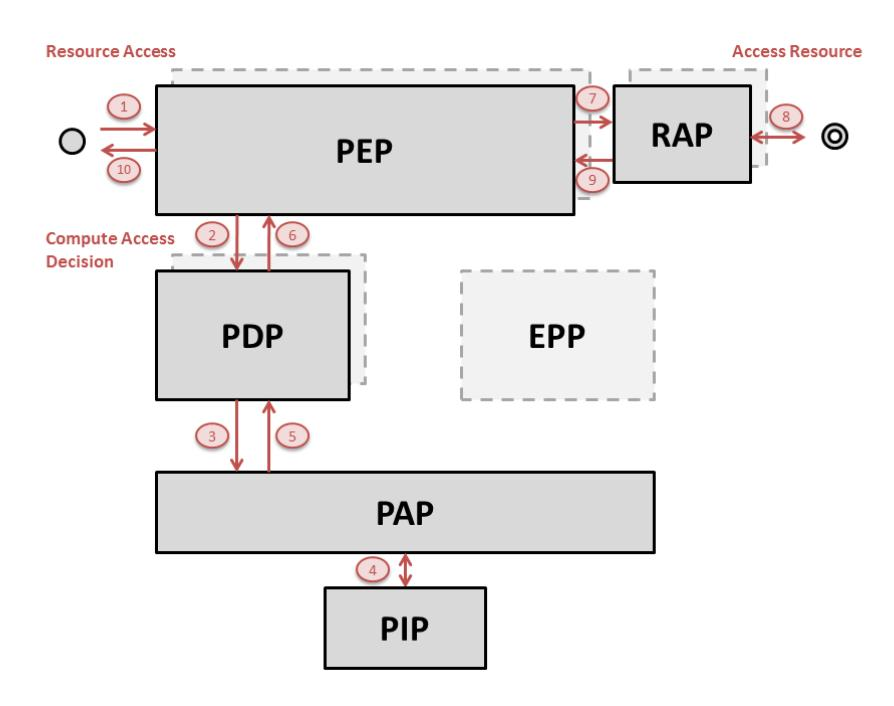

**Figure 2 – Resource Access Information Flow**

The numeric labels in Figure 2 refer to the step numbers in the following description.

The resource access information flow through the NGAC functional architecture is as follows:

- 1) A process attempts to gain access to a resource via a PEP, conveying the intended operation and the associated operands for the operation, which include the identifier of the object representing that resource and, optionally, any needed data;
- 2) The PEP issues an access request to a PDP for adjudication;
- 3) The PDP queries the PAP for policy information needed to compute an access decision;
- 4) The PAP issues the requisite commands to the PIP to retrieve the information;
- 5) The PAP returns the queried information to the PDP;
- 6) The PDP renders a decision on the access request, resolves the resource location (only for a positive decision), and returns the decision and locator to the PEP;
- 7) The PEP issues a directive to the RAP associated with the resource to carry out the access;
- 8) The RAP carries out the operation on the resource and receives the status information and result data (if any);
- 9) Status information and data (if any) are returned from the RAP to the PEP; and
- 10) Status information and data (if any) are returned from the PEP to the process.

### **4.2.3 Administration access information flow**

Similar to a resource access information flow, an administration access information flow begins when a user launches a client application, creating a process that attempts to access policy information via a PEP. NGAC administrative operations are used to create and destroy policy entities and relations persisted at the PIP and, as a consequence, affect the policy enforced by NGAC.

The administration access information flow within the NGAC architecture is shown in Figure 3.

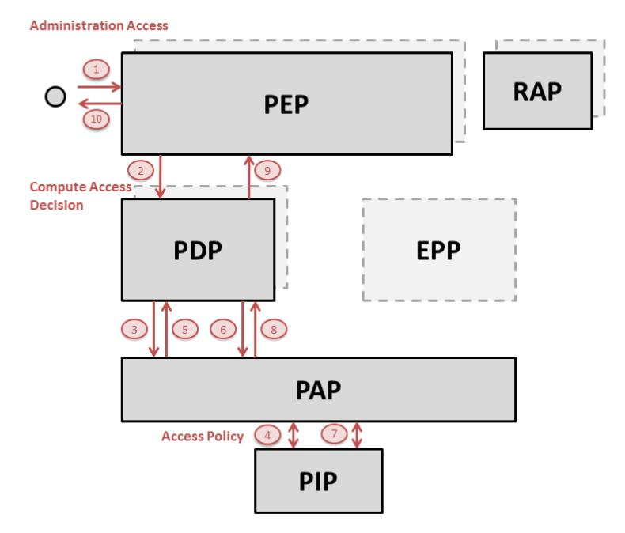

**Figure 3 – Administration Access Information Flow**

The numeric labels in Figure 3 refer to the step numbers in the description below. Steps (1) through (4) in the administration access information flow are identical to the resource access information flow defined in 4.2.2.

The administration access information flow through the NGAC functional architecture is as follows:

- 1) A process attempts to gain access to policy information via a PEP, conveying the intended operation and the associated operands for that operation, which include the identifiers of the policy entities in question and, optionally, any needed data;
- 2) The PEP issues an access request to a PDP for adjudication;
- 3) The PDP queries the PAP for policy information needed to compute an access decision;
- 4) The PAP issues the requisite commands to the PIP to retrieve the queried information;
- 5) The PAP returns the queried information to the PDP;
- 6) The PDP renders a decision on the access request and, for a positive decision, issues a directive to the PAP to carry out the administration access;
- 7) The PAP issues the requisite commands to the PIP to modify policy per the directive and receives the status information and result data (if any);
- 8) Status information and data (if any) are returned from the PAP to the PDP;
- 9) Status information and data (if any) in turn are returned from the PDP to the PEP; and
- 10) Status information and data (if any) are returned from the PEP to the process.

## **4.2.4 Event context information flow**

An event context information flow occurs only when an EPP functional entity is present. The flow begins when either a PEP or PDP performs a successful resource or administration access and issues an event context to the EPP. The EPP applies an event context to the event patterns of obligations persisted at the PIP and carries out the associated event response for any obligations matched. An event response comprises NGAC administrative operations and, as a consequence, affects the policy enforced by NGAC.

The event context information flow within the NGAC architecture is shown in Figure 4.

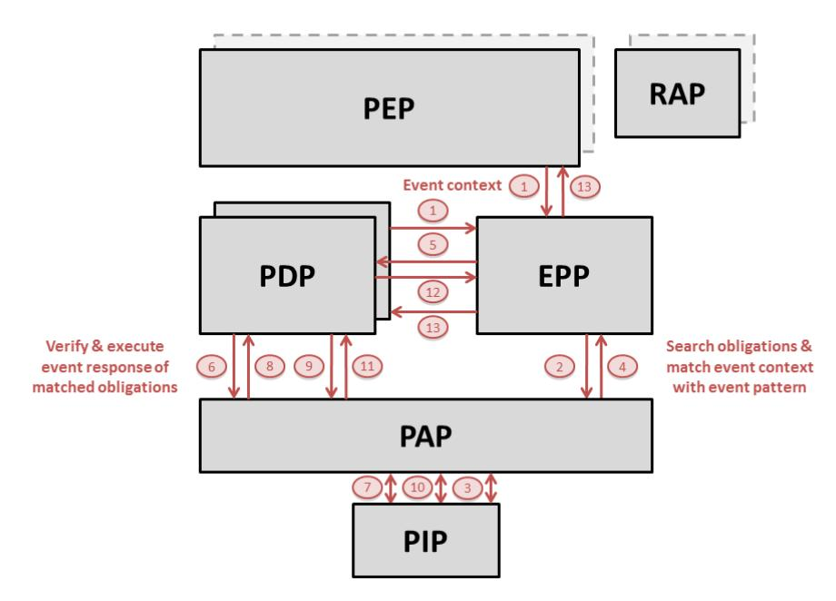

**Figure 4 – Event Context Information Flow**

The numeric labels in Figure 4 refer to the step numbers in the following description. Note that unlike the previous information flows, two PDPs are depicted for clarity: one that issues an event context to the EPP and another that assists the EPP in processing any responses triggered by a matched obligation.

The optional event context information flow through the NGAC functional architecture is as follows:

- 1) A PEP or a PDP generates an event context that respectively indicates that a resource or an administration access has been successful and issues the event context to the EPP;
- 2) The EPP issues one or more directives to the PAP to identify those defined obligations which have an event pattern that is a match for the event context;
- 3) The PAP issues the requisite commands to the PIP to retrieve the sought information;
- 4) The PAP returns the information gathered to the EPP;
- 5) For each obligation identified, the EPP issues the respective event response to the PDP to be adjudicated and executed;
- 6) The PDP queries the PAP for policy information needed to compute an access decision;
- 7) The PAP issues the requisite commands to the PIP to retrieve the queried information;
- 8) The PAP returns the queried information to the PDP;
- 9) The PDP renders a decision on the event response and, for a positive decision, issues a sequence of directives to the PAP to carry out the event response;
- 10) The PAP issues the requisite commands to the PIP to modify policy per the directives and receives the status information and result data (if any);
- 11) Status information and data (if any) are returned from the PAP to the PDP;
- 12) Status information and data (if any) are returned from the PDP to the EPP; and
- 13) The EPP returns status information and data (if any) to the PEP or PDP that issued the event context.

The policy changes from the event context information flow can affect subsequent access decisions concerning the resource or policy information targeted in the resource or administration access information flow which triggered the event information flow. They can also affect access decisions to resources and policy information arising from other concurrent information flows. That is, an inherent race condition exists in the architecture between the policy changes occurring as a result of the event context information flow and the processing of concurrent resource and administration access information flows (see 8.3 for more details).

## <span id="page-29-0"></span>**5 Functional entity descriptions and requirements**

## <span id="page-29-1"></span>**5.1 Background**

A resource access is the only way by which users shall gain access to resources. An administration access is the only way by which users shall gain access to policy information. A user may be associated with one or more processes, while a process shall be associated with just one user. Requests from a user's process to access resources or policy information need to be submitted under an established session. A user shall not have more than one session active at any time. An authenticated user shall establish a session with a PEP prior to any of its processes submitting an access request. All of a user's processes shall use the PEP to which the user has formed a session to access resources or policy information.

At the start of a session, the NGAC framework may assemble information to facilitate processing access attempts initiated for the user by one of its processes. For example, the framework may determine intermediate information derived from the policy, such as the object attributes and objects that are accessible to the user, based on the authorizations held by the user at that moment. If the policy configuration is updated, the derived intermediate information could be affected, necessitating its recomputation. Intermediate representations may be maintained in a virtual or actual form at either the PAP or the PIP.

The policy persisted at the PIP constitutes the authorization state of the system and is therefore essential to the workings of the NGAC reference architecture. Derived relations and other intermediate information computed from the policy may be cached in other components of an NGAC-compliant implementation, but caching is done mainly for the purposes of data reuse and performance rather than to maintain the authorization state of the system.

## <span id="page-29-2"></span>**5.2 Common requirements**

#### **5.2.1 Overview**

The functional entities of the NGAC framework need to work closely together to govern access for a computational environment. It should be no surprise that to do so securely and effectively, the entities have many characteristics in common. These characteristics are summarized as follows:

- a) exclusivity;
- b) discoverability;
- c) trustworthiness;
- d) secure interactivity;
- e) auditability;
- f) resiliency; and
- g) extensibility.

#### **5.2.2 Exclusivity**

The points of interaction between functional entities are restricted and intended for the exclusive use of the designated NGAC functional entities depicted in Figure 1. An NGAC functional entity shall not interact with other NGAC functional entities aside from those depicted in Figure 1.

An NGAC functional entity may use the interfaces of non-NGAC entities to accomplish its tasks, provided that a trust relationship is established between them. Entities may include system-level entities that provide essential services within the computational environment, such as location services, audit logging services, and authentication services.

## **5.2.3 Discoverability**

A functional entity shall be able to determine the points of access to a cooperating functional entity upon whose interfaces it relies. The means of determining a cooperating entity's points of access are not prescribed by NGAC.

Various means of locating a cooperating functional entity may be suitable depending on the computational environment and design decisions for the implementation. For instance, a functional entity may obtain the network address of a cooperating entity via a discovery service to gain access to the interfaces the cooperating functional entity supports. A discovery service, if used in an NGAC implementation, should be realized as an independent functional entity that is distinct from NGAC functional entities and meets the criteria necessary to be treated as a trustworthy entity.

### **5.2.4 Trustworthiness**

A functional entity shall not use the interfaces of a cooperating functional entity without first having established a trust relationship with it. NGAC does not prescribe the means of establishing a trust relationship.

Various methods for establishing trust between functional entities may exist for the computational environment of the implementation, some of which may be better suited than others. Examples of trust relationships range from cooperating entities operating in the same supervisory mode within an operating system kernel to the interaction between two cooperating entities across a public network using a mutual authentication and cryptographically protected connection protocol. All NGAC functional entities should meet a minimum set of requirements that are stipulated for the computational environment for the establishment of trust relationships and suited for the purposes of the implementation.

### **5.2.5 Secure interactivity**

A functional entity shall interact securely with a cooperating functional entity upon whose interfaces it relies. If the functional entities are situated in different computational environments (e.g., not collocated within a single device or on the same private, secured network), communications between them should be secured. At a minimum, authentication, integrity, and non-repudiation security services should apply to communications between the entities.

#### **5.2.6 Auditability**

The activities of an NGAC functional entity that pertain directly to reaching and enforcing access control decisions should be auditable. Audit information provides a valuable means for detecting and investigating violations of security. An implementation should be able to capture audit information for all security-relevant events in a well-defined format and timely manner as individually selectable items for the purposes of regulatory compliance, liability mitigation, and investigation. All audit information collected should be resistant to tampering such that unauthorized access to the information is readily detected. This standard does not specify the manner in which audit monitoring, collection, and reporting is accomplished.

### **5.2.7 Resiliency**

Functional entities should return to a secure mode of operation when faced with the occurrence of an unexpected event or other unexpected circumstances. Such situations may result in a disruption of service that affects the availability of the NGAC framework implementation in lieu of allowing the access control policy to be violated.

#### **5.2.8 Extensibility**

An implementation of a functional entity may incorporate features and behaviors beyond those specified in the NGAC and extend its capabilities, provided that all mandatory features and behaviors are met.

Additional features and behaviors shall not interfere with those mandated by NGAC. If an NGAC functional entity does not support the extensions provided by the interface of a cooperating NGAC functional entity or vice-versa, the interaction shall default to the NGAC-mandated features and behaviors.

## <span id="page-31-0"></span>**5.3 PEP requirements**

A PEP governs access attempts by utilizing a PDP (see description in clause 4) and should not be aware of the details of the policy it enforces. The PEP shall regulate attempts by processes to access policy information and resources. Access attempts may take the form of a process invoking an interface provided by the PEP or the PEP intercepting and interpreting a process's invocation of other interfaces within the computational environment. Neither the interface supported by a PEP nor the methods of intercepting invocations of other interfaces are prescribed by NGAC.

Each process has a unique identity, is associated with a unique user, and operates within a unique session. A PEP needs to be able to determine the identity of the process attempting access as well as the identity of the process's user. Each access attempt submitted to a PEP shall convey a process ID, operation, operands of the operation, and any additional data needed. The PEP shall issue an access request to a PDP, which equates to the attempted access.

A PEP shall ensure that only access requests for which a PDP has rendered a grant decision are permitted access to resources or policy information. If the PDP replies that a request is granted, the PEP shall take one of two possible courses of action. For a resource access, the PEP shall transmit a directive to the RAP associated with the resource and, upon its completion, return the PDP's decision and the results of actions taken by the PEP, including any resulting data, to the originating process. For an administration access, the PEP shall return the decision and the results of actions taken by the PDP, including any resulting data, to the originating process. If the PDP replies that a request is denied, the PEP shall return the decision to the originating process.

Policy needs to be enforced ubiquitously and continuously. Processes running on behalf of a user should not be able to bypass a PEP within its scope of operation, and the information accessed by a user should be isolated from access by other users within the computational environment. The method to ensure that these properties are attained is dependent upon the computational environment of the implementation and is not prescribed by NGAC.

Each PEP shall ask exactly one PDP for a decision on an access request. If that PDP fails to service the request, the PEP may ask another PDP to adjudicate the access request. Only one access request is allowed per authorization adjudication by a PDP. If multiple accesses are needed to perform a complex function, they cannot be adjudicated together as a group. Instead, several independent access requests that comprise the function need to be issued consecutively for adjudication.

In addition to the security interactivity requirements outlined in 5.2.5, confidentiality services should apply to communications between the PEP and RAP. A successful resource access request shall cause the PEP to generate an event context characterizing the access and issue it to the EPP, if one is present in the system.

## <span id="page-31-1"></span>**5.4 PDP requirements**

PDPs utilize the prevailing policy to reach decisions about access requests submitted by a PEP and event responses submitted by the EPP. They are at the core of the NGAC framework and highly critical to its operation.

A PDP shall determine if an access request submitted by a PEP is to be granted or denied. A PDP shall adjudicate the access request by processing authorization information pertaining to the request retrieved via the PAP.

The decision to grant an access request shall be rendered if and only if:

- a) Privileges exist that match those required for the process to effectuate the access request; and
- b) No restriction exists that negates a requisite privilege for either the process requesting access or the user of the process.

Otherwise, the access request shall be denied.

For a resource access, the PDP shall return the results of its access decision to the PEP from which it received the request. If the access request is granted, the PDP shall also obtain the information necessary to locate the resource to which access is being requested and communicate the locator for the resource to the PEP along with the decision results. The details of the locator and the way in which a locator is obtained and used are not prescribed by NGAC, but the objective may be accomplished in various ways. For example, a mapping of object identifiers to resource locators might be maintained at the PIP and retrieved via the PAP or maintained by and retrieved from some other trusted entity.

For an administration access, the PDP shall return the results of its access decision to the PEP from which it received the request. If the access request is granted, the PDP shall carry out the requested access and communicate the results of the access to the PEP along with the access decision. A successful administration access request shall cause the PDP to generate an event context characterizing the access and, if an EPP is present in the system, forward it to the EPP. To prevent abuse and accidental misuse of privilege, the PDP should ensure that the user initiating an administrative access that involves the creation or deletion of an association or a prohibition is in possession of the access rights over the policy elements designated in the relation before granting access. The determination of whether to permit these types of administrative accesses is an additional check beyond that performed by the access decision function.

A PDP shall determine if an event response submitted by the EPP is to be carried out. The PDP shall obtain authorization information pertaining to the event response via the PAP. The PDP shall render an access decision about the event response and determine whether the authorization held by the creator of the obligation at the time of creation is sufficient for the response to be carried out. Execution of the event response shall occur only if the user that created the obligation has sufficient authorization to carry out the response in its entirety. If the access decision is positive, the PDP shall process the event response using the PAP. The PDP shall communicate the results of its decision to the EPP, along with information regarding the processing of the event response.

To suit the needs of an implementation, the interfaces of a PDP may be enabled or disabled through configuration settings. That is, a PDP may be configured to interact with only certain PEPs, with only the EPP, with all PEPs and not the EPP, or with other such settings.

## <span id="page-32-0"></span>**5.5 EPP requirements**

The EPP is an optional functional entity needed only if the policy specified utilizes obligations. If present, the EPP shall respond to event contexts generated by either a PEP or a PDP using the facilities of a PDP and the PAP as outlined in clause 4. The EPP shall process event contexts in the order of receipt.

Each event context submitted to the EPP shall convey information identifying the user, process, operation performed, and operands of the operation. It may also include additional details about the resource or policy information that was accessed. The EPP shall match the information conveyed by the event context against the event pattern of each defined obligation.

The obligation relation has unique characteristics that distinguish it from other relations. Its main constituents, the event pattern and response, are not identifiers of defined policy entities. Instead, they identify strings of characters that need to conform to a defined grammar (i.e., sentences of a formal language) for tokenization and semantic transformation during the event context information flow. The syntax of the sequence of symbols for an event pattern and response shall be well-formed according to a defined grammar.

The event pattern is a logical expression that conforms to its grammar and defines conditions that, when met, trigger the execution of the event response. To determine whether a triggering condition exists (i.e., the expression evaluates to TRUE), the terms of the expression are recognized and resolved with the information conveyed via the event context and also with details from the prevailing policy configuration. The event context is used in a similar way to process terms in the event response, which describes one or more administrative actions to be taken on behalf of the obligation's defining user. The event response needs to be conformant with its grammar, fully resolved, and transformed into administrative actions in order to be carried out.

The event context may match more than one obligation and trigger the execution of multiple responses corresponding to each obligation matched. NGAC does not prescribe the order in which obligations are matched or event responses processed in such situations. However, all event responses triggered by an event context shall be processed in their entirety before those triggered by another event context.

For each matched obligation, the EPP shall communicate with a PDP to confirm whether the authorization held by the defining user of the obligation is sufficient to carry out the event response and to process it accordingly. The outcome of future access request decisions may be affected by the alterations made to policy in processing the event response.

Obligations are essentially policy-modifying programs, which are triggered by a successful access that meets specified conditions. Therefore, their use involves various types of risk, such as specification errors in an event pattern or response, the unexpected triggering of a response by an unforeseen event, and possible conflicts with administration access requests being performed concurrently.

## <span id="page-33-0"></span>**5.6 PAP requirements**

The PAP acts as a managed access point through which the policy information persisted at the PIP is accessed. Access to policy information persisted at the PIP shall be performed exclusively via the PAP. Operational routines to access data representations of the policy information are customarily implemented at the PAP. The PAP shall regulate access to the PIP from PDPs and the EPP. The PAP shall limit an EPP to read-only access to the PIP but permit a PDP read and other types of access. The main objective of the PAP is to allow PDPs and the EPP access to policy information while preserving the integrity of the authorization state and preventing interference with each other's activities. That is, the PAP controls and coordinates the processing of concurrent directives it receives to access the policy representation.

The PAP shall provide methods that allow the administration of the contents of the PIP and the search and retrieval of the information needed to adjudicate an access request or the event response of an obligation. The PAP may cache policy information persisted at the PIP for various reasons. For example, when the PAP is initiated, it may load policy information from the PIP into its memory in a form conducive to improved performance. As adjustments are made to policy during operation of the NGAC framework, both the PAP-resident policy information and the PIP-persisted policy need to be kept in sync.

A derived relation is one example of policy information that could be maintained at the PAP. Derived relations are the result of evaluating a logical expression over one or more base relations. A derived relation may be virtual and computed as needed or maintained continuously in memory for access. The former approach requires continual reevaluation of the relation, which can negatively affect performance. However, to keep both representations of policy in sync, the latter may occasionally need to entirely reevaluate a derived relation due to alternations of policy. The implementation strategy and efficiency trade-offs for key NGAC derived relations—namely, privileges and restrictions—can have a significant effect on the performance of the PAP and the access decision function.

Another example of policy information that the PAP could maintain is the set of obligations whose terms have been preprocessed and partially resolved. The main constituents of an obligation (viz., the event pattern and response) reference character strings or sentences that should be grammatically wellformed. Grammar recognition can occur at the time an obligation is defined to verify that the syntax of a sentence supplied as an event pattern or an event response is well-formed. However, the event pattern and response cannot be fully evaluated at the time of definition since some terms used in a sentence may refer to items returned in the event context, which is not available until such time as an obligation is matched and processed. Therefore, the resolution of undefined terms cannot take place until then. Nevertheless, the event pattern and response, as sentences in a language, can be parsed and converted into an intermediate representation at the time of definition and maintained at the PAP for later interpretation and final resolution. The benefit is that the bulk of the resolution work can occur at definition time, reducing the effort needed during obligation matching and response processing.

## <span id="page-34-0"></span>**5.7 PIP requirements**

The PIP acts as the gateway for the PAP to the policy it persists. The PIP shall incorporate a data store that contains information which constitutes the access control policy for the system. The PIP may also maintain other policy-related information that facilitates implementation. The data store shall support ACID semantics.

The behavior of the PIP, with respect to changes to the authorization state of the policy, is formally specified in clause 6. Commands issued by the PAP to access policy information are actualized at the PIP.

## <span id="page-34-1"></span>**5.8 RAP requirements**

A RAP acts as the gateway for PEPs to resources under its control. A RAP shall provide a managed access point through which a set of protected resources may be accessed by one or more PEPs. Operational routines to access resources are customarily implemented at the RAP. Each resource shall only be accessible via a RAP and only via a single RAP at any one time.

A RAP shall not provide access to resources to any entity other than a PEP. Commands issued by PEPs to access resources (e.g., read and write) are actualized at a RAP. A RAP may be used to monitor the status of resources as well as affect them.

## <span id="page-35-0"></span>**6 Security model**

## <span id="page-35-1"></span>**6.1 Overview**

The NGAC security model defines the conceptual framework for the specification of a wide range of access control policies. The security model is intended to facilitate the understanding and analysis of the properties afforded to protect resources. The security model is defined formally in terms of the mathematics of set theory and predicate calculus in consonance with the Z notation (see ZNOT). The formal specification allows the essential properties for the composition and working of NGAC to be stated free from constraints on how the properties are achieved.

The NGAC security model is, in essence, a description of a finite state machine. The elements of the state machine are described through expressions using mathematical concepts such as sets, relations, functions, and sequences. Predicates express static laws to which the elements of the state machine adhere, and constitute the invariants of the abstract machine. Commands utilize element declarations and predicates to define allowable state transitions and their effect on the state.

The abstractions specified by the security model govern the operation of the NGAC Functional Architecture. The abstractions involve the elements, relations, and commands that are used to represent security policies and provide the basis for rendering access decisions. The types of abstractions that are defined herein are as follows:

- a) basic elements;
- b) relations;
- c) administrative commands; and
- d) access adjudication.

The basic elements and relations collectively define the prevailing policy and constitute the authorization state. The access decision function adjudicates access requests based on the authorization state. A change in state or state transition occurs when an administration access information flow is granted by the access decision function and successfully carried out as an administrative command. A change in state may also occur during an event context information flow when an obligation is triggered, and its response is successfully carried out as one or more administrative commands. Annex B provides examples of expressing two well-known security policies using NGAC basic elements and relations. Annex C describes an efficient algorithm for performing policy analysis, including the adjudication of access requests.

## <span id="page-35-2"></span>**6.2 Basic elements**

### **6.2.1 Background**

NGAC basic elements characterize the policy entities used to depict some item or detail of policy. They are persisted at the PIP and managed through administrative actions. A basic data type called ID is used to represent all possible opaque identifiers of policy items. ID is treated as a given type since no need exists at this level of abstraction to address the exact composition. That is, an identifier is considered to be a finite sequence of bytes whose characteristics and interpretation are left unspecified. The set GUID is used to maintain the set of all identifiers of the policy items that comprise the policy and to ensure that each identifier is unique and assigned to only one entity. These items are defined as follows:

```
[ID] // the set of all possible policy item identifiers
GUID ∈ 2ID // the set of identifiers of existing policy items1
```

<span id="page-35-3"></span><sup>22</sup> 1 The power set as defined by the Z notation is denoted as ℙS, not 2S. However, the latter representation is used in this clause and elsewhere in the document as an accommodation to those readers unfamiliar with the former.

The following basic elements are described in this clause:

- a) users;
- b) processes;
- c) objects;
- d) operations;
- e) access rights;
- f) user attributes;
- g) object attributes; and
- h) policy classes.

## **6.2.2 Users**

Users need to be authenticated by an authentication service before they are activated. Details of user authentication are outside of the scope of this standard. A unique identifier (user ID) distinguishes each user within the system environment. NGAC users shall be represented by a finite set of user identifiers.

$$U = \{u_1, \dots, u_n\}$$
  
$$U \subseteq GUID$$

### **6.2.3 Processes**

Processes possess a reliable identity and operate in a unique memory space of a system. Authenticated users do not initiate access requests directly but instead create one or more processes that initiate requests for them. Differentiating between users and processes allows for the creation of fine-grained access restrictions in NGAC. A unique identifier (process ID) distinguishes each process within the system environment. NGAC processes shall be represented by a finite set of process identifiers.

$$P = \{p_1, \dots, p_n\}$$
$$P \subseteq GUID$$

#### **6.2.4 Objects**

Objects represent resources to which access is controlled. Resources can be logical or physical assets, such as files, messages, database records, printers, or network devices. A unique identifier (object ID) distinguishes each object within the system environment. NGAC objects shall be represented by a finite set of object identifiers.

$$O = \{o_1, \dots, o_n\}$$
  
 $O \subseteq GUID$ 

When an object is created, it is regarded as both an object and an object attribute by NGAC. That is, the identifier of the object may not only be treated as an object within NGAC relations but may also be treated as an object attribute based on its context within a relation.

#### **6.2.5 Operations**

Operations denote modes of access to be performed on objects or policy information. Each operation is represented by a unique identifier. NGAC operations shall be represented by a finite set of operation identifiers.

$$OP = \{op_1, ..., op_n\}$$
  
 $OP \subseteq GUID$ 

Generic operations are partitioned into two distinct, finite sets of operations: resource operations and administrative operations. Resource operations denote modes of access to objects whose resources are associated with a RAP, while administrative operations denote modes of access to policy information persisted at the PIP.

```
\begin{aligned} ROP &= \{rop_1, \, \dots, \, rop_n\} \\ AOP &= \{aop_1, \, \dots, \, aop_n\} \\ OP &= ROP \; U \; AOP \end{aligned}
```

#### 6.2.6 Access rights

An access right denotes an authorizable unit or measure of authority in a defined security policy. One or more access rights are required to perform an operation. Each access right is represented by a unique identifier. Access rights shall be represented by a finite set of access right identifiers. One or more access rights are required to enable an operation to be carried out.

```
\begin{array}{l} \mathsf{AR} = \{\mathsf{ar}_1,\, \dots\,,\, \mathsf{ar}_n\} \\ \mathsf{AR} \, \subseteq \, \mathsf{GUID} \end{array}
```

#### 6.2.7 User attributes

A user attribute denotes an abstract user characteristic or property that is significant in determining authorization, such as organizational membership, geographic location, job function, or clearance level. Each user attribute is identified by a unique identifier. User attributes shall be represented by a finite set of user attribute identifiers.

```
UA = \{ua_1, ..., ua_n\}

UA \subseteq GUID
```

#### 6.2.8 Object attributes

An object attribute denotes an abstract object characteristic or property that is significant in determining authorization, such as relative importance, sensitivity, geographic location, or resource type. Each object attribute is identified by a unique identifier. Object attributes shall be represented by a finite set of object attribute identifiers.

```
OA = \{oa_1, \dots oa_n\}

OA \subseteq GUID
```

Every member of the set O is, by definition, also a member of OA.

$$O \subseteq OA$$

#### 6.2.9 Policy classes

A policy class denotes an affiliation of certain users, user attributes, objects, and object attributes to an access control policy. A policy class is identified by a unique identifier. Policy classes shall be represented by a finite set of policy class identifiers.

```
\begin{aligned} PC &= \{pc_1, \, \dots, \, pc_n\} \\ PC &\subseteq GUID \end{aligned}
```

#### <span id="page-38-0"></span>6.3 Relations

#### 6.3.1 Background

NGAC relations fall into one of two categories: configured relations or derived relations. Configured relations represent relationships among basic elements, including sets of basic elements. Configured relations are persisted at the PIP and managed through administrative actions. Derived relations are calculated from configured relations and used to render an access control decision or conduct an administrative review of the authorization state. Since they are refinements of existing information already present in configured relations, derived relations are not treated as part of the authorization state. The following NGAC configured relations are described in this clause:

- a) assignment;
- b) association;
- c) prohibition; and
- d) obligation.

### 6.3.2 Assignment

The assignment relation defines linkages among policy elements which establish the attributes of users and objects. NGAC policy elements comprise all users, user attributes, object attributes (including all objects), and policy classes. The policy element set is defined as follows:

```
PE = U U UA U OA U PC
```

The assignment relation is a binary relation on the set PE which has the following properties:

- a) It is irreflexive:
- b) Its directed graph representation is acyclic;
- c) It is policy class connected (i.e., a sequence of assignments exists from every element of (PE \ PC) to an element of PC); and
- d) It precludes object attribute to object assignments.

Policy element linkages denoted by assignments are directional. The first policy element of each assignment tuple is the direct ascendant of the second policy element, and the second policy element is the direct descendant of the first. A path is a sequence of policy elements in which each pair of consecutive policy elements in the sequence constitutes an assignment. Assignments between certain policy elements are also precluded, essentially distinguishing user and user attribute linkages from object and object attribute linkages.

The assignment relation is defined as follows:

ASSIGN  $\subseteq$  (UxUA) U (UAxUA) U (OAxOA) U (UAxPC) U (OAxPC), where the following properties hold:

```
 \forall x, y : \mathsf{PE} \bullet ((x, y) \in \mathsf{ASSIGN} \Rightarrow x \neq y) \land \\ \neg \exists s : \mathsf{iseq_1} \ \mathsf{PE} \bullet (\#s > 1 \land (\forall i : \mathbb{N} \bullet \mathsf{i} \in 1..(\#s - 1) \Rightarrow (\mathsf{s} \ (\mathsf{i}), \, \mathsf{s} \ (\mathsf{i} + 1)) \in \mathsf{ASSIGN}) \land \\ (\mathsf{s} \ (\#s), \, \mathsf{s} \ (1)) \in \mathsf{ASSIGN}) \land \\ \forall w : (\mathsf{PE} \setminus \mathsf{PC}) \bullet \exists s : \mathsf{iseq_1} \ \mathsf{PE} \bullet (\#s > 1 \land \mathsf{s} \ (1) = \mathsf{w} \land \mathsf{s} \ (\#s) \in \mathsf{PC} \land (\forall i : \mathbb{N} \bullet \mathsf{i} \in 1..(\#s - 1) \Rightarrow ((\mathsf{s} \ (\mathsf{i}), \, \mathsf{s} \ (\mathsf{i} + 1)) \in \mathsf{ASSIGN})) \land \\ \forall x : \mathsf{OA}; \ y : \mathsf{PE} \bullet ((x, y) \in \mathsf{ASSIGN} \Rightarrow y \notin \mathsf{O})
```

The assignment relation can be represented as a directed graph or digraph G = (PE, ASSIGN), where PE are the vertices of the graph, and each tuple (x, y) of ASSIGN represents a direct edge or arc that originates at x and terminates at y. A digraph of policy elements and the assignments among them is referred to as a policy element diagram.

An object can be said to be "contained by" an object attribute if a path exists between the object and the object attribute. The Objects function represents the mapping from an object attribute to the set of objects that are contained by or denote that object attribute. Intuitively, the function Objects(oa) returns the set of objects that are contained by or possess the characteristics of the object attribute oa. The Objects function is a total function from OA to 2O, which is defined as follows:

Objects ⊆ OA × 2O, where the following properties hold:

```
∀oa: OA; x: 2O  ((oa, x) ∈ Objects ⇔ (∀o: O  (o ∈ x ⇔ (o, oa) ∈ ASSIGN*))))
```

Similarly, the Users function is a total function from UA to 2U, which represents the mapping from a user attribute to the set of users that are contained by that user attribute. The Users function is defined as follows:

Users ⊆ UA × 2U, where the following properties hold:

```
∀ua: UA; x: 2U  ((ua, x) ∈ Users ⇔ (∀u: U  (u ∈ x⇔ (u, ua) ∈ ASSIGN+)))
```

The containment concept can also be generalized for any policy element. The Elements function is a total function from PE to 2PE, which represents the mapping from a given policy element to the set of policy elements that includes the policy element and all the policy elements contained by that policy element. The Elements function is defined as follows:

Elements ⊆ PE × 2PE, where the following properties hold:

```
∀pe: PE; x: 2PE  ((pe, x) ∈ Elements ⇔ (∀e: PE  (e ∈ x ⇔ (e, pe) ∈ ASSIGN*)))
```

A policy element can also be viewed as a referent or representative for the entire section of a policy element diagram rooted at the policy element. Stated more formally, for the policy element diagram G = (PE, ASSIGN), a referent r ∈ PE represents the subgraph G' = (PE', ASSIGN'), where PE' = Elements(r) and ASSIGN' = {∀x, y: PE | x ∈ PE' ⋀ y ∈ PE' ⋀ (x, y) ∈ ASSIGN (x, y)}. When viewed as a referent, a policy element serves as a designator for not only itself but also for policy elements contained by the referent. User and object attributes are normally used as referents within NGAC relations. The attribute set, AT, consisting of all user and object attributes, is defined as follows:

AT = UA ⋃ OA

#### **6.3.3 Association**

The association relation defines an allocation of access rights among certain policy elements. The association relation is a ternary relation from UA to 21 AR to AT. It is defined as follows:

ASSOCIATION 
$$\subseteq$$
 UA  $\times$   $2_1^{AR}$   $\times$  AT

Each association consists of an ordered triple of a user attribute, an access right set, and a user or object attribute. Members of an access right set are related for the purposes of access control. An access right set is identified by a unique identifier.

The privilege relation is derived from the association and assignment relations. Each privilege is a triple of the form user, access right, and policy element whereby an association exists for each policy class containing the policy element, such that the following is true:

- a) The user is contained by the user attribute of the association;
- b) The policy element is contained by the attribute of the association;
- c) The attribute of the association is contained by the policy class; and
- d) The access right is a member of the access right set of the association.

26

The privilege relation is a ternary relation from U to AR to PE\PC. It is defined as follows:

 $PRIVILEGE \subseteq U \times AR \times (PE \setminus PC)$ , where the following properties hold:

```
\forallu: U; ar: AR; pe: (PE\PC) • ((u, ar, pe) ∈ PRIVILEGE \Leftrightarrow \forallpc: PC • ((pe, pc) ∈ ASSIGN<sup>+</sup> \Rightarrow \existsua: UA; ars: 2<sup>AR</sup>; at: AT • ((ua, ars, at) ∈ ASSOCIATION \land u ∈ Users(ua) \land ar ∈ ars \land pe ∈ Elements(at) \land at ∈ Elements(pc))))
```

#### 6.3.4 Prohibition

#### 6.3.4.1 Background

Prohibition relations define a negation of access rights that are allocated or may be allocated to policy elements via the association relation. Three distinct, but related types of prohibition relations exist: user-based prohibitions (see 6.3.4.2), process-based prohibitions (see 6.3.4.3), and attribute-based prohibitions (see 6.3.4.4). These prohibitions, in effect, denote a set of privileges that a specific user, process, or group of users is precluded from exercising, regardless of whether any of the privileges involved can or cannot actually be derived for the user, process, or group of users in question. Unlike user- and user attribute-based prohibitions and other relations, which persist indefinitely until deleted, a process-based prohibition is deleted automatically when the associated process terminates.

The set of policy elements affected by a prohibition is designated via either conjunctive or disjunctive mappings over sets of referent attributes to the policy elements in question. The disjunctive range function represents the mapping from two constraint sets of attributes—the first designating policy elements for inclusion and the second designating policy elements for exclusion—to a set of policy elements formed by logical disjunction of the policy elements contained within or not contained within the subgraphs of the referent attributes of each constraint set, respectively. More precisely, the set of policy elements returned by the disjunctive range function, DisjRange(atis, ates), where atis∈2<sup>AT</sup> and ates∈2<sup>AT</sup>, is the union of Elements(ati) for all ati in the inclusion set atis, joined in union with the union of ((PE\PC) \ Elements(ate)) for all ate in the exclusion set ates, which can be more succinctly expressed as follows:

DisjRange(atis, ates) = 
$$\bigcup_{\text{ati} \in \text{atis}} \text{Elements(ati)} \cup \bigcup_{\text{ate} \in \text{ates}} ((PE\PC) \setminus \text{Elements(ate)})$$

The disjunctive range function is a total binary function from  $2^{AT} \times 2^{AT}$  to  $2^{(PE\setminus PC)}$  and is defined as follows:

DisiRange  $\subseteq (2^{AT} \times 2^{AT}) \times 2^{(PE\setminus PC)}$ , where the following properties hold:

```
\forallatis: 2^{AT}; ates: 2^{AT}; pes: 2^{(PE\setminus PC)} \cdot (pes \in DisjRange(atis, ates) \Leftrightarrow (\forallati: atis; ate: ates; pe: pes \cdot (pe \in Elements(ati)) \lor pe \in ((PE\setminus PC) \setminus Elements(ate))))
```

Similarly, the conjunctive range function represents the mapping from two constraint sets of attributes—the first designating policy elements for inclusion and the second designating policy elements for exclusion—to a set of policy elements formed by logical conjunction of the policy elements contained by or not contained by the attributes of each constraint set respectively. More precisely, the set of policy elements returned by the conjunctive range function, ConjRange(atis, ates), where atis $\in 2^{AT}$  and ates $\in 2^{AT}$ , is the intersection of Elements(ati) for all ati in the inclusion set atis, intersected with the intersection of ((PE\PC) \ Elements(ate)) for all ate in the exclusion set ates, which can be more succinctly expressed as follows:

$$ConjRange(atis, ates) = \bigcap_{\substack{\text{ati} \in atis}} \mathsf{Elements}(\mathsf{ati}) \cap \bigcap_{\substack{\text{ate} \in \mathsf{ates}}} ((\mathsf{PE} \backslash \mathsf{PC}) \backslash \mathsf{Elements}(\mathsf{ate}))$$

The conjunctive range function is a total binary function from 2AT  $\times$  2AT to 2(PE\PC). The function is defined as follows:

ConjRange  $\subseteq$  (2<sup>AT</sup> × 2<sup>AT</sup>) × 2<sup>(PE\PC)</sup>, where the following properties hold:

```
\forall atis: 2^{AT}; \ ates: 2^{AT}; \ pes: 2^{(PE\setminus PC)} \bullet (pes \in ConjRange(atis, ates) \Leftrightarrow (\forall ati: atis; \ ate: ates; \ pe: pes \bullet (pe \in Elements(ati) \land pe \in ((PE\setminus PC) \setminus Elements(ate)))))
```

#### 6.3.4.2 User-based prohibitions

User-based prohibition relations involve a quaternary relation from U to  $2_1^{AR}$  to  $2_1^{AT}$  to  $2_1^{AT}$ , where the first set represents all users, the second set represents all access right sets, and the third and fourth sets represent all inclusion and all exclusion sets of attributes, respectively. Two variants of user-based prohibition relations exist: a disjunctive and a conjunctive form. A disjunctive user prohibition tuple denotes that all processes initiated by the user are withheld the right to exercise any of the access rights defined in the access right set against any policy elements that lie within the disjunctive range of the inclusion and exclusion sets of attributes. The inclusion and exclusion sets cannot both be the empty set. The relation is defined as follows:

```
U_DENY_DISJ ⊆ U×2_1^{AR}×2_1^{AT}×2_1^{AT}, where \forall u: U; ars: 2_1^{AR}; atis: 2_1^{AT}; ates: 2_1^{AT}; ates: 2_1^{AT}; ates: 2_1^{AT}; ates: 2_1^{AT}; ates: 2_1^{AT}; ates: 2_1^{AT}; ates: 2_1^{AT}; ates: 2_1^{AT}; ates: 2_1^{AT}; ates: 2_1^{AT}; ates: 2_1^{AT}; ates: 2_1^{AT}; ates: 2_1^{AT}; ates: 2_1^{AT}; ates: 2_1^{AT}; ates: 2_1^{AT}; ates: 2_1^{AT}; ates: 2_1^{AT}; ates: 2_1^{AT}; ates: 2_1^{AT}; ates: 2_1^{AT}; ates: 2_1^{AT}; ates: 2_1^{AT}; ates: 2_1^{AT}; ates: 2_1^{AT}; ates: 2_1^{AT}; ates: 2_1^{AT}; ates: 2_1^{AT}; ates: 2_1^{AT}; ates: 2_1^{AT}; ates: 2_1^{AT}; ates: 2_1^{AT}; ates: 2_1^{AT}; ates: 2_1^{AT}; ates: 2_1^{AT}; ates: 2_1^{AT}; ates: 2_1^{AT}; ates: 2_1^{AT}; ates: 2_1^{AT}; ates: 2_1^{AT}; ates: 2_1^{AT}; ates: 2_1^{AT}; ates: 2_1^{AT}; ates: 2_1^{AT}; ates: 2_1^{AT}; ates: 2_1^{AT}; ates: 2_1^{AT}; ates: 2_1^{AT}; ates: 2_1^{AT}; ates: 2_1^{AT}; ates: 2_1^{AT}; ates: 2_1^{AT}; ates: 2_1^{AT}; ates: 2_1^{AT}; ates: 2_1^{AT}; ates: 2_1^{AT}; ates: 2_1^{AT}; ates: 2_1^{AT}; ates: 2_1^{AT}; ates: 2_1^{AT}; ates: 2_1^{AT}; ates: 2_1^{AT}; ates: 2_1^{AT}; ates: 2_1^{AT}; ates: 2_1^{AT}; ates: 2_1^{AT}; ates: 2_1^{AT}; ates: 2_1^{AT}; ates: 2_1^{AT}; ates: 2_1^{AT}; ates: 2_1^{AT}; ates: 2_1^{AT}; ates: 2_1^{AT}; ates: 2_1^{AT}; ates: 2_1^{AT}; ates: 2_1^{AT}; ates: 2_1^{AT}; ates: 2_1^{AT}; ates: 2_1^{AT}; ates: 2_1^{AT}; ates: 2_1^{AT}; ates: 2_1^{AT}; ates: 2_1^{AT}; ates: 2_1^{AT}; ates: 2_1^{AT}; ates: 2_1^{AT}; ates: 2_1^{AT}; ates: 2_1^{AT}; ates: 2_1^{AT}; ates: 2_1^{AT}; ates: 2_1^{AT}; ates: 2_1^{AT}; ates: 2_1^{AT}; ates: 2_1^{AT}; ates: 2_1^{AT}; ates: 2_1^{AT}; ates: 2_1^{AT}; ates: 2_1^{AT}; ates: 2_1^{AT}; ates: 2_1^{AT}; ates: 2_1^{AT}; ates: 2_1^{AT}; ates: 2_1^{AT}; ates: 2_1^{AT}; ates: 2_1^{AT}; ates: 2_1^{AT}; ates: 2_1^{AT}; ates: 2_1^{AT};
```

Similarly, the conjunctive user prohibition tuple denotes that all processes initiated by the user are withheld the right to exercise any of the access rights defined in the access right set against any policy elements that lie within the conjunctive range of the inclusion and exclusion sets of attributes. The relation is defined as follows:

```
U_DENY_CONJ ⊆ U×2_1^{AR}×2_1^{AT}×2_1^{AT}, where \forall u: U; ars: 2_1^{AR}; atis: 2_1^{AT}; ates: 2_1^{AT}; ates: 2_1^{AT}; ates: 2_1^{AT}; ates: 2_1^{AT}; ates: 2_1^{AT}; ates: 2_1^{AT}; ates: 2_1^{AT}; ates: 2_1^{AT}; ates: 2_1^{AT}; ates: 2_1^{AT}; ates: 2_1^{AT}; ates: 2_1^{AT}; ates: 2_1^{AT}; ates: 2_1^{AT}; ates: 2_1^{AT}; ates: 2_1^{AT}; ates: 2_1^{AT}; ates: 2_1^{AT}; ates: 2_1^{AT}; ates: 2_1^{AT}; ates: 2_1^{AT}; ates: 2_1^{AT}; ates: 2_1^{AT}; ates: 2_1^{AT}; ates: 2_1^{AT}; ates: 2_1^{AT}; ates: 2_1^{AT}; ates: 2_1^{AT}; ates: 2_1^{AT}; ates: 2_1^{AT}; ates: 2_1^{AT}; ates: 2_1^{AT}; ates: 2_1^{AT}; ates: 2_1^{AT}; ates: 2_1^{AT}; ates: 2_1^{AT}; ates: 2_1^{AT}; ates: 2_1^{AT}; ates: 2_1^{AT}; ates: 2_1^{AT}; ates: 2_1^{AT}; ates: 2_1^{AT}; ates: 2_1^{AT}; ates: 2_1^{AT}; ates: 2_1^{AT}; ates: 2_1^{AT}; ates: 2_1^{AT}; ates: 2_1^{AT}; ates: 2_1^{AT}; ates: 2_1^{AT}; ates: 2_1^{AT}; ates: 2_1^{AT}; ates: 2_1^{AT}; ates: 2_1^{AT}; ates: 2_1^{AT}; ates: 2_1^{AT}; ates: 2_1^{AT}; ates: 2_1^{AT}; ates: 2_1^{AT}; ates: 2_1^{AT}; ates: 2_1^{AT}; ates: 2_1^{AT}; ates: 2_1^{AT}; ates: 2_1^{AT}; ates: 2_1^{AT}; ates: 2_1^{AT}; ates: 2_1^{AT}; ates: 2_1^{AT}; ates: 2_1^{AT}; ates: 2_1^{AT}; ates: 2_1^{AT}; ates: 2_1^{AT}; ates: 2_1^{AT}; ates: 2_1^{AT}; ates: 2_1^{AT}; ates: 2_1^{AT}; ates: 2_1^{AT}; ates: 2_1^{AT}; ates: 2_1^{AT}; ates: 2_1^{AT}; ates: 2_1^{AT}; ates: 2_1^{AT}; ates: 2_1^{AT}; ates: 2_1^{AT}; ates: 2_1^{AT}; ates: 2_1^{AT}; ates: 2_1^{AT}; ates: 2_1^{AT}; ates: 2_1^{AT}; ates: 2_1^{AT}; ates: 2_1^{AT}; ates: 2_1^{AT}; ates: 2_1^{AT}; ates: 2_1^{AT}; ates: 2_1^{AT}; ates: 2_1^{AT}; ates: 2_1^{AT}; ates: 2_1^{AT}; ates: 2_1^{AT}; ates: 2_1^{AT}; ates: 2_1^{AT}; ates: 2_1^{AT}; ates: 2_1^{AT}; ates: 2_1^{AT}; ates: 2_1^{AT}; ates: 2_1^{AT}; ates: 2_1^{AT}; ates: 2_1^{AT};
```

The user restriction relation is derived from the disjunctive and conjunctive user prohibition relations. Each user restriction tuple comprises a user, access right, and policy element, such that for some user prohibition, the following is true:

- a) the user is designated by the user identifier of the prohibition;
- b) the access right is a member of the access right set of the prohibition; and
- c) the policy element lies within either the disjunctive or conjunctive range of the inclusion and exclusion attribute sets of the prohibition, respective of whether the prohibition is a disjunctive or conjunctive variant.

The user restriction relation is a ternary relation from U to AR to PE. It is defined as follows:

U RESTRICT ⊆ U×AR×PE, where the following properties hold:

```
\forall u: U; ar: AR; pe: PE \bullet ((u, ar, pe) \in U_RESTRICT \Leftrightarrow \exists ars: 2^{AR}; atis: 2^{AT}; ates: 2^{AT} \bullet (((u, ars, atis, ates) \in U_DENY_DISJ \land ar \in ars \land pe \in DisjRange(atis, ates))) \lor ((u, ars, atis, ates) \in U_DENY_CONJ \land ar \in ars \land pe \in ConjRange(atis, ates))))
```

#### 6.3.4.3 Process-based prohibitions

A user can only perform accesses indirectly through one or more processes that carry out actions on its behalf. Each process is related to only one user. The process-to-user mapping is a total function from the domain P to the codomain U. It is defined as follows:

```
Process_User \subseteq PxU, where \forall p: P • \exists_1 u \in U • u = Process_User(p)
```

Process-based prohibitions are defined similarly to user-based prohibitions. A process-based prohibition relation is a quaternary relation from P to  $2_1^{AR}$  to  $2^{AT}$ , where the first set represents all processes, the second set represents all access right sets, and the third and fourth sets represent all inclusion and 28

all exclusion sets of attributes, respectively. Both disjunctive and conjunctive variants of process-based prohibition relations exist. A disjunctive process prohibition tuple denotes that the process is prohibited from exercising any of the access rights defined in the access right set against any of the policy elements that lie within the disjunctive range of the inclusion and exclusion sets of attributes. The inclusion and exclusion sets cannot both be the empty set. The relation is defined as follows:

```
P_DENY_DISJ \subseteq P×2<sup>AR</sup>×2<sup>AT</sup>×2<sup>AT</sup>, where \forallp: P; ars: 2<sup>AR</sup>; atis: 2<sup>AT</sup>; ates: 2<sup>AT</sup> • ((p, ars, atis, ates) \in P_DENY_DISJ \Rightarrow (atis U ates \neq \emptyset))
```

Similarly, the conjunctive process prohibition tuple denotes that the process is prohibited from exercising any of the access rights defined in the access right set against any of the policy elements that lie within the conjunctive range of the inclusion and exclusion sets of attributes. The relation is defined as follows:

```
P_DENY_CONJ \subseteq P×2<sup>AR</sup><sub>1</sub>×2<sup>AT</sup>×2<sup>AT</sup>, where \forallp: P; ars: 2<sup>AR</sup>; atis: 2<sup>AT</sup>; ates: 2<sup>AT</sup> • ((p, ars, atis, ates) \in P_DENY_CONJ \implies (atis \cup ates \neq \emptyset))
```

The process restriction relation is derived from the disjunctive and conjunctive process prohibition relations. Each process restriction tuple comprises a process, access right, and policy element, such that for some process-based prohibition, the following is true:

- a) The process is designated by the process identifier of the prohibition;
- b) The access right is a member of the access right set of the prohibition; and
- c) The policy element lies within either the disjunctive or conjunctive range of the inclusion and exclusion attribute sets of the prohibition, respective of whether the prohibition is a disjunctive or conjunctive variant.

The process restriction relation is a ternary relation from P to AR to PE. It is defined as follows:

P\_RESTRICT ⊆ P×AR×PE, where the following properties hold:

```
\forall p: P; ar: AR; pe: PE \bullet ((p, ar, pe) \in P\_RESTRICT \Leftrightarrow \exists ars: 2^{AR}; atis: 2^{AT}; ates: 2^{AT} \bullet (((p, ars, atis, ates) \in P\_DENY\_DISJ \land ar \in ars \land pe \in DisjRange(atis, ates)) \lor ((p, ars, atis, ates) \in P\_DENY\_CONJ \land ar \in ars \land pe \in ConjRange(atis, ates))))
```

#### 6.3.4.4 Attribute-based prohibitions

Attribute-based prohibitions are defined similarly to user-based prohibitions. An attribute-based prohibition relation is a quaternary relation from UA to  $2_1^{AR}$  to  $2^{AT}$  to  $2^{AT}$ , where the first set represents all user attributes, the second set represents all access right sets, and the third and fourth sets represent all inclusion and all exclusion sets of attributes, respectively. Both disjunctive and conjunctive variants of attribute-based prohibition relations exist. A disjunctive attribute prohibition tuple denotes that all processes initiated by any user contained by the attribute are prohibited from exercising any of the access rights defined in the access right set against any of the policy elements that lie within the disjunctive range of the inclusion and exclusion sets of attributes. The inclusion and exclusion sets cannot both be the empty set. The relation is defined as follows:

```
UA_DENY_DISJ \subseteq UA\times 2_1^{AR} \times 2^{AT} \times 2^{AT}, where \forallua: UA; ars: 2_1^{AR}; atis: 2^{AT}; ates: 2^{AT} • ((ua, ars, atis, ates) \in UA_DENY_DISJ \Rightarrow (atis \cup ates \neq \emptyset))
```

Similarly, the conjunctive attribute prohibition tuple denotes that all processes initiated by any user contained by the attribute are prohibited from exercising any of the access rights defined in the access right set against any of the policy elements that lie within the conjunctive range of the inclusion and exclusion sets of attributes. The relation is defined as follows:

```
UA_DENY_CONJ \subseteq UA\times 2_1^{AR} \times 2_1^{AT} \times 2_1^{AT}, where \forallua: UA; ars: 2_1^{AR}; atis: 2_1^{AT}; ates: 2_1^{AT}; ates: 2_1^{AT}; ates: 2_1^{AT}; ates: 2_1^{AT}; ates: 2_1^{AT}; ates: 2_1^{AT}; ates: 2_1^{AT}; ates: 2_1^{AT}; ates: 2_1^{AT}; ates: 2_1^{AT}; ates: 2_1^{AT}; ates: 2_1^{AT}; ates: 2_1^{AT}; ates: 2_1^{AT}; ates: 2_1^{AT}; ates: 2_1^{AT}; ates: 2_1^{AT}; ates: 2_1^{AT}; ates: 2_1^{AT}; ates: 2_1^{AT}; ates: 2_1^{AT}; ates: 2_1^{AT}; ates: 2_1^{AT}; ates: 2_1^{AT}; ates: 2_1^{AT}; ates: 2_1^{AT}; ates: 2_1^{AT}; ates: 2_1^{AT}; ates: 2_1^{AT}; ates: 2_1^{AT}; ates: 2_1^{AT}; ates: 2_1^{AT}; ates: 2_1^{AT}; ates: 2_1^{AT}; ates: 2_1^{AT}; ates: 2_1^{AT}; ates: 2_1^{AT}; ates: 2_1^{AT}; ates: 2_1^{AT}; ates: 2_1^{AT}; ates: 2_1^{AT}; ates: 2_1^{AT}; ates: 2_1^{AT}; ates: 2_1^{AT}; ates: 2_1^{AT}; ates: 2_1^{AT}; ates: 2_1^{AT}; ates: 2_1^{AT}; ates: 2_1^{AT}; ates: 2_1^{AT}; ates: 2_1^{AT}; ates: 2_1^{AT}; ates: 2_1^{AT}; ates: 2_1^{AT}; ates: 2_1^{AT}; ates: 2_1^{AT}; ates: 2_1^{AT}; ates: 2_1^{AT}; ates: 2_1^{AT}; ates: 2_1^{AT}; ates: 2_1^{AT}; ates: 2_1^{AT}; ates: 2_1^{AT}; ates: 2_1^{AT}; ates: 2_1^{AT}; ates: 2_1^{AT}; ates: 2_1^{AT}; ates: 2_1^{AT}; ates: 2_1^{AT}; ates: 2_1^{AT}; ates: 2_1^{AT}; ates: 2_1^{AT}; ates: 2_1^{AT}; ates: 2_1^{AT}; ates: 2_1^{AT}; ates: 2_1^{AT}; ates: 2_1^{AT}; ates: 2_1^{AT}; ates: 2_1^{AT}; ates: 2_1^{AT}; ates: 2_1^{AT}; ates: 2_1^{AT}; ates: 2_1^{AT}; ates: 2_1^{AT}; ates: 2_1^{AT}; ates: 2_1^{AT}; ates: 2_1^{AT}; ates: 2_1^{AT}; ates: 2_1^{AT}; ates: 2_1^{AT}; ates: 2_1^{AT}; ates: 2_1^{AT}; ates: 2_1^{AT}; ates: 2_1^{AT}; ates: 2_1^{AT}; ates: 2_1^{AT}; ates: 2_1^{AT}; ates: 2_1^{AT}; ates: 2_1^{AT}; ates: 2_1^{AT}; ates: 2_1^{AT}; ates: 2_1^{AT}; ates: 2_1^{AT}; ates: 2_1^{AT}; ates: 2_1^{AT}; ates: 2_1^{AT}; ates: 2_1^{AT}; ates: 2_1^{
```

The attribute restriction relation is derived from the disjunctive and conjunctive attribute prohibition relations. Each attribute restriction tuple comprises an attribute, access right, and policy element, such that for some attribute-based prohibition, the following is true:

- a) The attribute is designated by the user attribute identifier of the prohibition;
- b) The access right is a member of the access right set of the prohibition;
- c) The policy element lies within either the disjunctive or conjunctive range of the inclusion and exclusion attribute sets of the prohibition, respective of whether the prohibition is a disjunctive or conjunctive variant.

The attribute restriction relation is a ternary relation from UA to AR to PE. It is defined as follows:

UA\_RESTRICT ⊆ UA×AR×PE, where the following properties hold:

```
∀ua: UA; ar: AR; pe: PE  ((ua, ar, pe) ∈ UA_RESTRICT ⇔ ∃ars: 21
                                                                 AR; atis: 2AT; ates: 2AT 
(((ua, ars, atis, ates) ∈ UA_DENY_DISJ ⋀ ar ∈ ars ⋀ pe ∈ DisjRange(atis, ates)) ⋁ 
((ua, ars, atis, ates) ∈ UA_DENY_CONJ ⋀ ar ∈ ars ⋀ pe ∈ ConjRange(atis, ates))))
```

## **6.3.5 Obligation**

The obligation relation is intuitively used to screen event notifications of successfully completed access requests and, for those events that match a predefined pattern, automatically trigger a predefined response. The user that defines a tuple of the obligation relation needs to possess adequate authority to carry out the associated response in its entirety at the time the pattern is matched with the event, or the response is not undertaken.

The event pattern is a statement of conditions related to an event. The event response defines a sequence of administrative actions that specify changes to be effected. A conditional expression may apply to each action to allow flexible execution of the response. Each event pattern and response represents sentences that conform to a formal language. That is, the syntax of the sequence of symbols for a pattern and response are required to be well-formed according to their respective grammars. Annex A provides an example of pattern and response grammars. To interoperate, all NGAC functional entities supporting an application need to apply formal languages in a consistent fashion when forming the pattern and the response expressions.

The set of all allowable patterns is defined as the set of sentences that are well-formed with respect to the grammar GP, where Σ<sup>P</sup> is the alphabet of the grammar.

The set of all allowable responses is defined as the set of sentences that are well-formed with respect to the grammar GR, where Σ<sup>R</sup> is the alphabet of the grammar.

The grammars and alphabets for patterns and responses are not prescribed by NGAC. The sets of allowable patterns and responses are treated as given types for specification purposes.

```
[PATTERN, RESPONSE]
```

The obligation relation is a ternary relation from U to PATTERN to RESPONSE. For each tuple (u, pattern, response) of the obligation relation, u represents the user that established the pattern and response and under whose authorization the response is carried out. The obligation relation is defined as follows:

OBLIG ⊆ U × PATTERN × RESPONSE

## <span id="page-44-0"></span>**6.4 Administrative commands**

### **6.4.1 Background**

Administrative commands describe the allowable manner in which the NGAC authorization state may be affected. Each command defines a state transition, which results in changes to certain basic elements and relations. Administrative commands take the form of a schema in the Z formal specification notation [ZNOT]. They take effect as a result of the successful adjudication of administrative access requests and the event responses of triggered obligations.

This clause defines the semantics for the core NGAC administrative commands that affect the authorization state. The semantics of other administration commands, namely those involving retrieval or inquiry, are not defined since they do not affect the authorization state. Semantic definitions specify the correct behavior expected of commands, which is necessary to maintain the integrity of the NGAC framework. In order to specify the semantics of the administrative commands, the basic elements and relations of 6.2 and 6.3, which represent the authorization state, need to be restated conjointly as a schema, along with some additional elements and relations.

### **6.4.2 Semantic definitions**

Each administrative command describes specific changes made to the authorization state maintained by NGAC. The syntax and notation used to specify semantic behavior should not be interpreted as programming statements. Instead, they should be interpreted as changes to the authorization state, which occur when a command is correctly invoked. Behavioral aspects other than those that pertain to the authorization state are outside the scope of this standard.

Administrative commands require the orderly build up and tear down of policy representation. Schemas are used to define static properties (e.g., policy) and dynamic properties (e.g., administrative commands) of NGAC. The representation of a schema is as follows:

```
Schema (Input Declarations): Output Declarations
 Other Declarations
 {
 Predicates
 }
```

Predicates and Declarations conform to the Z formal specification notation [ZNOT]. The schema representation used in this standard is specific to this work. However, the representation can be readily transformed to the equivalent horizontal schema format defined by the Z formal specification notation standard, merely by appending input and output variables with an "?" and "!" suffix, respectively, and merging all the declarations together as indicated below. All operations on schemas defined by the Z formal specification notation, such as schema inclusion, conjunction, and disjunction, apply as well to the schema representation used in this standard.

```
Schema == [ Declarations | Predicates ]
```

Predicates are stated as logical expressions that define the required behavior of administrative commands. They are used to specify pre-conditions and invariants and ensure that the basic properties of the model are observed. Predicates are also used to specify post conditions that stipulate the effect of an administrative command on the authorization state of the system. By convention, unprimed variables represent the state before the command occurs and primed variables represent the change in state due to the command. Primed variables declared in a schema (e.g., by schema inclusion using the delta convention) but not otherwise altered by a predicate are presumed to maintain their original unprimed value. That is, for a state variable x, if the state of x′ was not explicitly changed within an administrative command schema, then x′ = x applies implicitly.

Predicates appear within the body of a schema and may also include those of other schemas referenced via a declaration. Predicates appearing on separate lines are conjoined together by default. Although multiple statements may apply to a command, the effect is atomic. That is, either all the statements apply, or no change occurs to the authorization state. As an aid to the reader, comments may appear anywhere in a command. They begin with two forward slashes (i.e., //) and apply only to a single line. Note that the convention for depicting the power set as defined by the Z notation is ℙS, not 2S, and is used exclusively in the schema definitions that follow.

Before proceeding with the formal schema specification, some additional data elements and relations are needed to maintain identifiers allocated to certain types of entities used in policy formation. The data elements represent various sets (e.g., sets of access rights, sets of access right sets, sets of patterns and responses, or sets of exclusive and inclusive attributes), whereas the relations map data element identifiers to the respective members in their range. This arrangement allows a set of entities to be treated as a single entity in the administrative command schema specifications that follow. However, the mappings affect the formal specification of relations that involve those entities, causing them to differ from the mathematical descriptions given in 6.3 by imparting a level of indirection. The sets in question are represented in a more concrete fashion as sequences instead of sets, which also differs from the preceding descriptions.

The additional data elements and mappings are defined as follows:

ARset ⊆ GUID ARmap ⊆ ARset x iseq1 AR

PATTERNid ⊆ GUID PATTERNmap ⊆ PATTERNid x PATTERN

RESPONSEid ⊆ GUID RESPONSEmap ⊆ RESPONSEid x RESPONSE

ATIset ⊆ GUID ATImap ⊆ ATIset x iseq AT

ATEset ⊆ GUID ATEmap ⊆ ATEset x iseq AT

ARseq ⊆ GUID ARseqmap ⊆ ARseq x iseq1 ARset

ARseqlist ⊆ GUID ARseqlistmap ⊆ ARseqlist x iseq1 ARseq

#### **6.4.2.1 Authorization state**

The authorization state comprises policy items that are affected by administrative commands over time. Invariants are defined which maintain the integrity of the policy when any changes occur. The authorization state at any time is formally described below.

The given types that form the basis of the Policy schema were discussed in 6.2 and 6.3, and are summarized as follows: [ID, PATTERN, RESPONSE].

The following abbreviation is also defined to denote the specification of non-empty injective finite sequences, which is used in the schema definitions:

iseq1 X == iseq X \ {∅}

// defines the items of policy that constitute the authorization state (i.e., the Policy schema) Policy () // declaration of policy items // or : 2<sup>ID</sup> GUID: ℙ ID // or : 2<sup>ID</sup> U, O, UA, OA, PC, P, ROP, AOP, AR: ℙID // or : 2<sup>ID</sup> AT, PE, OP: ℙID ARset, ATIset, ATEset, PATTERNid, RESPONSEid, ARseq, ARseqlist: ℙ ID // or : 2<sup>ID</sup>  $// \subseteq 2^{(ID \times ID)}$ Process User: ID → ID  $// \subseteq 2^{(ID \times iseq1 \ ID)}$ ARmap: ID → iseq ID  $// \subseteq 2^{(ID \times iseq ID)}$ ATImap, ATEmap: ID → iseq ID  $// \subseteq 2^{(ID \times PATTERN)}$ PATTERNmap: ID → PATTERN  $// \subseteq 2^{(ID \times RESPONSE)}$ RESPONSEmap: ID → RESPONSE  $// \subseteq 2^{(ID \times iseq_1 ID)}$ ARsegmap: ID → iseq<sub>1</sub> ID  $// \subseteq 2^{(ID \times iseq1 \ ID}$ ARseglistmap: ID → iseq<sub>1</sub> ID  $// \subseteq 2^{(ID \times ID)}$ RegCap: ID → ID  $// = 2^{(ID \times ID)}$ ASSIGN: ID ↔ ID  $// = 2^{(ID \times ID \times ID)}$ ASSOCIATION: ID ↔ ID ↔ ID  $// = 2^{(ID \times ID \times ID \times ID)}$ U DENY DISJ:  $ID \leftrightarrow ID \leftrightarrow ID \leftrightarrow ID$  $// = 2^{(ID \times ID \times ID \times ID)}$ P DENY DISJ:  $ID \leftrightarrow ID \leftrightarrow ID \leftrightarrow ID$  $// = 2^{(ID \times ID \times ID \times ID)}$  $\mathsf{UA\_DENY\_DISJ} \colon \mathsf{ID} \leftrightarrow \mathsf{ID} \leftrightarrow \mathsf{ID} \leftrightarrow \mathsf{ID}$  $// = 2^{(ID \times ID \times ID \times ID)}$ U DENY CONJ:  $ID \leftrightarrow ID \leftrightarrow ID \leftrightarrow ID$  $// = 2^{(ID \times ID \times ID \times ID)}$  $P\_DENY\_CONJ: ID \leftrightarrow ID \leftrightarrow ID \leftrightarrow ID$  $// = 2^{(ID \times ID \times ID \times ID)}$ UA DENY CONJ:  $ID \leftrightarrow ID \leftrightarrow ID \leftrightarrow ID$  $// = 2^{(ID \times ID \times ID)}$ OBLIG:  $ID \leftrightarrow ID \leftrightarrow ID$ // predicates involving basic policy items (U, AT, PC, P, OP, AR, PATTERNId, RESPONSEID, ARSet, ATISet, ATEset. ARseg, ARseglist) partition GUID (UA, OA) partition AT (ROP, AOP) partition OP  $O \subseteq OA$ PE = U U UA U OA U PC P = dom Process User ran Process\_User ⊆ U  $\forall x$ : Process\_User •  $x.1 \in P \land x.2 \in U$  $\forall x$ : ARmap •  $x.1 \in ARset \land x.2 \in iseq AR$  $\forall x$ : ATImap •  $x.1 \in$  ATIset  $\land$  ( $x.2 \in$  iseq UA  $\lor$   $x.2 \in$  iseq OA)  $\forall x$ : ATEmap •  $x.1 \in ATEset \land (x.2 \in iseq UA \lor x.2 \in iseq OA)$ ∀x: PATTERNmap • x.1 ∈ PATTERNid ∀x: RESPONSEmap • x.1 ∈ RESPONSEid  $\forall x$ : ARseqmap •  $x.1 \in ARseq \land x.2 \in iseq ARset \setminus \{\emptyset\}$  $\forall x$ : ARseglistmap •  $x.1 \in ARseglist \land x.2 \in iseg ARseg \setminus \{\emptyset\}$  $\forall x: RegCap \cdot x.1 \in OP \land x.2 \in ARseglist$ ARset = dom ARmap// used to represent ARset → iseq<sub>1</sub> AR mapping  $\forall x$ : ARset • ran (ARmap (x))  $\subseteq$  AR

// used to represent ATIset → iseq AT mapping

ATIset = dom ATImap

```
\forall x: ATIset • ran (ATImap x) \subseteq UA V ran (ATImap x) \subseteq OA
ATEset = dom ATEmap
                                                // used to represent ATEset → iseq AT mapping
\forall x: ATEset • ran (ATEmap x) \subseteq UA \forall ran (ATEmap x) \subseteq OA
PATTERNId = dom PATTERNmap
ran PATTERNmap ⊆ PATTERN
RESPONSEid = dom RESPONSEmap
ran RESPONSEmap ⊆ RESPONSE
ARseq = dom ARseqmap
                                               // used to represent ARseq → iseq1 ARset mapping
\forall x: ARseq • ran (ARseqmap (x)) \subseteq ARset
ARseglist = dom ARseglistmap
                                               // used to represent ARseglist → iseg<sub>1</sub> ARseg mapping
\forall x: ARseglist • ran (ARseglistmap (x)) \subseteq ARseg
\forall x: ReqCap \cdot x.1 \in OP \land x.2 \in ARseqlist
// predicates involving relations
      Assignment Relation
ASSIGN \subseteq (UxUA) U (UAxUA) U (OxOA) U (OAxOA) U (UAxPC) U (OAxPC)
\forall x: OA; y: PE \bullet ((x, y) \in ASSIGN \Rightarrow y \notin O)
                                                                 // no OAs are assigned to Os
\forall x, y \in PE \bullet ((x, y) \in ASSIGN \Rightarrow x \neq y)
                                                                 // no loops exist
\forall x: PE \bullet \neg ((x, x) \in ASSIGN+)
                                                                // no cycles exist
\forall x: (PE \ PC) • \exists y: PC • (x, y) \in ASSIGN^*
                                                               // a path exists from every PE to a PC
      Association Relation
\forall x: ASSOCIATION • x.1 \in UA \land x.2 \in ARset \land x.3 \in AT
      // ARset is unique for the association relation
\forall x, y: ASSOCIATION \bullet x.2 = y.2 \Rightarrow x = y
//
      Prohibition Relation
      // ARset is unique for each type of prohibition relation
\forall x: U_DENY_DISJ • x.1 \in U \land x.2 \in ARset \land x.3 \in ATIset \land x.4 \in ATEset
\forall x, y: U DENY DISJ \bullet x.2 = y.2 \Rightarrow x = y
\forall x: P_DENY_DISJ • x.1 \in P \land x.2 \in ARset \land x.3 \in ATIset \land x.4 \in ATEset
\forall x, y: P DENY DISJ \bullet x.2 = y.2 \Rightarrow x = y
\forall x: UA_DENY_DISJ • x.1 \in UA \land x.2 \in ARset \land x.3 \in ATIset \land x.4 \in ATEset
\forall x, y: UA\_DENY\_DISJ \bullet x.2 = y.2 \Rightarrow x = y
\forall x: U_DENY_CONJ • x.1 \in U \land x.2 \in ARset \land x.3 \in ATlset \land x.4 \in ATEset
\forall x, y: U DENY CONJ \cdot x.2 = y.2 \Rightarrow x = y
\forall x: P_DENY_ CONJ • x.1 \in P \land x.2 \in ARset \land x.3 \in ATlset \land x.4 \in ATEset
\forall x, y: P\_DENY\_CONJ \bullet x.2 = y.2 \Rightarrow x = y
\forall x: UA\_DENY\_CONJ \cdot x.1 \in UA \land x.2 \in ARset \land x.3 \in ATIset \land x.4 \in ATEset
\forall x, y: UA\_DENY\_CONJ \cdot x.2 = y.2 \Rightarrow x = y
      // ARset is unique across the association and prohibition relations
disjoint \langle \{a, b, c: GUID \mid (a, b, c) \in ASSOCIATION \bullet b \}
    \{a, b, c, d: GUID \mid (a, b, c, d) \in U_DENY_DISJ \bullet b\},\
    { a, b, c, d: GUID | (a, b, c, d) \in P_DENY_DISJ \cdot b },
    { a, b, c, d: GUID \mid (a, b, c, d) \in UA\_DENY\_DISJ \bullet b },
    \{a, b, c, d: GUID \mid (a, b, c, d) \in U_DENY_CONJ \bullet b\},\
    { a, b, c, d: GUID | (a, b, c, d) \in P_DENY_CONJ \cdot b },
    { a, b, c, d: GUID \mid (a, b, c, d) \in UA DENY CONJ \cdot b },
    { b: GUID | (\forall a: ARsegmap \bullet b \in ran (a.2)) } }
```

```
// Obligation Relation  \forall x: \mathsf{OBLIG} \bullet x.1 \in \mathsf{U} \land x.2 \in \mathsf{PATTERNid} \land x.3 \in \mathsf{RESPONSEid} \\ \forall u: \mathsf{U}; \mathsf{pid}: \mathsf{PATTERNid}; \mathsf{rid}: \mathsf{RESPONSEid} \bullet ((\mathsf{u}, \mathsf{pid}, \mathsf{rid}) \in \mathsf{OBLIG} \Rightarrow (\mathsf{PATTERNmap} (\mathsf{pid}) \in \mathsf{PATTERN} \land \mathsf{RESPONSEmap} (\mathsf{rid}) \in \mathsf{RESPONSE}) \\ \forall x, y: \mathsf{OBLIG} \bullet x.2 = y.2 \Rightarrow x = y
```

An initial authorization state (i.e., the state immediately after initialization of the NGAC framework) is defined by the Policy schema in terms of the basic elements and relations that comprise policy and predicates that stipulate their initial settings. The authorization state is initialized to zero or empty as described in the administrative command below. The basic elements and relations can then be populated by the security authority with supported settings, such as inherent administrative operations and requisite administrative access rights, and also tailored to the specifics of the operating environment with other populated elements and relations, such as resource operations and requisite access rights.

```
// defines the initial state of policy items (i.e., the initial authorization state)
InitialState ()
    Policv'
    {
        // initialize policy elements
        U' = \emptyset
        O' = \emptyset
        UA' = \emptyset
         OA' = \emptyset
        PC' = \emptyset
        P' = \emptyset
        AT' = \emptyset
         PE' = \emptyset
        // initialize relations
         ASSIGN' = \emptyset
         ASSOCIATION' = \emptyset
         U_DENY_CONJ' = \emptyset
         U DENY DISJ' = Ø
         P DENY CONJ' = \emptyset
         P DENY DISJ' = Ø
         UA_DENY_CONJ' = \emptyset
         UA DENY DISJ' = \emptyset
         OBLIG' = \emptyset
         // initialize other entities
         GUID' = \emptyset
         Process User' = Ø
         AOP' = \emptyset
         ROP' = \emptyset
         OP' = \emptyset
         AR' = \emptyset
         ARset' = \emptyset
         ARmap' = \emptyset
         ATIset' = \emptyset
         ATImap' = \emptyset
         ATEset' = \emptyset
         ATEmap' = \emptyset
         PATTERNid' = \emptyset
         PATTERNmap' = \emptyset
         RESPONSEId' = \emptyset
         RESPONSEmap' = \emptyset
         ARseq' = \emptyset
         ARsegmap' = \emptyset
```

```
\begin{array}{l} \mathsf{ARseqlist'} = \emptyset \\ \mathsf{ARseqlistmap'} = \emptyset \\ \mathsf{ReqCap'} = \emptyset \end{array}
```

#### 6.4.2.2 Element creation

The semantic descriptions of element creation commands describe the state changes that occur with the addition of new basic elements to the policy representation.

```
CreateUinUA (x: ID; y: ID) // add user x to the policy representation and assign it to user attribute y
       ΔPolicy
       {
          x ∉ U
          x ∉ GUID
          y \in UA
          y ∈ GUID
          GUID' = GUID \cup \{x\}
          U' = U \cup \{x\}
          PE' = PE \cup \{x\}
          ASSIGN' = ASSIGN \cup \{(x, y)\}\
       }
   CreateUAinUA (x: ID; y: ID) // add user attribute x and assign it to user attribute y
       ΔPolicy
       {
          x ∉ UA
          x ∉ GUID
          y \in UA
          y \in GUID
          GUID' = GUID \cup \{x\}
          UA' = UA \cup \{x\}
          AT' = AT \cup \{x\}
          PE' = PE \cup \{x\}
          ASSIGN' = ASSIGN \cup \{(x, y)\}\
       }
   CreateUAinPC (x: ID; y: ID) // add user attribute x and assign it to policy class y
       ΔPolicy
       {
          x ∉ UA
          x ∉ GUID
          y \in PC
          y ∈ GUID
          GUID' = GUID \cup \{x\}
          UA' = UA \cup \{x\}
          AT' = AT \cup \{x\}
          PE' = PE \cup \{x\}
          ASSIGN' = ASSIGN \cup \{(x, y)\}\
   CreateOinOA (x: ID; y: ID) // add object x and assign it to object attribute y
       ΔPolicy
       {
          x ∉ GUID
          x ∉ O
          x ∉ OA
36
```

```
y \in OA
       y \in GUID
       GUID' = GUID \cup \{x\}
       O' = O \cup \{x\}
       OA' = OA \cup \{x\}
       AT' = AT \cup \{x\}
       PE' = PE \cup \{x\}
       ASSIGN' = ASSIGN \cup \{(x, y)\}
   }
CreateOAinOA (x: ID; y: ID) // add object attribute x and assign it to object attribute y
   ΔPolicy
   {
       x ∉ OA
       x ∉ GUID
       y \in OA
       v ∉ O
       y \in GUID
       GUID' = GUID \cup \{x\}
       OA' = OA \cup \{x\}
       AT' = AT \cup \{x\}
       PE' = PE \cup \{x\}
       ASSIGN' = ASSIGN \cup \{(x, y)\}
CreateOAinPC (x: ID; y: ID) // add object attribute x and assign it to policy class y
   ΔPolicy
   {
       x ∉ OA
       x ∉ GUID
       y \in PC
       y \in GUID
       GUID' = GUID \cup \{x\}
       OA' = OA \cup \{x\}
       AT' = AT \cup \{x\}
       PE' = PE \cup \{x\}
       ASSIGN' = ASSIGN \cup \{(x, y)\}\
   }
CreatePC (x: ID) // add a policy class x to the policy representation
   ΔPolicy
       x ∉ PC
       x ∉ GUID
       GUID' = GUID \cup \{x\}
       PC' = PC \cup \{x\}
       PE' = PE \cup \{x\}
   }
CreateP (x: ID; y: ID) // add process x and map it to user y
   ΔPolicy
   {
       x ∉ P
       x ∉ GUID
       y \in U
       y \in GUID
       GUID' = GUID \cup \{x\}
```

```
P' = P \cup \{x\}
       Process User' = Process_User U {(x, y)}
   }
CreateROP (x: ID) // add a resource operation to the policy representation
   ΔPolicy
   {
       x ∉ OP
       x ∉ GUID
       GUID' = GUID \cup \{x\}
       OP' = OP \cup \{x\}
       ROP' = ROP \cup \{x\}
   }
CreateAOP (x: ID) // add an administrative operation to the policy representation
   ΔPolicy
       x ∉ OP
       x ∉ GUID
       GUID' = GUID \cup \{x\}
       OP' = OP \cup \{x\}
       AOP' = AOP \cup \{x\}
   }
CreateAR (x: ID) // add an access right to the policy representation
   ΔPolicy
   {
       x ∉ AR
       x ∉ GUID
       GUID' = GUID \cup \{x\}
       AR' = AR \cup \{x\}
   }
CreateARset (x: ID; y: iseq ID) // add a set of defined access rights to the policy representation
   ΔPolicy
   {
       x ∉ ARset
       x ∉ GUID
       (\forall a: ran y \bullet a \in AR)
                                      // ensure elements of the sequence are access rights
       GUID' = GUID \cup \{x\}
       ARset' = ARset \cup \{x\}
                                    // maintains set of identifiers for defined access right sets
       ARmap' = ARmap \cup \{(x, y)\}\ //\ maintains\ mapping\ from\ ARset\ identifiers\ to\ AR\ sequences
   }
CreateARseq (x: ID; y: iseq1 ID) // add a sequence of access right sets to the policy representation
   ΔPolicy
   {
       x ∉ ARseq
       x ∉ GUID
       // ensure each member of sequence is an access right set and not used elsewhere
       ∀arset: ran y • (arset ∈ ARset ∧
       // ensure no associations exist that involve the access right set
       ¬∃a: ASSOCIATION • arset = a.2 ∧
       // ensure no disjunctive user prohibitions exist that involve the access right set
       ¬∃a: U_DENY_DISJ • arset = a.2 ∧
       // ensure no conjunctive user prohibitions exist that involve the access right set
```

```
¬∃a: U DENY CONJ • arset = a.2 ∧
       // ensure no disjunctive process prohibitions exist that involve the access right set
       ¬∃a: P DENY DISJ • arset = a.2 ∧
       // ensure no conjunctive process prohibitions exist that involve the access right set
       ¬∃a: P_DENY_CONJ • arset = a.2 ∧
          // ensure no disjunctive attribute prohibitions exist that involve the access right set
       ¬∃a: UA DENY DISJ • arset = a.2 ∧
       // ensure no conjunctive attribute prohibitions exist that involve the access right set
       ¬∃a: UA DENY CONJ • arset = a.2 ∧
       // ensure no existing ARseq involves the access right set
       ¬∃a: ARseg • arset ∈ ran (ARsegmap (a)))
       GUID' = GUID \cup \{x\}
       ARseq' = ARseq U \{x\}
                                              // maintains set of ids for defined access right sequences
       ARseqmap' = ARseqmap U {(x, y)} // maintains mapping from ARseq ids to ARset sequences
CreateARseglist (x: ID; y: iseq1 ARseq) // add a list of AR sequences to the policy representation
   ΔPolicy
   {
       x ∉ ARseqlist
       x ∉ GUID
       // ensure each member of list is not used elsewhere
       ∀arseq: ran y • (¬∃arseqlist: ran ARseqlistmap • ∀a: ran arseqlist • arseq = a)
       GUID' = GUID \cup \{x\}
       ARseglist' = ARseglist \cup \{x\}
                                                    // update ids for list of access right sequences
       ARseqlistmap' = ARseqlistmap U \{(x, y)\} // update mapping from ids to sequence lists
   }
CreateATIset (x: ID; y: iseq ID) // add a set of inclusion attributes to the representation
   ΔPolicy
   {
       x ∉ ATIset
       x ∉ GUID
       ((\forall a: ran \ y \bullet a \in UA) \lor (\forall a: ran \ y \bullet a \in OA))
       GUID' = GUID \cup \{x\}
       ATIset' = ATIset \cup \{x\}
       ATImap' = ATImap \cup \{(x, y)\}
   }
CreateATEset (x: ID; y: iseq ID) // add a set of exclusion attributes to the representation
   ΔPolicy
   {
       x ∉ ATEset
       x ∉ GUID
       ((\forall a: ran y \bullet a \in UA) \lor (\forall a: ran y \bullet a \in OA))
       GUID' = GUID \cup \{x\}
       ATEset' = ATEset U {x}
       ATEmap' = ATEmap \cup \{(x, y)\}
CreatePattern (x: ID; y: PATTERN) // add an event pattern to the policy representation
   ΔPolicy
       x ∉ PATTERNid
       x ∉ GUID
       GUID' = GUID \cup \{x\}
       PATTERNid' = PATTERNid \cup \{x\}
```

```
PATTERNmap' = PATTERNmap U \{(x, y)\}
}
CreateResponse (x: ID; y: RESPONSE) // add an event response to the policy representation \Delta Policy
{
    x \notin RESPONSEid
    x \notin GUID
    GUID' = GUID U \{x\}
    RESPONSEid' = RESPONSEid U \{x\}
    RESPONSEmap' = RESPONSEmap U \{(x, y)\}
```

#### 6.4.2.3 Element deletion

The semantic descriptions of element deletion commands describe the state changes that occur with the removal of existing basic elements from the policy representation.

```
DeleteUinUA (x: ID; y: ID) // remove user x from the policy representation
    ΔPolicy
    {
       x \in U
       y \in UA
       x \in GUID
       v ∈ GUID
       (x, y) \in ASSIGN
       ¬∃p: P • (p, x) ∈ Process User // ensure no processes that operate on behalf of x exist
       ¬∃a: ASSIGN • a.1 = x \wedge a.2 ≠ y // ensure no other assignments emanate from the user
       // ensure no prohibitions exist for the user (first element of the tuple)
       \neg \exists a: U_DENY_DISJ \bullet a.1 = x
       ¬∃a: U_DENY_CONJ • a.1 = x
       // ensure no obligations exist defined by the user
       ¬∃a: OBLIG • a.1 = x
       ASSIGN' = ASSIGN \setminus \{(x, y)\} // delete assign
       GUID' = GUID \setminus \{x\}
       U' = U \setminus \{x\}
       PE' = PE \setminus \{x\}
   }
DeleteUAinUA (x: ID; y: ID) // remove user attribute x from the policy representation
    ΔPolicy
    {
       x \in UA
       v \in UA
       x \in GUID
       y ∈ GUID
       (x, y) \in ASSIGN
       // ensure no other assignments emanate from or to the first user attribute
       \neg \exists a: ASSIGN • (x = a.1 \land y \neq a.2) \lor (x = a.2)
       // ensure no associations exist in which the first UA is the first or last element of the tuple
       \neg \exists a: ASSOCIATION • (x = a.1 V x = a.3)
       // ensure no attribute prohibitions exist in which the first UA is the first element of the tuple
       ¬∃a: UA DENY DISJ • x = a.1
       ¬∃a: UA DENY CONJ • x = a.1
       // ensure no inclusive element sets exist that involve the first user attribute
       ¬∃a: ATImap • x \in ran a.2
       // ensure no exclusive element sets exist that involve the user attribute
```

```
¬∃a: ATEmap • x \in ran a.2
       ASSIGN' = ASSIGN \setminus \{(x, y)\} // delete assign
       GUID' = GUID \setminus \{x\}
       UA' = UA \setminus \{x\}
       AT' = AT \setminus \{x\}
       PE' = PE \setminus \{x\}
    }
DeleteUAinPC (x: ID; y: ID) // remove user attribute x from the policy representation
    ΔPolicy
    {
       x \in UA
       v ∈ PC
       x \in GUID
        y \in GUID
        (x, y) \in ASSIGN
       // ensure no other assignments emanate from or to the user attribute
        \neg \exists a: ASSIGN • (x = a.1 \land y \neq a.2) \lor (x = a.2)
       // ensure no associations exist in which the UA is the first or last element of the tuple
        \neg \exists a: ASSOCIATION • (x = a.1 V x = a.3)
       // ensure no attribute prohibitions exist in which the UA is the first element of the tuple
        \neg \exists a: UA\_DENY\_DISJ \cdot x = a.1
        ¬∃a: UA DENY CONJ • x = a.1
       // ensure no inclusive element sets exist that involve the user attribute
        \neg \exists a: ATImap • x \in ran a.2
       // ensure no exclusive element sets exist that involve the user attribute
        ¬∃a: ATEmap • x \in ran a.2
       ASSIGN' = ASSIGN \setminus \{(x, y)\} // delete assign
       GUID' = GUID \setminus \{x\}
       UA' = UA \setminus \{x\}
       AT' = AT \setminus \{x\}
       PE' = PE \setminus \{x\}
DeleteOinOA (x: ID; y: ID) // remove object x from the policy representation
    ΔPolicy
    {
       x \in O
       x \in OA
       y \in OA \setminus O
       x \in GUID
        y ∈ GUID
        (x, y) \in ASSIGN
        // ensure no other assignments emanate from/to the object
        \neg \exists a: ASSIGN • (x = a.1 \land y \neq a.2) \lor (x = a.2)
        // ensure no associations exist where the object/object attribute is the third element of the tuple
        ¬\existsa: ASSOCIATION • x = a.3
       // ensure no inclusive element sets exist that involve the object
        ¬∃a: ATImap • x \in ran a.2
       // ensure no exclusive element sets exist that involve the object
        ¬∃a: ATEmap • x \in ran a.2
        ASSIGN' = ASSIGN \setminus \{(x, y)\} // delete assign
        GUID' = GUID \setminus \{x\}
       O' = O \setminus \{x\}
       OA' = OA \setminus \{x\}
       AT' = AT \setminus \{x\}
       PE' = PE \setminus \{x\}
    }
```

```
DeleteOAinOA (x: ID; y: ID) // remove object attribute x from the policy representation
    ΔPolicy
    {
       x \in OA \setminus O
       v \in OA \setminus O
       x \in GUID
       y ∈ GUID
        (x, y) \in ASSIGN
       // ensure no other assignments emanate from or to the object attribute
        \neg \exists a: ASSIGN • (x = a.1 \land y \neq a.2) \lor (x = a.2)
       // ensure no associations exist in which the first object attribute is the third element of the tuple
        \neg \exists a: ASSOCIATION • x = a.3
       // ensure no inclusive element sets exist that involve the first object attribute
       ¬∃a: ATImap • x ∈ ran a.2
       // ensure no exclusive element sets exist that involve the first object attribute
       ¬∃a: ATEmap • x \in ran a.2
       ASSIGN' = ASSIGN \setminus \{(x, y)\} // delete assign
       GUID' = GUID \setminus \{x\}
       OA' = OA \setminus \{x\}
       AT' = AT \setminus \{x\}
       PE' = PE \setminus \{x\}
DeleteOAinPC (x: ID; y: ID) // remove object attribute x from the policy representation
    ΔPolicy
    {
       x \in OA \setminus O
       y \in PC
       x \in GUID
       y \in GUID
        (x, y) \in ASSIGN
       // ensure no other assignments emanate from or to the object attribute
       ¬∃a: ASSIGN • (x = a.1 \land y \neq a.2) \lor (x = a.2)
       // ensure no associations exist in which the object attribute is the third element of the tuple
        \neg \exists a: ASSOCIATION • x = a.3
       // ensure no inclusive element sets exist that involve the object attribute
        \neg \exists a: ATImap • x \in ran a.2
       // ensure no exclusive element sets exist that involve the object attribute
        ¬∃a: ATEmap • x \in ran a.2
       ASSIGN' = ASSIGN \setminus \{(x, y)\} // delete assign
        GUID' = GUID \setminus \{x\}
       OA' = OA \setminus \{x\}
       AT' = AT \setminus \{x\}
       PE' = PE \setminus \{x\}
    }
DeletePC (x: ID) // remove policy class x from the policy representation
    ΔPolicy
       x \in PC
       x \in GUID
       ¬∃a: ASSIGN • x = a.2 // ensure no assignments emanating to the policy class exist
        GUID' = GUID \setminus \{x\}
       PC' = PC \setminus \{x\}
       PE' = PE \setminus \{x\}
```

```
}
DeleteP (x: ID) // remove process x from the policy representation
       x \in P
       x \in GUID
       \exists_1 u: U \bullet u = Process\_User(x)
                                                     // ensure the process maps to a user
       // ensure no prohibitions exist in which the process is the first element of the tuple
       \neg \exists a: P\_DENY\_DISJ \bullet x = a.1
       ¬∃a: P_DENY_CONJ • x = a.1
       GUID' = GUID \setminus \{x\}
       Process User' = Process_User \setminus \{(x, Process_User(x))\}\
    }
DeleteROP (x: ID) // remove a resource operation from the policy representation
    ΔPolicy
    {
       x \in ROP
       qO \ni x
       x ∈ GUID
       GUID' = GUID \setminus \{x\}
       OP' = OP \setminus \{x\}
       ROP' = ROP \setminus \{x\}
DeleteAOP (x: ID) // remove an administrative operation from the policy representation
    ΔPolicy
    {
       x \in AOP
       x \in OP
       x \in GUID
       GUID' = GUID \setminus \{x\}
       OP' = OP \setminus \{x\}
       AOP' = AOP \setminus \{x\}
DeleteAR (x: ID) // remove an access right from the policy representation
    ΔPolicy
    {
       x \in AR
       x \in GUID
       // ensure the access right does not belong to any access right set
       \neg∃a: ARmap • x ∈ ran a.2
       GUID' = GUID \setminus \{x\}
       AR' = AR \setminus \{x\}
    }
DeleteARset (x: ID) // remove an access right set from the policy representation
    ΔPolicy
       x \in ARset
       x ∈ GUID
       \exists_1 a: ARmap \bullet x = a.1
       GUID' = GUID \setminus \{x\}
       ARset' = ARset \setminus \{x\}
       ARmap' = \{x\} \triangleleft ARmap // the associated sequence of access rights is removed
    }
```

```
DeleteARseq (x: ID) // remove a sequence of access right sets from the policy representation
    ΔPolicy
   {
       x \in ARsea
       x \in GUID
       \exists_1 a: ARsegmap • x = a.1
       // ensure no access right seq list exists in which the access right seq is a member
       ¬∃a: ran ARseglistmap • ∀arseg: ran a • x = arseg
       GUID' = GUID \setminus \{x\}
       ARseq' = ARseq \setminus \{x\}
       ARsegmap' = {x} ◀ ARsegmap // the associated sequence of access right sets is removed
DeleteARseglist (x: ID) // remove a list of AR sequences from the policy representation
    ΔPolicv
    {
       x \in ARseglist
       x ∈ GUID
       \exists_1 a: ARseglistmap • x = a.1
       // ensure no ReqCap exist in which the access right seq list is the second element of the tuple
       \neg \exists a: RegCap \cdot x = a.2
       GUID' = GUID \setminus \{x\}
       ARseglist' = ARseglist \setminus \{x\}
       ARseqlistmap' = {x} ◀ ARseqlistmap // the associated access right sequence list is removed
    }
DeleteATIset (x: ID) // remove a set of inclusion attributes from the representation
   ΔPolicy
    {
       x \in ATIset
       x \in GUID
       \exists_1 a: ATImap \bullet x = a.1
       GUID' = GUID \setminus \{x\}
       ATIset' = ATIset \setminus \{x\}
       ATImap' = \{x\} \triangleleft ATImap // the associated sequence of attributes is removed
    }
DeleteATEset (x: ID) // remove a set of exclusion attributes from the representation
   ΔPolicy
       x \in ATEset
       x \in GUID
       \exists_1 a: ATEmap \bullet x = a.1
       GUID' = GUID \setminus \{x\}
       ATEset' = ATEset \setminus \{x\}
       ATEmap' = \{x\} \triangleleft ATEmap // the associated sequence of attributes is removed
DeletePattern (x: ID) // remove an event pattern from the policy representation
    ΔPolicy
       x ∈ PATTERNid
       x \in GUID
       \exists_1 a: PATTERNmap \bullet x = a.1
       // ensure no obligations exist that involve the pattern
```

```
\neg \exists a: OBLIG • x = a.2
       GUID' = GUID \setminus \{x\}
       PATTERNid' = PATTERNid \setminus \{x\}
       PATTERNmap' = \{x\} \triangleleft PATTERNmap
    }
DeleteResponse (x: ID) // remove an event response from the policy representation
    ΔPolicy
    {
       x ∈ RESPONSEid
       x \in GUID
       \exists_1 a: RESPONSEmap \bullet x = a.1
       // ensure no obligations exist that involve the response
       \neg \exists a: OBLIG • x = a.3
       GUID' = GUID \setminus \{x\}
       RESPONSEid' = RESPONSEid \setminus \{x\}
       RESPONSEmap' = \{x\} \triangleleft RESPONSEmap
    }
```

#### 6.4.2.4 Relation formation

The semantic descriptions of relation formation commands describe state changes that occur with the addition of tuples to existing relations and functions in the policy representation.

```
CreateAssign (x: ID; y: ID) // add tuple (x, y) to the assignment relation
   ΔPolicy
   {
       x \in PE
       y \in PE
       ((x \in U \land y \in UA) \lor (x \in UA \land y \in UA) \lor (x \in UA \land y \in PC) \lor
          (x \in OA \land y \in (OA \land O)) \lor (x \in (OA \land O) \land y \in PC))
       x \neq y // prevents the creating of a loop
       (x, y) ∉ ASSIGN
       // ensure that no assignment results in creating a cycle (i.e., if x and y are both
       // members of UA or OA, then there cannot already exist a series of assignments from y to x)
       \neg((y, x) \in ASSIGN^+)
       ASSIGN' = ASSIGN \cup \{(x, y)\}\
   }
ARsetUnique (arset: ID) // confirm that arset is not in use
   EPolicy
   {
       arset ∈ ARset
       // ensure no associations exist in which the access right set is the second element of the tuple
       ¬∃a: ASSOCIATION • arset = a.2
       // ensure no disjunctive user prohibitions exist that involve the access right set
       ¬∃a: U DENY DISJ • arset = a.2
       // ensure no conjunctive user prohibitions exist that involve the access right set
       ¬∃a: U DENY CONJ • arset = a.2
       // ensure no disjunctive process prohibitions exist that involve the access right set
       ¬∃a: P_DENY_DISJ • arset = a.2
       // ensure no conjunctive process prohibitions exist that involve the access right set
       ¬∃a: P DENY CONJ • arset = a.2
          // ensure no disjunctive attribute prohibitions exist that involve the access right set
       ¬∃a: UA DENY DISJ • arset = a.2
       // ensure no conjunctive attribute prohibitions exist that involve the access right set
       ¬∃a: UA DENY CONJ • arset = a.2
```

```
¬∃a: ARseq • arset ∈ ran (ARseqmap (a)) // ensure no ARseq involves the access right set
      }
   ATIsetUnique (atiset: ID) // confirm that atiset is not in use
      EPolicy
      {
          atiset ∈ ATIset
          // ensure no disjunctive user prohibitions exist that involve the attribute set
          ¬∃a: U_DENY_DISJ • atiset = a.3
          // ensure no conjunctive user prohibitions exist that involve the attribute set
          ¬∃a: U_DENY_CONJ • atiset = a.3
          // ensure no disjunctive process prohibitions exist that involve the attribute set
          ¬∃a: P DENY DISJ • atiset = a.3
          // ensure no conjunctive process prohibitions exist that involve the attribute set
          ¬∃a: P DENY CONJ • atiset = a.3
          // ensure no disjunctive attribute prohibitions exist that involve the attribute set
          ¬∃a: UA_DENY_DISJ • atiset = a.3
          // ensure no conjunctive attribute prohibitions exist that involve the attribute set
          ¬∃a: UA_DENY_CONJ • atiset = a.3
      }
   ATEsetUnique (ateset: ID) // confirm that ateset is not in use
      EPolicy
      {
          ateset ∈ ATEset
          // ensure no disjunctive user prohibitions exist that involve the attribute set
          ¬∃a: U_DENY_DISJ • ateset = a.4
          // ensure no conjunctive user prohibitions exist that involve the attribute set
          ¬∃a: U DENY CONJ • ateset = a.4
          // ensure no disjunctive process prohibitions exist that involve the attribute set
          ¬∃a: P DENY DISJ • ateset = a.4
          // ensure no conjunctive process prohibitions exist that involve the attribute set
          ¬∃a: P DENY CONJ • ateset = a.4
          // ensure no disjunctive attribute prohibitions exist that involve the attribute set
          ¬∃a: UA DENY DISJ • ateset = a.4
          // ensure no conjunctive attribute prohibitions exist that involve the attribute set
          ¬∃a: UA_DENY_CONJ • ateset = a.4
   CreateAssoc (x: ID; y: ID; z: ID) // add tuple (x, y, z) to the association relation
      ΔPolicv
      ARsetUnique [y / arset]
          x \in UA
          y ∈ ARset
          z \in AT
          (x, y, z) ∉ ASSOCIATION
          \neg (ARmap(y) = \langle \rangle)
          // ensure no duplicate association exists
          \neg \exists a: ASSOCIATION \bullet (a.1 = x \land ran (ARmap (a.2)) = ran (ARmap (y)) \land a.3 = z)
          ASSOCIATION' = ASSOCIATION \cup \{(x, y, z)\}
      }
   CreateConjUserProhibit (w: ID; x: ID; y: ID; z: ID) // add tuple (w, x, y, z) to the prohibition relation
      ΔPolicy
      ARsetUnique [x / arset]
46
```

```
ATIsetUnique [y / atiset]
    ATEsetUnique [z / ateset]
       w \in U
       x \in ARset
       y \in ATIset
       z \in ATEset
       (w, x, y, z) ∉ U_DENY_CONJ
       \neg (ARmap(x) = \langle \rangle)
       \neg (ATImap(y) = \langle \rangle \land ATEmap(z) = \langle \rangle)
       // ensure attributes of the relation are of the same type
       ((ran (ATImap (y)) \cup ran (ATEmap (z)) \subseteq UA) \lor
           (ran (ATImap (y)) \cup ran (ATEmap (z)) \subseteq (OA\O)))
       // ensure no duplicate prohibition exists
       \neg \exists a: U_DENY_CONJ \bullet (a.1 = w \land ran (ARmap (a.2)) = ran (ARmap (x)) \land
           ran (ATImap (a.3)) = ran (ATImap (y)) \Lambda ran (ATEmap (a.4)) = ran (ATEmap (z)))
       U DENY CONJ' = U DENY CONJ U \{(w, x, y, z)\}
    }
CreateConjProcessProhibit (w: ID; x: ID; y: ID; z: ID) // add tuple (w, x, y, z) to the prohibition relation
    ΔPolicy
    ARsetUnique [x / arset]
    ATIsetUnique [y / atiset]
    ATEsetUnique [z / ateset]
       w \in P
       x \in ARset
       y ∈ ATIset
       z \in ATEset
       (w, x, y, z) \notin P\_DENY\_CONJ
       \neg (ARmap(x) = \langle \rangle)
       \neg (ATImap(y) = \langle \rangle \land ATEmap(z) = \langle \rangle)
       // ensure attributes of the relation are of the same type
       ((ran (ATImap (y)) \cup ran (ATEmap (z)) \subseteq UA) \lor
           (ran (ATImap (y)) \cup ran (ATEmap (z)) \subseteq (OA \setminus O)))
       // ensure no duplicate prohibition exists
       \neg \exists a: P\_DENY\_CONJ \bullet (a.1 = w \land ran (ARmap (a.2)) = ran (ARmap (x)) \land
           ran(ATImap(a.3)) = ran(ATImap(y)) \land ran(ATEmap(a.4)) = ran(ATEmap(z)))
       P_DENY_CONJ' = P_DENY_CONJ \cup \{(w, x, y, z)\}
    }
CreateConjAttributeProhibit (w: ID; x: ID; y: ID; z: ID) // add tuple (w, x, y, z) to the prohibition relation
    ΔPolicv
    ARsetUnique [x / arset]
    ATIsetUnique [y / atiset]
    ATEsetUnique [z / ateset]
    {
       w \in UA
       x \in ARset
       y ∈ ATIset
       z \in ATEset
       (w, x, y, z) ∉ UA_DENY_CONJ
       \neg (ARmap(x) = \langle \rangle)
       \neg (ATImap(y) = \langle \rangle \land ATEmap(z) = \langle \rangle)
       // ensure attributes of the relation are of the same type
       ((ran (ATImap (y)) \cup ran (ATEmap (z)) \subseteq UA) \lor
           (ran (ATImap (y)) \cup ran (ATEmap (z)) \subseteq (OA\O)))
       // ensure no duplicate prohibition exists
```

```
¬∃a: UA_DENY_CONJ • (a.1 = w \land ran (ARmap (a.2)) = ran (ARmap (x)) \land ran (ATImap (a.3)) = ran (ATImap (y)) \land ran (ATEmap (a.4)) = ran (ATEmap (z))) UA_DENY_CONJ' = UA_DENY_CONJ U {(w, x, y, z)} }
```

The disjunctive forms of user, process, and attribute-based prohibition formation are defined similarly to their conjunctive counterparts above.

```
CreateOblig (x: ID; y: ID; z: ID) // add tuple (x, y, z) to the obligation relation
   ΔPolicy
   {
      x \in U
      y ∈ PATTERNid
      z ∈ RESPONSEid
      (x, y, z) ∉ OBLIG
      // ensure no duplicate (i.e., identical sentences, not semantic equivalents) obligation exists
      \neg \exists a: OBLIG • (a.1 = x \land PATTERNmap(a.2) = PATTERNmap(y) \land
          RESPONSEmap(a.3) = RESPONSEmap(z)
      OBLIG' = OBLIG \cup \{(x, y, z)\}
   }
CreateRegCap (x: ID; y: ID) // add a regcap tuple to the function
   ΔPolicy
   {
      x \in OP
      y ∈ ARseglist
      (x, y) ∉ ReqCap
      // ensure that no RegCap uses this ARseq
      ¬∃a: ReqCap • y = a.2
      RegCap' = RegCap \cup \{(x, y)\}
   }
```

#### 6.4.2.5 Relation rescindment

The semantic descriptions of relation rescindment commands describe state changes that occur with the removal of tuples from existing relations and functions in the policy representation.

```
DeleteAssign (x: ID; y: ID) // remove tuple (x, y) from the assignment relation
        ΔPolicy
        {
           x \in PE
           y \in PE
           ((x \in U \land y \in UA) \lor (x \in UA \land y \in UA) \lor (x \in UA \land y \in PC) \lor
               (x \in OA \land y \in (OA \land O)) \lor (x \in (OA \land O) \land y \in PC))
           (x, y) \in ASSIGN
           // ensure that at least one other assignment emanates from x
           \exists a: ASSIGN \bullet (x = a.1 \land y \neq a.2)
           ASSIGN' = ASSIGN \setminus \{(x, y)\}
       }
   DeleteAssoc (x: ID; y: ID; z: ID) // remove tuple (x, y, z) from the association relation
        ΔPolicy
        {
           x \in UA
           y ∈ ARset
           z \in AT
           (x, y, z) \in ASSOCIATION
48
```

```
ASSOCIATION' = ASSOCIATION \setminus \{(x, y, z)\}
       }
   DeleteConjUserProhibit (w: ID; x: ID; y: ID; z: ID) // remove tuple from user prohibition relation
       ΔPolicy
          w \in U
          x \in ARset
          v ∈ ATIset
          z \in ATEset
          (w, x, y, z) \in U_DENY_CONJ
          U_DENY_CONJ' = U_DENY_CONJ \setminus \{(w, x, y, z)\}
       }
   DeleteConjProcessProhibit (w: ID; x: ID; y: ID; z: ID) // remove tuple from process prohibition relation
       ΔPolicy
       {
          w \in P
          x \in ARset
          y ∈ ATIset
          z \in ATEset
          (w, x, y, z) \in P_DENY_CONJ
          P_DENY_CONJ' = P_DENY_CONJ \setminus \{(w, x, y, z)\}
   DeleteConjAttributeProhibit (w: ID; x: ID; y: ID; z: ID) // remove tuple from process prohibition relation
       ΔPolicy
       {
          w \in UA
          x \in ARset
          v ∈ ATIset
          z \in ATEset
          (w, x, y, z) \in UA\_DENY\_CONJ
          UA_DENY_CONJ' = UA_DENY_CONJ \setminus \{(w, x, y, z)\}
       }
The disjunctive forms of user, process, and attribute-based prohibition rescindment are defined similarly
```

to their conjunctive counterparts above.

```
DeleteOblig (x: ID; y: ID; z: ID) // remove tuple (x, y, z) from the obligation relation
    ΔPolicy
    {
       x \in U
       v ∈ PATTERNid
       z \in \mathsf{RESPONSEid}
       (x, y, z) \in OBLIG
       OBLIG' = OBLIG \setminus \{(x, y, z)\}
   }
DeleteReqCap (x: ID; y: ID) // remove a reqcap tuple from the function
    ΔPolicy
    {
       x \in OP
       y ∈ ARseqlist
       (x, y) \in ReqCap
       ReqCap' = ReqCap \setminus \{(x, y)\}
   }
```

## <span id="page-63-0"></span>6.5 Access adjudication

NGAC mediates all resource and administration access attempts by processes. This clause defines the semantics for access adjudication and derived relations based on the configured relations defined in 6.4. The user on whose behalf a process operates needs to hold sufficient authority over the policy elements targeted by an access in the form of at least one and possibly more privileges in order for it to proceed. That is, accesses may only be issued from processes acting on behalf of a user, and they are allowed to proceed provided that appropriate privileges exist that allow the access and no restriction exists that prevents the access. If a restriction does exist, the access request is denied.

An access request comprises a process, operation, and list of enumerated arguments whose type and order are dictated by the operation. A tuple of the access request relation is expressed as (p, op, argseq), where p: P, op: Op, and argseq: seq1 GUID. The argument sequence, argseq, is a finite sequence of one or more arguments that are compatible with the scope of the operation. Each argument sequence can denote one of the following items: an object for a resource operation and either a policy class or the components of a relation for an administrative operation.

Resource accesses are simpler than administrative operations insofar as they affect only objects and require only a single argument in the argument sequence. Administration accesses affect policy information and are generally more complex, requiring multiple arguments that appear in the correct order in the argument sequence.

To determine whether an access request can be granted, the access decision function requires a mapping from the operation to the sequence of possible access right sets that the process's user needs to hold over the arguments of the operation. The required capabilities mapping is defined as a total binary function, ReqCap, from OP to ARseqlist, such that  $\forall$ op: OP • arseq  $\in$  ran ARseqlistmap(ReqCap(op))  $\Rightarrow$  ( $\forall$ arset: ARseqmap(arseq); i:  $\mathbb{N}$  • i  $\in$  1..#arset  $\Rightarrow$  ar  $\in$  ran ARmap(arset(i)) if and only if ar is a requisite access right that, together with the other members of ARmap(arset(i)), constitutes authorization to perform the operation op on argseq)).

The access decision function grants a process, p, permission to execute an access request (p, op, argseq), provided that certain conditions hold for each policy element of the argument sequence, argseq(i). Namely, there exists one member of the access right sequence returned by the required capabilities function, ReqCap(op), such that for each access right, arseq(i), in the sequence:

- a) There exists a privilege (Process\_User(p), ar, pe);
- b) There does not exist a process restriction (p, ar, pe) ∈ P\_RESTRICT;
- c) There does not exist a user restriction (Process\_User(p), ar, pe) ∈ U\_RESTRICT; and
- d) There does not exist an attribute restriction (ua, ar, pe) ∈ UA\_RESTRICT, such that Process\_User(p) is contained by the user attribute ua.

Otherwise, the requested access is denied.

The access decision function is a mapping from the domain AREQ to the codomain DECISION, where the outcome, DECISION, is defined as follows:

```
DECISION ::= Grant | Deny
```

The access decision function uses but does not affect the basic elements and relations that constitute policy. It can be defined in terms of the privilege and restriction relations as shown below.

AdjudicateAccess  $\subseteq$  (P x OP x seq<sub>1</sub> GUID) x DECISION, where the following properties hold:

```
\forall p: P; op: OP; \forall argseq: seq_1 GUID \bullet (AdjudicateAccess((p, op, argseq)) = Grant \Leftrightarrow \exists arseq: ran ARseqlistmap(ReqCap(op)); arset: ran ARseqmap(arseq) \bullet
```

```
\#ARmap(arset) = \#argseq \land (\forall i: \mathbb{N} \cdot i \in 1..\#argseq \Rightarrow
         ((Process_User(p), ARmap(arset)(i), argseq(i)) ∈ PRIVILEGE Λ
          (p, ARmap(arset)(i), argseq (i)) ∉ P_RESTRICT Λ
         (Process_User(p), ARmap(arset)(i), argseq(i)) ∉ U_RESTRICT ∧
          (¬∃ua: UA • Process_User(p) ∈ Users(ua) ∧
          (ua, ARmap(arset)(i), argseq (i)) ∈ UA RESTRICT))));
         otherwise, Adjudicate((p, op, argseq)) = Deny
The respective schemas definitions for access adjudication are as follows:
    AuthorizationBasis ()
         EPolicy
         // declarations of derived functions and relations
                                                                         // = 2^{(ID \times ID \times ID)}
         PRIVILEGE: ID ↔ ID ↔ ID
                                                                        // = 2^{(ID \times ID \times ID)}
         P RESTRICT: ID ↔ ID ↔ ID
                                                                      // = 2^{(ID \times ID \times ID)}
         U RESTRICT: ID \leftrightarrow ID \leftrightarrow ID
                                                                       // = 2^{(ID \times ID \times ID)}
         UA RESTRICT: ID \leftrightarrow ID \leftrightarrow ID
         Users: ID \rightarrow \mathbb{P} ID
                                                                               // \subseteq 2^{(ID \times 2^{ID})}
                                                                              // \subseteq 2^{(ID \times 2^{ID})}
         Elements: ID \rightarrow \mathbb{P} ID
                                                                            /\!/ \subseteq 2^{(2^{(\mathsf{ID})} \times 2^{(\mathsf{ID})}) \times 2^{\mathsf{ID}})} or \mathbb{P} ((\mathbb{P} \mathsf{ID} \times \mathbb{P} \mathsf{ID}) \times \mathbb{P} \mathsf{ID})
         DisjRange: (\mathbb{P} \ \mathsf{ID} \times \mathbb{P} \ \mathsf{ID}) \to \mathbb{P} \ \mathsf{ID}
                                                                          // \subset 2^{(2^{(ID)} \times 2^{(ID)}) \times 2^{ID}}
         ConjRange: (\mathbb{P} \ \mathsf{ID} \times \mathbb{P} \ \mathsf{ID}) \to \mathbb{P} \ \mathsf{ID}
         {
              // predicates of derived functions and relations
              \forall x: Users • x.1 \in UA \land x.2 \in \mathbb{P} U
              \forall ua: UA; x: \mathbb{P} \cup \bullet ((ua, x) \in Users \Leftrightarrow (\forall u: U \bullet (u \in x \Leftrightarrow (u, ua) \in ASSIGN^+)))
              \forall x: Elements • x.1 \in PE \land x.2 \in PP
              \forall pe: PE: x: \mathbb{P} PE \bullet ((pe, x) \in Elements \Leftrightarrow (\forall e: PE \bullet (e \in x \Leftrightarrow (e, pe) \in ASSIGN^*)))
              \forall x: DisjRange • x.1 \in (\mathbb{P} AT \times \mathbb{P} AT) \land x.2 \in \mathbb{P} (PE \setminus PC)
              \forallatis: \mathbb{P} AT; ates: \mathbb{P} AT; pes: \mathbb{P} (PE \ PC) • (((atis, ates), pes) \in DisjRange \Leftrightarrow (\forallati: atis;
              ate: ates; pe: pes • (pe ∈ Elements(ati) V pe ∈ ((PE \ PC) \ Elements(ate)))))
              \forall x: ConjRange • x.1 \in (\mathbb{P} AT \times \mathbb{P} AT) \land x.2 \in \mathbb{P} (PE \setminus PC)
              \forallatis: \mathbb{P} AT; ates: \mathbb{P} AT; pes: \mathbb{P} (PE\PC) • (((atis, ates), pes) \in ConjRange \Leftrightarrow (\forallatis atis;
              ate: ates; pe: pes • (pe ∈ Elements(ati) ∧ pe ∈ ((PE \ PC) \ Elements(ate)))))
              \forall x: PRIVILEGE \bullet x.1 \in U \land x.2 \in AR \land x.3 \in (PE \setminus PC)
              \forall u: U; ar: AR; pe: (PE\PC) \bullet ((u, ar, pe) \in PRIVILEGE \Leftrightarrow \forall pc: PC \bullet ((pe, pc) \in ASSIGN^+ \Rightarrow
              ∃ua: UA; ars: ARset; at: AT • ((ua, ars, at) ∈ ASSOCIATION ∧
              u \in Users(ua) \land ar \in range (ARmap (ars)) \land pe \in Elements(at) \land at \in Elements(pc))))
              \forall x: U \ RESTRICT \bullet x.1 \in P \land x.2 \in AR \land x.3 \in (PE \setminus PC)
              \forall u: U; ar: AR; pe: PE \bullet ((u, ar, pe) \in U RESTRICT \Leftrightarrow \exists ars: ARset;
              atis: ATIset: ates: ATEset .
              (((u, ars, atis, ates) \in U DENY DISJ \land ar \in ran (ARmap (ars)) \land
              pe ∈ DisiRange ((ran (ATImap (atis)), ran (ATEmap (ates))) )) V
              ((u, ars, atis, ates) \in U_DENY_CONJ \land ar \in ran (ARmap (ars)) \land
              pe ∈ ConjRange ((ran (ATImap (atis)), ran (ATEmap (ates))) ))))
              \forall x: P\_RESTRICT \bullet x.1 \in P \land x.2 \in AR \land x.3 \in (PE \setminus PC)
```

```
\forall p: P; ar: AR; pe: PE \bullet ((p, ar, pe) \in P_RESTRICT \Leftrightarrow \exists ars: ARset;
       atis: ATIset; ates: ATEset •
       (((p, ars, atis, ates) \in P DENY DISJ \land ar \in ran (ARmap (ars)) \land
       pe ∈ DisjRange ((ran (ATImap (atis)), ran (ATEmap (ates))) )) V
       ((p, ars, atis, ates) \in P DENY CONJ \land ar \in ran (ARmap (ars)) \land
       pe ∈ ConjRange ((ran (ATImap (atis)), ran (ATEmap (ates))) ))))
       \forall x: UA RESTRICT • x.1 \in UA \land x.2 \in AR \land x.3 \in (PE \setminus PC)
       ∀ua: UA; ar: AR; pe: PE • ((ua, ar, pe) ∈ UA_RESTRICT ⇔ ∃ars: ARset;
       atis: ATIset; ates: ATEset •
       (((ua, ars, atis, ates) \in UA_DENY_DISJ \land ar \in ran (ARmap (ars)) \land
       pe ∈ DisjRange ((ran (ATImap (atis)), ran (ATEmap (ates))) )) V
       ((ua, ars, atis, ates) \in UA DENY CONJ \land ar \in ran (ARmap (ars)) \land
       pe ∈ ConjRange ((ran (ATImap (atis)), ran (ATEmap (ates))) ))))
    }
AdjudicateAccess (x: ID, y: ID, z: seq1 ID): w: DECISION // determine whether access is authorized
    EAuthorizationBasis
    {
       x \in P
       v ∈ OP
       (\forall i : \mathbb{N} \cdot i \in 1..\#z \Rightarrow z (i) \in GUID) // ensure each operand in the sequence is a valid policy item
       (∃arseq: ran ARseqlistmap(ReqCap(y)) • ∃arset: ran ARseqmap(arseq) •
       \#ARmap(arset) = \#z \land (\forall i: \mathbb{N} \cdot i \in 1..\#z \Rightarrow
       ((Process User(x), ARmap(arset)(i), z(i)) \in PRIVILEGE \Lambda
       (x, ARmap(arset)(i), z(i)) ∉ P_RESTRICT ∧
       (Process_User(x), ARmap(arset)(i), z(i)) ∉ U_RESTRICT ∧
       (¬∃ua: UA • Process_User(x) ∈ Users(ua) Λ (ua, ARmap(arset)(i), z(i)) ∈ UA_RESTRICT)))))
       (w = Deny \land
       ¬(∃arseq: ran ARseqlistmap(ReqCap(y)) • ∃arset: ran ARseqmap(arseq) •
       \#ARmap(arset) = \#z \land (\forall i: \mathbb{N} \cdot i \in 1..\#z \Rightarrow
       ((Process_User(x), ARmap(arset)(i), z(i)) \in PRIVILEGE \Lambda
       (x, ARmap(arset)(i), z(i)) ∉ P_RESTRICT ∧
       (Process_User(x), ARmap(arset)(i), z(i)) ∉ U_RESTRICT ∧
       (¬∃ua: UA • Process User(x) ∈ Users(ua) Λ (ua, ARmap(arset)(i), z(i)) ∈ UA RESTRICT))))))
    }
```

## <span id="page-66-0"></span>**7 Interface specifications**

## <span id="page-66-1"></span>**7.1 Background**

The implementation requirements in this standard are intended to support the exchange of access control data between entities of the functional architecture. Each functional entity of the NGAC framework exposes one or more interfaces, which were identified earlier in clause 4. They are illustrated in Figure 5. A black line depicts an interface supported by a functional entity. An arrow through an interface depicts the direction of invocation of the exposed interface with the interface provider at the arrowhead and the interface consumer at the tail.

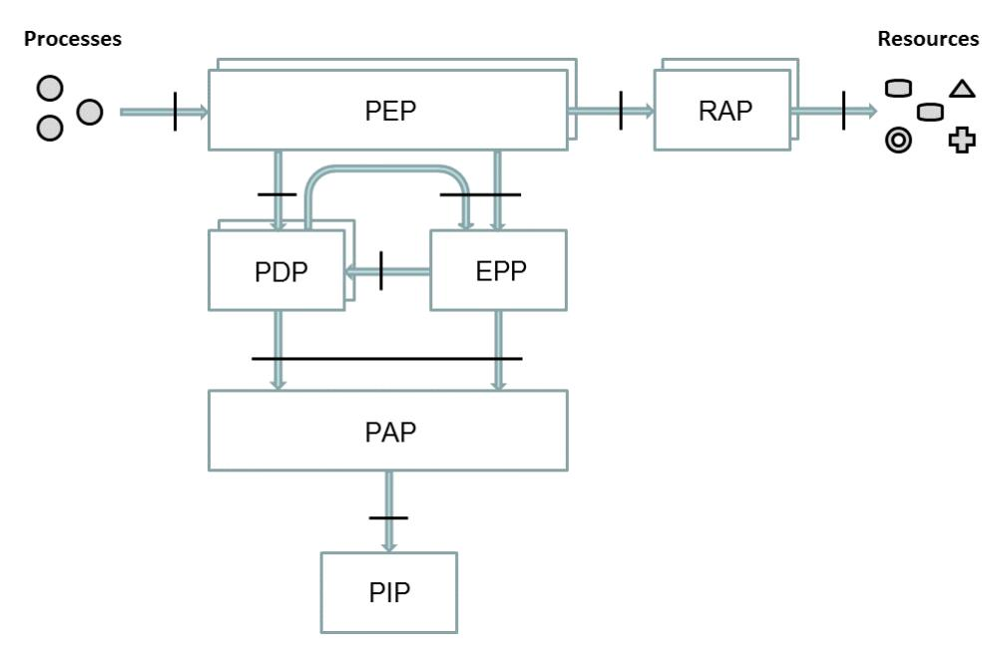

**Figure 5 – Interfaces Between Functional Entities**

The following interfaces are depicted:

- a) A PEP exposes an interface for use by instances of NGAC-aware client applications (CA processes);
- b) A PDP exposes an interface for use by a PEP and another for use by the EPP, if present;
- c) The EPP exposes an interface for use by a PEP or PDP;
- d) The PAP exposes interfaces for use by a PDP and, if present, the EPP ;
- e) The PIP exposes an interface for use by the PAP;
- f) A RAP exposes an interface for use by a PEP; and
- g) A resource exposes an interface for use by a RAP.

The interfaces between key functional entities, namely those enumerated in items (b), (c), and (d) above, are specified in greater detail in this clause. The remaining interfaces are not elaborated further within the NGAC specifications due to variability in the type of resources protected by the policy, the translation of abstract operations performed on objects to concrete operations on the resources they represent, and the potential for diversity in the data model and services offered by various types of data stores.

An interface is a boundary across which two entities meet or communicate with each other. Documenting an interface consists of identifying it, assigning it a name, and specifying its syntactic and semantic information. The syntactic information consists of the signature of the methods that constitute the interface. The signature specifies the name of the method and its parameters. Parameters are defined by stating their order and type. The semantic information is in the form of a description of the behavior of

each method. Since an entity may both consume and produce information through an interface it provides, the order and type of the values returned by each method of the interface are also specified.

## <span id="page-67-0"></span>**7.2 Interface descriptions**

Interfaces are described at an abstract level that specifies the information conveyed via the interface and indicates the behavior of the functional entity when a method of the interface is invoked. The description follows the mathematical specifications formulated for the security model in 6.2 and 6.3. The methods that constitute an interface are specified similar to the administrative command descriptions in 6.4 with two exceptions: first, only the name and input and output declarations of a schema are necessary, and second, schema variable declarations can be defined directly in terms of policy items specified in the security model policy schema in addition to given and enumerated types. This approach allows conformant functional entities to be developed free from constraints on the implementation environment of an entity, such as the programming language or operating system features. In addition, the specifications formulated for the security model also apply to this clause.

Besides the interfaces specified in this standard, an implementation may support additional interfaces for functional entities to provide supplemental services. An implementation may also build upon a defined interface, extending and adjusting it to meet the design of the implementation and the practicalities of the computational environment.

The interface specifications defined herein apply only to exposed interfaces. Implementations in which two or more functional entities have been amalgamated and are treated as a unit may use appropriate internal interfaces that are not exposed and differ from these specifications. However, it is recommended that the exposed interface specifications be followed to the greatest extent possible in such instances.

## <span id="page-67-1"></span>**7.3 PDP interfaces**

### **7.3.1 Overview**

Two distinct interfaces are supported by a PDP:

- a) adjudication of access requests received from a PEP; and
- b) evaluation and processing of event responses received from the EPP.

The Resource and Administrative Access Information Flows in clause 4 describe the behavior of a PDP for the former, and the Event Context Information Flow therein describes a PDP's behavior for the latter.

### **7.3.2 Access request adjudication**

The access request adjudication interface is for the sole use of PEPs. Two similar but distinct types of PEP-issued access requests are adjudicated by a PDP through this interface:

- a) resource access; and
- b) administration access.

Although the behavior of a PDP in each case is different, the access request input is the same for both types of access. The methods that constitute the access request adjudication interface are specified in Table 1.

**Table 1 – Access Request Adjudication Interface**

<span id="page-68-0"></span>

| Method                                                     | Description                                                                                                                                                                                                                                                                    |
|------------------------------------------------------------|--------------------------------------------------------------------------------------------------------------------------------------------------------------------------------------------------------------------------------------------------------------------------------|
| AdjudicateResAccess (request:<br>AREQ): response: RES_RESP | Check the authorization of the user/process to perform a resource<br>access and return the access decision in the response. If the<br>decision is to grant access to an object, return the locator for the<br>corresponding resource along with the decision in the response.  |
| AdjudicateAdmAccess (request:<br>AREQ): response: ADM_RESP | Check the authorization of the user/process to perform an<br>administration access and return the access decision. If the<br>decision is to grant access, perform the access and return the<br>access decision and the result of the administrative access in the<br>response. |

An aIt is defined as follows:

AREQ ∈ (P × OP × seq1 GUID)

The response to a resource access adjudication conveys the decision rendered by the PDP and the locator for the resource denoted by the object in the access request. The decision may be to grant or deny access. The contents and semantics of the locator can differ depending on the computational environment of the implementation and are not defined in further detail in this standard.

DECISION ::= Grant | Deny

[LOC] // location is defined as a given type

RES\_RESP ∈ (DECISION × LOC)

The response to an administrative access adjudication conveys the decision rendered by the PDP. If a grant decision was rendered and the administrative access taken, the result of the administrative access and the identifier of a basic element, relation, or other policy entity created by the access are also conveyed. An administrative access is not attempted if there is insufficient authorization. A completed access is reported as a success, and any error encountered during processing is reported as a failure. The PDP should raise a system alert for any critical, actionable problems encountered that could affect the integrity and coherence of the policy. The details of any problems encountered should be entered into the audit log.

ADM\_RESP ∈ DECISION × RESULT × GUID

RESULT ::= Success | Failure

#### **7.3.3 Event response evaluation**

For each obligation that matches an event context, the EPP communicates with a PDP to evaluate whether the authorization held by the obligation's creator for the actions of the event response is adequate and to process the event response accordingly. The PDP utilizes the interface afforded by the PAP to carry out the event response.

The method defining this interface is specified in Table 2.

**Table 2 – Event Response Evaluation Interface**

<span id="page-69-1"></span>

| Method                                                             | Description                                                                                                                                                                                                                                         |
|--------------------------------------------------------------------|-----------------------------------------------------------------------------------------------------------------------------------------------------------------------------------------------------------------------------------------------------|
| EvaluateResponse (evresp:<br>EVNT_RESP): outcome: seq1<br>ADM_RESP | Check the authorization of the user that defined the obligation and<br>its event response. If the authorization is sufficient, undertake<br>performing the administrative actions of the event response and<br>return the outcome of those actions. |

The event response, EVNT\_RESP, conveys the identifier of the user responsible for defining the event response and the actions to be taken. The actions are represented as a non-empty sequence of paired administrative operations and conformant operands.

EVNT\_RESP ∈ (U × seq1 (AOP × seq1 GUID))

## <span id="page-69-0"></span>**7.4 EPP interface**

## **7.4.1 Overview**

The EPP interface accepts and processes event contexts that are issued from both PEPs and PDPs, which pertain to successfully completed accesses to resources or to policy information persisted at the PIP, respectively.

The Event Context Information Flow in clause 4 describes the behavior of the EPP, which is the same regardless of the source of issue. The single interface supports both types of functional entities.

#### **7.4.2 Event context processing**

The EPP uses the information from an event context to process obligations. It matches the event context with the event pattern of each obligation and carries out the event response of each matched obligation as a single atomic action. Table 3 specifies the method that defines this interface.

**Table 3 – Event Context Processing Interface**

<span id="page-69-2"></span>

| Method                                                  | Description                                                                                                                                                                                                                                                                                                                                                                                                                                                                                      |
|---------------------------------------------------------|--------------------------------------------------------------------------------------------------------------------------------------------------------------------------------------------------------------------------------------------------------------------------------------------------------------------------------------------------------------------------------------------------------------------------------------------------------------------------------------------------|
| ProcessEventContext (context:<br>EC): response: EC_RESP | If the event context is not well formed, return a negative result in<br>the response. Otherwise, match the event context against the<br>event pattern of each defined obligation. For each matched pattern,<br>process the corresponding event response using the PDP interface<br>defined for this purpose. If the event responses of all matched<br>obligation patterns are processed without complications, return a<br>positive result in the response. Otherwise, return a negative result. |

The event context, EC, includes the identifiers for the user of the process, the process, and the access operation and operands which describe the associated event. Other additional information employed in the EPP's matching process, such as the containers of a policy element targeted by the access (e.g., the object attributes of an object that was deleted), are also conveyed via the event context. The additional information conveyed is dependent on the type of event that occurred and may be attuned to the language grammar and semantics for an obligation's event pattern and response.

## EC ∈ (U × P × OP × seq1 GUID × seq GUID)

For each event context it receives, the EPP returns a response, EC\_RESP, to the functional entity that initiated the request. If the event context is malformed or irregular such that it precludes the resolution of event patterns necessary for matching, no processing occurs, and the result is reported as a failure. If no problems were encountered when the processing of all matched obligations has completed, the result is reported as a success. If any problems were encountered, the result is reported as a failure. The EPP should raise a system alert for any critical, actionable problems encountered, such as resolution errors, insufficient authorization, response incongruity, or service errors, which could affect the integrity and coherence of the policy. The details of any problems encountered should be entered into the audit log.

$$\mathsf{EC}_\mathsf{RESP} \in (\mathsf{U} \times \mathsf{P} \times \mathsf{RESULT})$$

The EPP may be assigned a PDP for its exclusive use in processing the event responses of matched obligations to avoid contention with PEPs performing access request adjudication with the same PDP as the EPP.

## <span id="page-70-0"></span>**7.5 PAP interfaces**

### **7.5.1 Overview**

The following two distinct interfaces are supported by the PAP:

- a) processing of inquiries from a PDP and the EPP, used to form an access decision with respect to the defined policy and to process an event context against event pattern of defined obligations, respectively; and
- b) processing of directives from a PDP that affect policy, used to carry out successfully adjudicated administrative access requests and event responses of matched obligations.

The PAP interfaces are designed to preserve the properties of the policy model. Policy inquiries shall not affect any policy entity, and policy modifications shall not have any side effect on the policy persisted at the PIP other than the outcome defined for the interface. The naming conventions used for PAP interfaces prepends each method with a prefix—a letter followed by a dash—to indicate the type of task performed by the method. The prefixes used are as follows: C - create, D - delete, G - get, and Q - query. For use in Q methods, the following type is defined:

BOOLEAN ::= True | False

#### **7.5.2 Policy inquiry**

The PAP interface for PDP and EPP inquiries is defined to meet the distinct needs of each functional entity. In the case of the PDP, the focus of inquiries is on the privileges and restrictions that pertain to a process and the user of the process. For the EPP, the focus is on obligations and aspects of event patterns and event responses related to the details of an event context and the defined policy.

The methods defining this interface are listed in Table 4 below. Not all of the methods may be needed in an implementation, and some may be combined to define more complex methods. Where possible, table entries whose methods serve a related purpose are grouped together and demarcated from others by a double horizontal bar.

Table 4 – Policy Inquiry Interface

<span id="page-71-0"></span>

| Method                                                                                                                                        | Description                                                                                                                                                                                                                                 |
|-----------------------------------------------------------------------------------------------------------------------------------------------|---------------------------------------------------------------------------------------------------------------------------------------------------------------------------------------------------------------------------------------------|
| G-AccessibleObjects(user: U): return: 2 <sup>(PE x 2<sub>1</sub><sup>AR</sup>)</sup>                                                          | Return the set of policy elements to which user U has access together with the access rights U has on each.                                                                                                                                 |
| G-UsersWithAccess(element: PE): return: 2 <sup>(U x 2<sub>1</sub><sup>AR</sup>)</sup>                                                         | Return the set of users that have access to element PE together with the access rights each user has on PE.                                                                                                                                 |
| G-PermittedARs (process: P; element: PE): return: 2 <sup>AR</sup>                                                                             | Return the set of access rights a process holds for the given policy element for all policy classes that contain the policy element.                                                                                                        |
| G-DeniedARs (process: P;<br>element: PE): return: 2 <sup>AR</sup>                                                                             | Return the set of access rights a process is restricted from exercising for the given policy element.                                                                                                                                       |
| G-BaseATs (user: U): return: 2 <sup>AT</sup>                                                                                                  | Return the set of nethermost attributes for the user (i.e., attributes to which the user holds an association through a containing user attribute and which are not contained by any other attribute to which the user has an association). |
| G-DestinationATs (user: U): return: 2 <sup>AT</sup>                                                                                           | Return the set of attributes to which the user holds an association through a containing user attribute.                                                                                                                                    |
| G-AdjacentAscendants<br>(element: PE): return: 2 <sup>PE</sup>                                                                                | Return the set of policy elements that have an assignment emanating to the given policy element.                                                                                                                                            |
| G-AdjacentDescendants<br>(element: PE): return: 2 <sup>PE</sup>                                                                               | Return the set of policy elements that have an assignment emanating from the given policy element.                                                                                                                                          |
| G-PermittedARs (u: U;<br>element: PE): return: 2 <sup>AR</sup>                                                                                | Return the set of access rights a user holds for the given policy element.                                                                                                                                                                  |
| G-DeniedARs (u: U; element: PE): return: 2 <sup>AR</sup>                                                                                      | Return the set of access rights a user is restricted from exercising for the given policy element.                                                                                                                                          |
| G-OBLIGs (): return: OBLIG                                                                                                                    | Return all defined obligations.                                                                                                                                                                                                             |
| G-EventResponses (context:<br>EC): return: 2 <sup>(U × seq<sub>1</sub> (AOP × seq<sub>1</sub> GUID))</sup>                                    | Return all event responses for which the given event context matched the respective event pattern.                                                                                                                                          |
| G-ATContainers (element: PE): return: 2 <sup>PE</sup>                                                                                         | Return the set of attributes that contain the given policy element.                                                                                                                                                                         |
| G-PCContainers (element:<br>PE): return: 2 <sup>PC</sup>                                                                                      | Return the set of policy classes that contain the given policy element.                                                                                                                                                                     |
| G-ASSOCs (user: U): return: 2 <sup>(UA x 2<sub>1</sub><sup>AR</sup> x AT)</sup>                                                               | Return the set of associations whose first term pertains to the given user (i.e., contains the user).                                                                                                                                       |
| G-ASSOCs (user: UA): return: 2 <sup>(UA x 2<sub>1</sub><sup>AR</sup> x AT)</sup>                                                              | Return the set of associations whose first term pertains to the given user attribute (i.e., is or contains the user attribute).                                                                                                             |
| G-ASSOCs (at: AT): return: 2 <sup>(UA × 2<sub>1</sub><sup>AR</sup> × AT)</sup>                                                                | Return the set of associations whose third term pertains to the given attribute (i.e., is or contains the attribute).                                                                                                                       |
| G-ConjPDENYs (process: P): return: $2^{(P \times 2_1^{AR} \times 2_1^{AT} \times 2_1^{AT})}$                                                  | Return the set of conjunctive prohibitions that reference the given process.                                                                                                                                                                |
| G-DisjPDENYs (process: P):<br>return: 2 <sup>(P x 2<sub>1</sub><sup>AR</sup> x 2<sub>1</sub><sup>AT</sup> x 2<sub>1</sub><sup>AT</sup>)</sup> | Return the set of disjunctive prohibitions that reference the given process.                                                                                                                                                                |
| G-ConjUDENYs (user: U):<br>return: 2 <sup>(U × 2<sup>AR</sup> × 2<sup>AT</sup> × 2<sup>AT</sup>)</sup>                                        | Return the set of conjunctive prohibitions that reference the given user.                                                                                                                                                                   |
| G-DisjUDENYs (user: U):<br>return: 2 <sup>(U × 2<sup>AR</sup> × 2<sup>AT</sup> × 2<sup>AT</sup>)</sup>                                        | Return the set of disjunctive prohibitions that reference the given user.                                                                                                                                                                   |

| Method                                                                                                  | Description                                                                                                                |
|---------------------------------------------------------------------------------------------------------|----------------------------------------------------------------------------------------------------------------------------|
| G-ConjUADENYs (ua: UA):<br>return: 2 <sup>(UA x 2<sup>AR</sup> x 2<sup>AT</sup> x 2<sup>AT</sup>)</sup> | Return the set of conjunctive prohibitions that reference the given user attribute.                                        |
| G-DisjUADENYs (ua: UA):<br>return: 2 <sup>(UA × 2<sup>AR</sup> × 2<sup>AT</sup> × 2<sup>AT</sup>)</sup> | Return the set of disjunctive prohibitions that reference the given user attribute.                                        |
| G-OBLIG (user: U): return: 2(U x PATTERN x RESPONSE)                                                    | Return the set of obligations defined by the given user.                                                                   |
| G-OBLIG (ua: UA): return: 2(UA × PATTERN × RESPONSE)                                                    | Return the set of obligations whose pattern references the given user attribute.                                           |
| G-OBLIG (op: OP): return: 2(UA × PATTERN × RESPONSE)                                                    | Return the set of obligations whose pattern references the given operation.                                                |
| G-OBLIG (ua: UA): return: 2(UA × PATTERN × RESPONSE)                                                    | Return the set of obligations whose response references the given user attribute.                                          |
| G-ReqCap (op: OP): return:<br>2 <sup>2AR</sup>                                                          | Return the alternative sets of requisite access rights for the given operation.                                            |
| Q-Contains (e1, e2: PE): return: BOOLEAN                                                                | Return a logical value (i.e., TRUE or FALSE) indicating whether the first policy element contains a second policy element. |
| Q-UserHasAttribute (u: U; ua: UA): return: BOOLEAN                                                      | Return a logical value indicating whether the given user is contained by the user attribute.                               |
| Q-UserHasPC(u: U; pc: PC): return: BOOLEAN                                                              | Return a logical value indicating whether the given user is contained by the policy class.                                 |
| Q-ObjectHasAttribute (o: O; oa: OA): return: BOOLEAN                                                    | Return a logical value indicating whether the given object is contained by the object attribute.                           |
| Q-ObjectHasPC(o: O; pc:<br>PC): return: BOOLEAN                                                         | Return a logical value indicating whether the given object is contained by the policy class.                               |

#### 7.5.3 Policy adjustment

The PAP policy adjustment interface accepts and processes directives that are issued exclusively from PDPs and involve administration of the policy information maintained at the PIP. The authorization of the user and the process in question shall be verified as sufficient by a PDP prior to the invocation of any policy adjustment interface method.

The methods defining this interface are listed in Table 5 below. Where possible, table entries whose methods serve a related purpose are grouped together and demarcated from others by a double horizontal bar. The methods summarized therein should not be confused with the administrative commands defined in clause 6, which represent a different level and type of abstraction.

Table 5 - Policy Adjustment Interface

<span id="page-72-0"></span>

| Method                                 | Description                                                                                                                                         |
|----------------------------------------|-----------------------------------------------------------------------------------------------------------------------------------------------------|
| C-Session (user: U): return:<br>RESULT | Signal the start of a session for the user.                                                                                                         |
| D-Session (user: U): return:<br>RESULT | Signal the end of a session for the user.                                                                                                           |
| C-PC (): return: PC                    | Create a policy class and return its identifier. A null value for the identifier indicates that the action failed.                                  |
| C-UAinPC (pc: PC): return:<br>UA       | Create a user attribute and assign it to the given policy class. Return the identifier of the user attribute or, if the action fails, a null value. |

| Method                                                                     | Description                                                                                                                                                                                                 |
|----------------------------------------------------------------------------|-------------------------------------------------------------------------------------------------------------------------------------------------------------------------------------------------------------|
| C-UAinUA (ua: UA): return:<br>UA                                           | Create a user attribute and assign it to the given user attribute.<br>Return the identifier of the user attribute or, if the action fails, a null<br>value.                                                 |
| C-UinUA (ua: UA): return: U                                                | Create a user, assign it to the given user attribute, and return the<br>identifier of the user or, if the action fails, a null value.                                                                       |
| C-OAinPC (pc: PC): return:<br>OA                                           | Create an object attribute and assign it to the given policy class.<br>Return the identifier of the object attribute or, if the action fails, a null<br>value.                                              |
| C-OAinOA (oa: OA): return:<br>OA                                           | Create an object attribute and assign it to the given object attribute.<br>Return the identifier of the object attribute or, if the action fails, a null<br>value.                                          |
| C-OinOA (oa: OA): return: O                                                | Create an object and assign it to the given object attribute. Return the<br>identifier of the object attribute or, if the action fails, a null value.                                                       |
| D-PC (pc: PC): return:<br>RESULT                                           | Delete the given policy class. Return a result indicating whether the<br>action succeeded.                                                                                                                  |
| D-UAinPC (ua: UA; pc: PC):<br>return: RESULT                               | Delete the given user attribute and its assignment to the policy class.<br>Return a result indicating whether the action succeeded.                                                                         |
| D-UAinUA (ua1, ua2: UA):<br>return: RESULT                                 | Delete the given user attribute and its assignment to the user<br>attribute. Return a result indicating whether the action succeeded.                                                                       |
| D-UinUA (u: U; ua: UA):<br>return: RESULT                                  | Delete the given user and its assignment to the user attribute.<br>Return a result indicating whether the action succeeded.                                                                                 |
| D-OAinPC (oa: OA; pc: PC):<br>return: RESULT                               | Delete the given object attribute and its assignment to the policy<br>class. Return a result indicating whether the action succeeded.                                                                       |
| D-OAinOA (oa1, oa2: OA):<br>return: RESULT                                 | Delete the given object attribute and its assignment to the object<br>attribute. Return a result indicating whether the action succeeded.                                                                   |
| D-OinOA (o: O; oa: OA):<br>return: RESULT                                  | Delete the given object and its assignment to the object attribute.<br>Return a result indicating whether the action succeeded.                                                                             |
| C-UtoUA (u: U; ua: UA):<br>return: RESULT                                  | Create an assignment from the given user to the user attribute.<br>Return a result indicating whether the action succeeded.                                                                                 |
| C-UAtoUA (ua1, ua2: UA):<br>return: RESULT                                 | Create an assignment from the first user attribute given to the second<br>user attribute. Return a result indicating whether the action<br>succeeded.                                                       |
| C-UAtoPC (ua: UA; pc: PC):<br>return: RESULT                               | Create an assignment from the given user attribute to the policy<br>class. Return a result indicating whether the action succeeded.                                                                         |
| C-OAtoOA (oa1, oa2: OA):<br>return: RESULT                                 | Create an assignment from the first object attribute given to the<br>second object attribute. Return a result indicating whether the action<br>succeeded.                                                   |
| C-OAtoPC (oa: OA; pc: PC):<br>return: RESULT                               | Create an assignment from the given object attribute to the policy<br>class. Return a result indicating whether the action succeeded.                                                                       |
| C-Assign (e1, e2: PE): return:<br>RESULT                                   | Create an assignment from the first policy element given to the<br>second one. Return a result indicating whether the action succeeded.<br>(A possible alternative for all of the above assignment methods) |
| AR;<br>C-Assoc (ua: UA; ars: 21<br>at:<br>AT): return: RESULT              | Create an association from the given user attribute specified to the<br>other attribute given. Return a result indicating whether the action<br>succeeded.                                                  |
| AR;<br>C-ConjUProhib (u: U; ars: 21<br>atis, ates: 2AT): return:<br>RESULT | Create a conjunctive prohibition on the given user for the inclusive<br>and exclusive policy elements denoted by the respective attribute<br>sets. Return a result indicating whether the action succeeded. |

| Method                                                                           | Description                                                                                                                                                                                                              |
|----------------------------------------------------------------------------------|--------------------------------------------------------------------------------------------------------------------------------------------------------------------------------------------------------------------------|
| AR;<br>C-ConjPProhib (p: P; ars: 21<br>atis, ates: 2AT): return:<br>RESULT       | Create a conjunctive prohibition on the given process for the inclusive<br>and exclusive policy elements denoted by the respective attribute<br>sets. Return a result indicating whether the action succeeded.           |
| C-ConjUAProhib (ua: UA; ars:<br>AR;<br>atis, ates: 2AT): return:<br>21<br>RESULT | Create a conjunctive prohibition on the given user attribute for the<br>inclusive and exclusive policy elements denoted by the respective<br>attribute sets. Return a result indicating whether the action<br>succeeded. |
| AR;<br>C-DisjUProhib (u: U; ars: 21<br>atis, ates: 2AT): return:<br>RESULT       | Create a disjunctive prohibition on the given user for the inclusive<br>and exclusive policy elements denoted by the respective attribute<br>sets. Return a result indicating whether the action succeeded.              |
| AR;<br>C-DisjPProhib (p: P; ars: 21<br>atis, ates: 2AT): return:<br>RESULT       | Create a disjunctive prohibition on the given process for the inclusive<br>and exclusive policy elements denoted by the respective attribute<br>sets. Return a result indicating whether the action succeeded.           |
| C-DisjUAProhib (ua: UA; ars:<br>AR;<br>atis, ates: 2AT): return:<br>21<br>RESULT | Create a disjunctive prohibition on the given user attribute for the<br>inclusive and exclusive policy elements denoted by the respective<br>attribute sets. Return a result indicating whether the action<br>succeeded. |
| C-Oblig (u: U; pattern:<br>PATTERN; response:<br>RESPONSE): return:<br>RESULT    | Create an obligation for the given user with the given event pattern<br>and event response sentences. Return a result indicating whether the<br>action succeeded.                                                        |
| D-Assign (e1, e2: PE): return:<br>RESULT                                         | Delete an assignment between the first policy element given to the<br>second one. Return a result indicating whether the action succeeded.                                                                               |
| AR;<br>D-Assoc (ua: UA; ars: 21<br>at:<br>AT): return: RESULT                    | Delete an association from the given user attribute to the other<br>attribute. Return a result indicating whether the action succeeded.                                                                                  |
| AR;<br>D-ConjUProhib (u: U; ars: 21<br>atis, ates: 2AT): return:<br>RESULT       | Delete a conjunctive prohibition on the given user for the access right<br>set and inclusive and exclusive attribute sets. Return a result<br>indicating whether the action succeeded.                                   |
| AR;<br>D-ConjPProhib (p: P; ars: 21<br>atis, ates: 2AT): return:<br>RESULT       | Delete a conjunctive prohibition on the given process for the access<br>right set and inclusive and exclusive attribute sets. Return a result<br>indicating whether the action succeeded.                                |
| D-ConjUAProhib (ua: UA; ars:<br>AR;<br>atis, ates: 2AT): return:<br>21<br>RESULT | Delete a conjunctive prohibition on the given user attribute for the<br>access right set and inclusive and exclusive attribute sets. Return a<br>result indicating whether the action succeeded.                         |
| AR;<br>D-DisjUProhib (u: U; ars: 21<br>atis, ates: 2AT): return:<br>RESULT       | Delete a disjunctive prohibition on the given user for the access right<br>set and inclusive and exclusive attribute sets. Return a result<br>indicating whether the action succeeded.                                   |
| AR;<br>D-DisjPProhib (p: P; ars: 21<br>atis, ates: 2AT): return:<br>RESULT       | Delete a disjunctive prohibition on the given process for the access<br>right set and inclusive and exclusive attribute sets. Return a result<br>indicating whether the action succeeded.                                |
| D-DisjUAProhib (ua: UA; ars:<br>AR;<br>21<br>atis, ates: 2AT): return:<br>RESULT | Delete a disjunctive prohibition on the given user attribute for the<br>access right set and inclusive and exclusive attribute sets. Return a<br>result indicating whether the action succeeded.                         |
| D-Oblig (u: U; pattern:<br>PATTERN; response:<br>RESPONSE): return:<br>RESULT    | Delete the obligation for the given user with the given event pattern<br>and response. Return a result indicating whether the action<br>succeeded.                                                                       |
| C-OP (): return: OP                                                              | Create an operation and return its identifier. A null value for the<br>identifier indicates that the action failed.                                                                                                      |

| Method                                                      | Description                                                                                                                                                                               |
|-------------------------------------------------------------|-------------------------------------------------------------------------------------------------------------------------------------------------------------------------------------------|
| C-AR (): return: AR                                         | Create an access right and return its identifier. A null value for the<br>identifier indicates that the action failed.                                                                    |
| C-ReqCap (op: OP, setofars:<br>2AR) return:<br>21<br>RESULT | Create the required capability mapping for the given operation to one<br>or more alternative sets of requisite access rights. Return a result<br>indicating whether the action succeeded. |
| D-OP (): return: RESULT                                     | Delete the given operation. Return a result indicating whether the<br>action succeeded.                                                                                                   |
| D-AR (): return: RESULT                                     | Delete the given access right. Return a result indicating whether the<br>action succeeded.                                                                                                |
| D-ReqCap (op: OP) return:<br>RESULT                         | Delete the required capability mapping for the given operation.<br>Return a result indicating whether the action succeeded.                                                               |

## <span id="page-76-0"></span>**8 Implementation considerations**

## <span id="page-76-1"></span>**8.1 Interoperation of functional entities**

NGAC provides the architectural, functional, and interface specifications necessary to create a fullfeatured access control system. It is important to note that aspects of the specifications are intentionally left open to allow an implementation to be tailored to the control objectives of the system and the computational environment involved. The NGAC specifications allow functional entities to be implemented independently and function in a consistent manner when deployed together but only if the details of those open areas are in agreement.

The areas in which agreement needs to be reached include the following technical details:

- a) the syntax and semantics for GUIDs;
- b) the naming conventions for policy elements;
- c) the resource and administrative operations and access rights used to govern accesses;
- d) the alphabet and grammar for the language(s) used to express event patterns and responses in obligations;
- e) the procedures for authenticating the identity of a user and for establishing trust relationships between functional entities;
- f) the particulars of the interfaces used between functional entities, including the concrete encoding of parameters and the options and extensions supported; and
- g) the syntax and semantics of resource locators.

## <span id="page-76-2"></span>**8.2 Policy**

### **8.2.1 Representation**

NGAC policy is defined in terms of abstractions on the resources and authorizations of a computational environment and the behavior of conceptual functional entities. While certain abstractions are specified for the purposes of standardization, they need to be reified by actual processing entities and settings within the computational environment of an implementation. The adaptation of the abstractions of the security model to the constituents of the implementation environment requires taking into consideration information about the environment when deciding how the abstractions are to be actualized.

#### **8.2.2 Updates**

The NGAC security model is specified utilizing a single data store in which the policy is maintained, and modifications to the policy take immediate effect. While the model captures the required behavior of applied policy updates, it does not address the more general issue of ensuring that the updates are of high-caliber. Because updates have a direct impact on the results of the access decision function, it would be useful to provide one or more means to vet intended updates before they are applied to the active policy.

A policy management application can be an important tool in understanding policy abstractions and the impact that policy settings have on controlling behavior. A policy management tool should be able to screen proposed changes before they are applied to verify that they are well-formed and do not produce inconstancies in the policy. Graphical renditions are an effective aid in comprehending and administering policy for which NGAC is well-suited.

Establishing separate, distinct spaces for creating and testing policy revisions before they are activated can also prove useful in practice. For example, two policy stores could be maintained: one for the test policy and one for the active policy. The active policy store is used to compute runtime access decisions, while the test policy store is used to apply revisions to a copy of the active policy for vetting. Once vetting of a test policy is complete, it can replace the active policy. Some means would also need to be

established to transition the test policy to the active policy in a synchronized fashion that avoids disrupting operations.

### **8.2.3 Performance**

The operation of NGAC relies squarely on the defined policy. Policy information is continually retrieved and updated by functional entities during runtime, making the velocity of those transactions a critical factor in the overall performance of an implementation. A practical method for improving response is to create a high-speed memory cache of all or parts of the prevailing policy persisted at the PIP and use that representation for access decisions and policy analytics. Caching can be done in various ways. For example, changes to policy could be immediately reflected in the intermediate representation of the policy elements and relations in memory and applied to the PIP-persisted policy in a synchronous fashion to maintain consistency. Any updates made directly to the PIP-persisted policy would also need to be applied automatically to the cached, intermediate representation of policy. The intermediate representation could also be serialized at shutdown to enable its quick restoration upon startup.

The data structures used to represent cached policy and the algorithms employed to search that intermediate representation have a direct impact on how quickly policy inquiries can be processed. The determination of efficient policy representations and algorithms for enabling rapid evaluation is an area for study. Annex C provides an example of an algorithm and data structure designed to perform policy analysis efficiently, which can be adapted for various purposes.

## <span id="page-77-0"></span>**8.3 Race conditions**

The purpose of the event context information flow is to modify aspects of policy based on the occurrence of events and the set of defined obligations in effect when they occur. The modifications may affect access to the resource or policy information referenced by the access request that triggered the event context information flow, as well as to other resources or policy information that are related to the access. For example, one type of counter-influence is the creation of prohibitions via an obligation that when triggered countermands authorizations already established. One can also negate established authorizations with the creation or deletion of an assignment or the deletion of an association.

The rivalry between administrative and resource access requests and concurrent policy changes spawned from an event context information flow and also among policy changes from concurrent event context information flows creates the potential for race conditions to arise in the architecture. Unexpected and unwanted changes to policy due to concurrent access by multiple functional entities should be avoided, and the following objectives attained:

- a) An event context flow should not affect the processing of the access request that triggered it;
- b) An event context flow should be able to affect, where appropriate, subsequent access requests from the process or user referenced in the event context; and
- c) An event context flow should be able to affect, where appropriate, access requests from other processes that are adjudicated after the access request of the event context flow.

Race conditions should be addressed in a manner suited to the computational environment of an implementation of the NGAC framework. The manner in which race conditions are addressed is not prescribed by NGAC. Possible methods to mitigate their impact include the following:

- a) Using the locking features of the PIP data store to prevent access to specific policy information structures being affected by an event context information flow until the flow completes;
- b) Delaying the return of the results from a successful resource or administration access to the CA until the event context information flow for the access completes; and
- c) Enforcing a queue structure within a PEP for delaying access attempts initiated within a session by a CA until the previous access completes.

## <span id="page-78-0"></span>**8.4 Collocated functional entities**

The NGAC framework can be adapted to a range of computational environments, from a single, selfcontained computer system to a group of individual network-interconnected systems. An implementation is not required to follow a completely centralized or completely distributed approach. Many types of hybrid configurations are also possible where some of the functional entities within the functional architecture reside together within a single system while the remaining functional entities are located in other systems.

Collocating functional entities can be beneficial in certain computational environments. The benefits can include simplified identification and authentication of collocated functional entities and their services, avoidance of network latency between functional entities, and reuse of programmed functionality.

#### **8.4.1 PEP collocation**

A PEP may be collocated in various ways. For example, a PEP could be collocated with the application protected within the kernel space or a trusted layer of the operating environment—to screen access attempts to resources via a PDP. Alternatively, a PEP could be collocated with a specific RAP to screen access attempts to resources associated with the RAP. The latter is appropriate only if the access attempts of each user pertain solely to the resources of a specific RAP (e.g., only a single RAP exists).

To retrofit existing, non-compliant applications requires a collocated PEP to intercept native access attempts, translate them for compatibility with the NGAC framework, and request adjudication from a PDP. The PEP would need to employ the specifications for native access requests to convert them to and from NGAC-conformant requests and responses.

#### **8.4.2 PDP collocation**

To reduce the overhead between PEP and PDP interactions, it is possible to closely couple them together (e.g., as an integrated PEP/PDP functional entity). While a PDP may be collocated and closely integrated with a PEP, there are advantages to decoupling one from the other. One benefit of decoupling is the possibility to replace the PDP implementation being used with another standard conformant PDP implementation. Simplified maintenance of the PDP implementation is another benefit of decoupling, since a PDP that is independent of the logic and programming of a PEP is neither affected by PEP dependencies (e.g., third-party program libraries) nor by PEP maintenance (e.g., specification changes, patches, and new code deployments).

A PDP operates in a stateless fashion, which makes it suited to having several instances operating concurrently. PDP instances may run on separate threads (e.g., to leverage the availability of multi-core architectures) and on separate hosts (e.g., to increase the capacity of the framework). As with any concurrent operations, care should be taken to ensure that interference is minimized and race conditions avoided.

It may be useful in some situations to establish a central PDP hub by collocating several PDPs together. The PDP hub would behave more like a relay than a PDP. When a request is received by the hub, the details of the request would be used to route the request to a relevant PDP for adjudication. Alternatively, a PDP discovery service could be used to facilitate locating an available PDP to adjudicate access requests.

### **8.4.3 EPP collocation**

The EPP uses the PAP to resolve and match obligations. It also relies entirely on the functionality of the PDP to carry out the processing of responses of matched obligations. Since the functional architecture allows for multiple PDPs, an obvious approach to avoid contention for a PDP is to collocate and tightly couple the EPP with a PDP, designating the PDP for its exclusive use.

### **8.4.4 PAP collocation**

The functional architecture allows only a single PAP and a single PIP to exist within the framework. The services offered by the PAP are at the same conceptual level as other NGAC service interfaces, while those of the PIP are at a more elemental, constituent level relied on by the PAP. These facts compel the collocation of the two functional entities.

## **Annex A**

(informative)

## **Pattern and response grammars**

## <span id="page-80-1"></span><span id="page-80-0"></span>**A.1 Overview**

Obligations represent potential changes to the authorization state of the policy. They are used when one or more administrative actions need to be carried out under a specific, known set of circumstances. Insofar as their ability to change the authorization state is concerned, obligations have a similar effect as administrative commands. Important differences exist between them, however. Administrative commands are typically carried out in response to an access request that has first been subjected to the access decision function for approval, which ensures that the requestor holds sufficient authorization. When the circumstances of a defined obligation are matched, the actions that make up the associated response are carried out automatically under the authorization held by the user that defined the obligation. The triggering of the obligation allows resolution of any unresolved terms appearing in the response with the details of the triggering event and verification that the user that defined the obligation holds sufficient authorization to carry out the response.

The benefits of obligations are twofold: complex policies that require more dynamic treatment than the NGAC policy representation provides can be accommodated, and administrative actions that require repetitive performance of administrative commands can be automated. The primary drawback is the potential to cause grave harm to the authorization state through error or intent. The former can be mitigated by thoroughly testing any obligation before it is enabled, and the latter by taking judicious care when employing obligations, preferably granting only trusted individuals the authorization to define obligations and restricting the scope of those individuals' authority to well-defined groups of policy elements.

As described in clause 6, each defined obligation is represented by a triple of the OBLIG relation of the form (user, pattern, response). From the perspective of the formal model, the pattern and response terms are simply a sequence of symbols from some alphabet. Therefore, the recognition and treatment of the acceptable symbol sequences that are possible for each item should be handled outside of the model using a different formalism well-suited for this goal.

A grammar is a formal mechanism that can be used to either enumerate the sentences of a language or determine whether a given sentence (i.e., a sequence of symbols from some alphabet) belongs to the language described by the grammar. The grammars for the pattern and response terms of an obligation relation can be specified using Backus-Naur Form (BNF) notation. A BNF grammar comprises a set of symbols and production rules, which formally describe a language. Therefore, the pattern and response grammars each defines a formal language whose respective sentences are conveyed by the corresponding terms of an obligation.

The following conventions are followed in the BNF notation used in the specifications below. Non-terminal symbols are enclosed by left and right-pointing angle braces (vis., ⟨⟩). Terminal symbols are bolded. Undefined symbols that lie outside the grammar (e.g., function calls) are italicized. Procedures and functions are specified in the syntax of the "C" programming language. Production rules use a special symbol (vis., ::=) as a replacement operator that separates a non-terminal symbol on the left side from the replacement rewrite expression on the right side. A vertical bar (vis., |) separates alternative rewrite expressions. Concatenation of adjacent symbols is implicit and takes precedence over |, which takes precedence over ::=. Paired square brackets group together expressions that are optional, and paired curly brackets group together expressions that may occur zero or more times. These grouping designators, which are drawn from the Extended BNF notation, take precedence over other operators.

## <span id="page-81-0"></span>**A.2 Event pattern grammar**

## **A.2.1 Base specification**

The event pattern grammar specifies an event, such as a specific operation performed on an object by a process running on behalf of a user that has certain attributes in some policy classes. The event pattern comprises four components, namely a user specification (see A.2.2), a policy class specification (see A.2.3), an operation specification (see A.2.4), and a policy element specification (see A.2.5). With the exception of the operation specification, all components are optional. In order to apply an event-response rule, the event being processed (the current event) needs to match every component specification present in the rule's event pattern.

```
⟨event pattern⟩ ::= [⟨user spec⟩] [⟨pc spec⟩] ⟨op spec⟩ [⟨pe spec⟩]
```

## **A.2.2 User specification**

If the user specification is present, it denotes the processes of a specific user, any user, or any user from a set of users and/or user attributes, or a specific process specified through its identifier. If the user specification is omitted, then any event matches this component of the pattern by default.

```
⟨user spec⟩ ::= ⟨user⟩ | ⟨any user⟩ | ⟨each user⟩ | ⟨process⟩
⟨user⟩ ::= [user] user_name
⟨any user⟩ ::= any [user] [of ⟨user or attr set⟩]
⟨each user⟩ ::= each [user] [of ⟨user or attr set⟩]
⟨user or attr set⟩ ::= ⟨user or attr⟩ {, ⟨user or attr⟩}
⟨user or attr⟩ ::= ⟨user⟩ | ⟨uattr⟩
⟨uattr⟩ ::= attribute attribute_name
⟨process⟩ ::= process process_id
```

## **A.2.3 Policy class specification**

The policy class specification, if present, can specify a particular policy class by name, any policy class, any policy class from a set, all policy classes, or all policy classes from a set. The current event matches the policy class specification if the user is contained in the designated policy classes. If the policy class is omitted, any event matches this component of the pattern.

```
⟨pc spec⟩ ::= in ⟨pc subspec⟩
⟨pc subspec⟩ ::= ⟨pc⟩ | ⟨any pc⟩ | ⟨each pc⟩
⟨pc⟩ ::= [policy] pc_name
⟨any pc⟩ ::= any [policy] [of ⟨pc set⟩]
⟨each pc⟩ ::= each [policy] [of ⟨pc set⟩]
⟨pc set⟩ ::= ⟨pc⟩ {, ⟨pc⟩}
```

## **A.2.4 Operation specification**

The mandatory operation specification specifies the event operation by its name, as any operation, or as any operation from a set of operations.

```
⟨op spec⟩ ::= performs ⟨op subspec⟩
⟨op subspec⟩ ::= ⟨op⟩ | ⟨any op⟩
⟨op⟩ ::= [operation] op_name
⟨any op⟩ ::= any [operation] [of ⟨op set⟩]
⟨op set⟩ ::= ⟨op⟩ {, ⟨op⟩}
```

## **A.2.5 Policy element specification**

If the policy element specification is present, it can specify a policy element by its name, any policy element, any policy elements contained in other policy elements, or any policy element from a set of enumerated policy elements.

```
⟨pe spec⟩ ::= on ⟨pe subspec⟩ [⟨membership subspec⟩]
⟨pe subspec⟩ ::= ⟨pe⟩ | ⟨any pe⟩
⟨pe⟩ ::= [policy element] pe_name
⟨any pe⟩ ::= any [policy element]
⟨membership subspec⟩ ::= in ⟨pe⟩ | of ⟨pe set⟩
⟨pe set⟩ ::= ⟨pe⟩ {, ⟨pe⟩}
```

## <span id="page-82-0"></span>**A.3 Event response grammar**

## **A.3.1 Base Specification**

The response grammar specifies a sequence of conditional actions to be performed by the EPP whenever an event occurs which matches the corresponding event pattern. Actions are prefixed with an optional condition that can be used to ascertain the existence or nonexistence of specified policy elements and also the existence or absence of evidence of certain policy relationships due to prior actions. The types of actions that are defined for a response are create (see A.3.2), assign (see A.3.3), grant (see A.3.4), deny (see A.3.5), and delete (see A.3.6) actions.

```
⟨response⟩ ::= ⟨conditional action⟩ {, ⟨conditional action⟩}
⟨conditional action⟩ ::= [if ⟨condition⟩ then] ⟨action⟩ {, ⟨action⟩}
⟨condition⟩ ::= ⟨factor⟩ {and ⟨factor⟩}
⟨factor⟩ ::= [not] ⟨cond entity⟩ ⟨rest factor⟩ | [not] evidence of ⟨action⟩
⟨rest factor⟩ ::= exists | in ⟨cond entity⟩
```

```
(cond entity) ::= user [attribute] (name or function call) |
```

#### A.3.2 Create action specification

A create action creates a policy element and assigns it to another element. The action is introduced by the keyword **create** followed by two components: the type of entity to be created and the container to which the new entity is to be assigned when created. The (create what) component specifies either a user, user attribute, object, object attribute, or policy class to create, whereas the (create where) component identifies the base node of the framework or a policy class, user attribute, or object attribute as the point of assignment for the new entity. A container name can be specified explicitly or as the result of a function call. Functions are evaluated at runtime as the response is being carried out.

```
⟨create action⟩ ::= create ⟨create what⟩ ⟨create where⟩
⟨create what⟩ ::= ⟨user or obj prefix⟩ [attribute] ⟨name or function call⟩ |
```

#### A.3.3 Assign action specification

An assign action creates an assignment, provided that no duplicate assignment already exists. It is introduced by the keyword **assign** followed by two components: the source entity and the destination entities. The source entity to be assigned can be a user, a user attribute, an object, or an object attribute. The destination entities can be either a set of containers to which the source entity is to be assigned or (by using the keyword **like**) a user, user attribute, object, or object attribute from which the assignments can be copied.

```
⟨assign action⟩ ::= assign ⟨assign what⟩ [⟨assign to⟩]
⟨assign what⟩ ::= ⟨user or obj prefix⟩ [attribute] ⟨name or function call⟩
```

70

```
⟨assign to⟩ ::= to ⟨container set⟩ | like ⟨model entity⟩
⟨container set⟩ ::= ⟨container⟩ {, ⟨container⟩}
⟨model entity⟩ ::= ⟨user or obj prefix⟩ [attribute] ⟨name or function call⟩
```

## A.3.4 Grant action specification

A grant action creates an association, provided that no duplicate association already exists. The action is introduced by the keyword **grant** and comprises three components: user attributes, access rights to grant, and policy elements on which the access rights are granted. The (grant to) component specifies user attributes that receive the granted access rights. A user attribute can be specified explicitly or as the result of a function call. The (grant what) component specifies the access rights for authorization. The optional (grant on) component, if specified, identifies policy elements targeted by the grant, which are designated via attributes. If omitted, the policy element specified in the optional (policy element) component of the event pattern is targeted. If that component is also not present, the policy element of the matched event is the one targeted by the grant.

```
⟨grant action⟩ ::= grant ⟨grant to⟩ ⟨grant what⟩ [⟨grant on⟩]
⟨grant to⟩ ::= ⟨uattr spec⟩ {, ⟨uattr spec⟩}
⟨uattr spec⟩ ::= [[user] attribute] ⟨name or function call⟩
⟨grant what⟩ ::= ⟨ar prefix⟩ ⟨granted ar set⟩
⟨ar prefix⟩ ::= access right | access rights
⟨granted ar set⟩ ::= ar_name {, ar_name}
⟨grant on⟩ ::= on ⟨attr container⟩
```

### A.3.5 Deny action specification

A deny action creates a prohibition, provided that no duplicate prohibition already exists. It is introduced by the keyword **deny** and comprises three components. The (deny to) component specifies the user, user attribute, or process that is denied authorization. If the operand is a user, then the deny operation is user-based. If the operand is a user attribute, then the deny operation is attribute-based. If the operand is a process, then the deny operation is process-based. The (deny what) component specifies the access rights denied. The (deny on) component specifies a list of referent attributes to which the denied access rights apply. The list can be prefixed by the keyword **complement of**, meaning the complement of the set of policy elements represented by the list. The list is interpreted as the union of the policy elements represented by the keyword **intersection of**, then it is interpreted as the intersection of the policy elements represented by its members. A list member can also be prefixed by the keyword **complement**, meaning the complement of the set of policy elements represented by that member as a referent container.

```
⟨deny action⟩ ::= deny ⟨deny to⟩ ⟨deny what⟩ ⟨deny on⟩
⟨deny to⟩ ::= user [attribute] ⟨name or function call⟩ |
```

```
⟨denied ar set⟩ ::= ar_name {, ar_name}

⟨deny on⟩ ::= [on [complement of] elements of [intersection of]] ⟨attribute set⟩

⟨attribute set⟩ ::= ⟨member attr⟩ {, ⟨member attr⟩}

⟨member attr⟩ ::= [complement of] ⟨attr container⟩
```

#### A.3.6 Delete action specification

A delete action is introduced by the keyword **delete**. To date, the following subtypes of delete actions are defined: delete assignment relations, delete deny relations, delete grant relations, and created policy elements.

```
⟨delete action⟩ ::= delete ⟨delete subaction⟩
⟨delete subaction⟩ ::= ⟨delete assign subaction⟩ |
```

#### <span id="page-85-0"></span>A.4 Grammar considerations

The pattern and response grammars, or grammar pairs, specified above provide an example of the type of facility that can be provided for expressing policy through obligations. The example grammar pairs are fairly extensive and, because of the English-like sentence syntax, have a high usability factor that enables users to easily perform administrative command-like manipulation of policy. However, the process used to analyze and interpret sentences, turning them into actions on the PIP, is also extensive and, as a result, complex. For many policies, the available features provided by the example grammars are superfluous and will go unused. Nevertheless, they provide a picture of the type of policy expressions that are conceivable.

Consider, for instance, a user x applying the example grammars to specify the following verbose and terse forms of a simple obligation:

```
(x, any user performs operation op_name on any policy element of pe_name, deny process fn_name() access right ar_name on elements of policy element name)

(x, op_name on any of pe_name, deny process fn_name() access right ar_name on elements of name)
```

This type of obligation is often used in a multi-level security policy to prevent a process (i.e., returned by  $fn\_name()$ ) from accessing certain classes of elements, (i.e., those contained by policy element name) by nullifying the process's access authority (i.e., represented by  $ar\_name$ ) whenever a certain operation (i.e., indicated by  $op\_name$ ) is carried out by it (i.e., the process acting on behalf of some user) on certain classes of elements (i.e., those contained by policy element  $pe\_name$ ).

This, and other possible obligations that can be generated using the grammars specified above, may also be expressed using other pattern and response grammars. For illustration purposes, the same obligation is expressed below using two different pairs of grammars. The first takes a very simple approach using procedure calls (i.e., if-op-on-container-members and deny-process-access-to-container-members) to represent the pattern and response terms of the obligation. The second takes a more mathematical approach over the data elements and relations of the model and the properties of an event notification (i.e., denoted by **event.**property) to represent the pattern and response terms, using predicate calculus notation and administrative command invocations, respectively.

(x, if-op-on-container-members(*op\_name, pe\_name*), deny-process-access-to-container-members(*ar\_name*, *name*)

(x, **event.**operation <sup>=</sup> *op\_name* <sup>⋀</sup> (**event.**target, *pe\_name*) <sup>∈</sup> ASSIGN+, CreateConjProcessProhibit (**event**.process, {*ar\_name*}, {*name*}, ∅))

While each grammar pair can express the same obligation, different pros and cons apply with respect to their implementation and usage and also to that of the grammar pair specified earlier. For example, predicate calculus affords the most expressive way to state patterns at a level of detail such that the semantics of the expressions are obvious, while a simple procedure call obscures those details but requires a less complicated grammar. Similarly, expressing a response as a procedure call allows reuse of the grammar for patterns but requires programming and thorough testing of the procedure, while invocating an administrative command takes advantage of an existing predefined procedure that has been thoroughly vetted. These sorts of differences are what ultimately determine the choice of grammars to implement and use for expressing obligations.

For a user to create an obligation, it needs to hold sufficient authorization to carry out the operation on the policy elements that appear in the pattern and response sentences (e.g., *pe\_name* and *name* in the above examples). Specifically, the user needs to hold "obligate" access rights over all identifiable policy elements present in the pattern and response portions of the obligation. Such authority is granted to the user through associations and ultimately constrains what policy element references may appear in the pattern and response sentences of an obligation, as verified during initial parsing of the sentences. This allows the scope of a defined obligation to be constrained to prescribed portions (i.e., subgraphs) of a policy element diagram.

However, an obligation is not fully formed at creation time since parts of the obligation cannot be resolved until the event variables pertaining to the access request that triggered it (e.g., the user whose process triggered the obligation and the object that was accessed) are known. It is only at runtime, when an obligation is matched, that event variables in the response can be resolved with the details of the triggering event. Therefore, to verify that sufficient authorization is in place to carry out the response at runtime, the response needs to be conducted under the auspices of the user that created it rather than the user whose actions triggered it. It is essential to perform the verification steps outlined at both creation time and runtime to ensure that the security policy is asserted correctly for obligations.

## **Annex B**

(informative)

## **Mappings of existing access control schemes**

## <span id="page-87-1"></span><span id="page-87-0"></span>**B.1 Overview**

Over the last several decades, numerous policies and access control models have been proposed to address real-world security problems. Only a small subset of these policies can be enforced through commercially available access control mechanisms, and an even smaller subset can be enforced by any one mechanism. NGAC comprises a functional architecture and a set of relations and data elements that allow a number of different access control schemes to be implemented using a common set of services. This annex looks at two common access control models—Chinese Wall and Role-Based Access Control—and describes how each can be expressed in terms of NGAC data elements and relations. Such a description entails the formulation of a mapping or algorithm for transforming the features and abstractions of the NGAC framework to a given access control model such that an access decision rendered by the NGAC framework would be the same decision as that rendered by the access control model.

Several different mappings may exist between the NGAC model abstractions and those of another access control scheme, and each mapping possesses its own benefits and drawbacks. The main objective of this annex is to demonstrate that at least one mapping exists in which the NGAC abstractions can be shown to capture the capabilities of the other access control model. That is, the mappings described here are intended to indicate the capability of NGAC to capture the functionality of another access control model. They do not imply that a policy supported by another access control model would necessarily be represented in NGAC using the described mapping.

## <span id="page-87-2"></span>**B.2 Chinese wall**

#### **B.2.1 Background**

The Chinese Wall policy evolved to address conflict of interest issues related to consulting activities within banking and other financial disciplines. It provides a good example of dynamic separation of duty constraints present in real-world situations. The stated objective of the Chinese Wall policy and its associated model is to prevent illicit flows of information that can result in conflicts of interest [BREW89]. The Chinese Wall model is based on several key entities: subjects, objects, and security labels. A security label designates the conflict of interest class and the company dataset of each object.

The Chinese Wall policy is application-specific in that it applies to a narrow set of activities that are tied to specific business transactions. Consultants or advisors are given access to proprietary information to provide a service for their clients. When a consultant gains access to the competitive practices of two banks, for instance, the consultant essentially obtains insider information that could be used for personnel profit or to undermine the competitive advantage of one or both of the organizations.

The Chinese Wall model establishes a set of access rules that forms a firewall or barrier, which prevents a subject from accessing objects on the wrong side of the barrier. It relies on the logical organization of the consultant's data store such that each company dataset belongs to exactly one conflict of interest class, and each object belongs to exactly one company dataset or the dataset of sanitized objects within a specially designated, non-conflict of interest class. A subject can have access to, at most, one company dataset in each conflict of interest class. However, the choice of dataset is at the subject's discretion. Once a subject accesses (i.e., reads or writes) an object in a company dataset, the only other objects accessible by that subject are those that lie within the same dataset or within the datasets of a different conflict of interest class. In addition, a subject can write to a dataset only if it does not have read access to an object containing unsanitized information, which resides in a company dataset different from the one for which write access is requested.

Limitations in the formulation of the Chinese Wall model have been noted previously. For example, once a subject has read objects from two or more company datasets, it can no longer write to any, and once a subject has read objects from exactly one company dataset, it can write only to that dataset. Moreover, the policy rules of the model are more restrictive than necessary to meet the stated conflict of interest avoidance objective. For instance, as previously mentioned, once a subject has read objects from two or more company datasets, it can no longer write to any data set. However, if the datasets were in different conflict of interest classes, no violation of the policy would result were the subject allowed to write to those objects. That is, while the policy rules are sufficient to preclude a conflict of interest from occurring, they are not necessary from a formal logic perspective, since actions that do not incur a conflict of interest are also prohibited by the rules.

## **B.2.2 Mapping considerations**

The Chinese Wall policy and model, as originally defined by Brewer and Nash, is used to formulate a mapping from NGAC [BREW89]. However, the model is interpreted slightly differently to resolve one of the limitations noted above. Instead of collectively treating both users and programs acting on a user's behalf as subjects, they are differentiated from one another, such that the stated policy continues to apply to programs but not to users, who are trusted as individuals to honor Chinese Wall barriers [SAND92].

The following NGAC policy elements and relations can be used to represent the key entities of the Chinese Wall model:

- a) In the Brewer and Nash model, each subject represents a user and any program that might act on the user's behalf. The corresponding NGAC concepts for subject are user and process.
- b) NGAC objects are the equivalent of objects in the Chinese Wall model.
- c) Instead of object labels, attributes are used to represent conflict of interest classes and company datasets and also the dataset of sanitized objects in a specially designated, conflict of interest class.
- d) Assignment relations between the aforementioned objects and object attributes capture the relationships in the Chinese Wall model between objects and the datasets in which the objects reside and also between the datasets and conflict of interest classes.
- e) An association between a user attribute representing all defined users, and an object attribute representing all defined objects and object containers, grants users the initial authorization to read and write any object in any dataset and associated conflict of interest class.

The two principle rules of the Chinese Wall model that also need to be addressed by the mapping are the ones for reading and writing objects:

- a) Read Rule a subject *s* can read object *o* only if: *o* is in the same dataset as some object previously read by *s*, or *o* belongs to a conflict of interest class for which *s* has yet to read an object.
- b) Write Rule a subject *s* can write object *o* only if: *s* can read o under the read rule, and no object can be read, if it is in a dataset different from the one for which write access is requested.

These policy rules are, in effect, separation of duty constraints that continually narrow the access rights of a subject as it performs allowed activities. Obligations that effectively capture these rules can be defined. The initial policy configuration would allow a user's process to read and write any object in the data store. As the process accesses objects, obligations are triggered that adjust the policy for both the user and its processes in accordance with the read and write rules. In short, when a process performs a read access of an object in some conflict of interest class, COIi, its user is denied the ability to read objects in any other dataset in COIi using different processes. Subsequent read or write attempts of objects in any other dataset in COIi by this process are denied. However, the user is allowed to employ different processes to read and write to objects in any other dataset in COIi, in accordance with the read and write rules.

## **B.2.3 Example mapping**

For NGAC to represent an arbitrary, generic Chinese Wall policy, the following key policy elements are needed:

- a) a set of object attributes representing each conflict of interest class, {COI1, … , COIn};
- b) a set of object attributes representing each company dataset, {DS1, … , DSn}; and
- c) a pair of object attributes representing the sanitized dataset, SDS, and the specially designated, conflict of interest class, SCOI, that contains it.

As previously described, assignment relations between the objects and the datasets in which the objects reside and between the datasets and their respective conflict of interest classes depict the principal relationships of the Chinese Wall model.

An example policy configuration depicting two conflict of interest classes, each with two company datasets, is illustrated in Figure B.1. Users assigned to this policy class are initially authorized full read and write authorization over objects in the data store. Users are collectively represented by the user attribute Users, and the data store and its contents are represented by the object attribute Data Store. Users are given authorization to read (r) and write (w) objects in the Data Store through an association, which is depicted as an arc from Users to Data Store and labeled with the associated set of access rights, {r, w}.

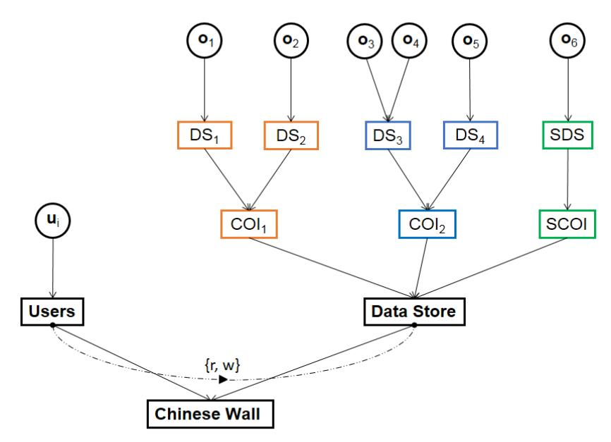

**Figure B.1 – Example Chinese Wall Policy**

<span id="page-89-0"></span>To capture the Chinese Wall read and write rules, an elaborate obligation needs to be defined for each COI attribute and any DS attributes contained by the COI attribute. The obligation needs also to specify the treatment of sanitized objects within the SDS and SCOI. The following template indicates the structure of the pattern and response components of each obligation in accordance with the respective grammars for them specified in Annex A:

(x, **any user of attribute** Users **performs operation** read **on any policy element in** COIi, **if object** *getobjectid***() in object attribute** DSj **then** 

**deny user** *process\_user***(***getprocessid***()) access right** read **on elements of intersection of policy element** COIi**, complement of policy element** DSj**,**

**deny process** *getprocessid***() access rights** read**,** write **on elements of intersection of complement of policy element** DSj**, complement of policy element** SDS**, deny process** *getprocessid***() access right** write **on elements of policy element** SDS**,**

```
if object getobjectid() in object attribute DSk then 
  deny user process_user(getprocessid()) access right read on elements of intersection of 
  policy element COIi, complement of policy element DSk,
  deny process getprocessid() access rights read, write on elements of intersection of 
  complement of policy element DSj, complement of policy element SDS,
  deny process getprocessid() access right write on elements of policy element SDS,
if object getobjectid() in object attribute DSl then 
  … )
```

For the example policy configuration illustrated in Figure B.1, the following two obligations would be defined as representative of the Chinese Wall read and write rules:

```
(x, any user of attribute Users performs operation read on any policy element in COI1, 
if object getobjectid() in object attribute DS1 then 
  deny user process_user(getprocessid()) access right read on elements of intersection of 
  policy element COI1, complement of policy element DS1,
  deny process getprocessid() access rights read, write on elements of intersection of 
  complement of policy element DS1, complement of policy element SDS,
  deny process getprocessid() access right write on elements of policy element SDS, 
if object getobjectid() in object attribute DS2 then 
  deny user process_user(getprocessid()) access right read on elements of intersection of 
  policy element COI1, complement of policy element DS2,
  deny process getprocessid() access rights read, write on elements of intersection of 
  complement of policy element DS2, complement of policy element SDS,
  deny process getprocessid() access right write on elements of policy element SDS)
```

(x, **any user of attribute** Users **performs operation** read **on any policy element in** COI2, **if object** *getobjectid***() in object attribute** DS3 **then** 

**deny user** *process\_user***(***getprocessid***()) access right** read **on elements of intersection of policy element** COI2**, complement of policy element** DS3**,**

**deny process** *getprocessid***() access rights** read**,** write **on elements of intersection of complement of policy element** DS3**, complement of policy element** SDS**,**

**deny process** *getprocessid***() access right** write **on elements of policy element** SDS**,**

**if object** *getobjectid***() in object attribute** DS4 **then deny user** *process\_user***(***getprocessid***()) access right** read **on elements of intersection of policy element** COI2**, complement of policy element** DS4**,**

**deny process** *getprocessid***() access rights** read**,** write **on elements of intersection of complement of policy element** DS4**, complement of policy element** SDS**,**

**deny process** *getprocessid***() access right** write **on elements of policy element** SDS)

These obligations complete the description of one possible mapping between NGAC and the Chinese Wall policy models.

## <span id="page-90-0"></span>**B.3 Role-based access control**

### **B.3.1 Background**

The Role Based Access Control (RBAC) model governs the access of a user to information through roles for which the user is authorized to perform. RBAC is based on several entities: users, roles, permissions, sessions, and objects [RBAC04]. A user represents an individual or an autonomous entity of the system. A role represents a job function or job title that carries with it some connotation of the authority held by a member of the role. Access authorizations on objects are specified for roles instead of users. A role is, fundamentally, a collection of permissions to use resources appropriate for carrying out a particular job function, while a permission represents a mode of access to one or more objects that represent the resources of a system.

The principle of least privilege requires that a user be given no more privilege than necessary to perform a job. The RBAC model supports this principle through role activation. Users are given authorization to

operate in one or more roles, and they can gain access to a role only via a session. A user may invoke one or more sessions, and each session relates a user to one or more roles. Within the RBAC model, the concept of a session is equivalent to the more traditional notion of a subject. When a user activates a role to operate within, it acquires the capabilities assigned to the role. Other roles authorized for the user, which have not been activated, remain dormant, and the user does not acquire their associated capabilities.

Another important feature of RBAC is role hierarchies, whereby one role at a higher level can acquire the capabilities of another role at a lower level through an explicit inheritance relation (i.e., role x ≥ role y means that role x inherits the permissions of role y). A user assigned to a role within a role hierarchy acquires the capabilities of any roles lower in the hierarchy as well as those capabilities directly attributed to the role. Standard RBAC also provides features to express policy constraints involving Separation of Duty (SoD) and cardinality. SoD is a security principle used to formulate multi-person control policies in which two or more roles are assigned responsibility for the completion of a sensitive transaction, but a single user is allowed to serve only in some distinct subset of those roles (e.g., not allowed to serve in more than one of two transaction-sensitive roles). Cardinality of a role limits its capacity to a fixed number of users. Cardinality constraints were incorporated into SoD relations in the RBAC standard.

Two types of SoD relations exist: Static Separation of Duty (SSD) and Dynamic Separation of Duty (DSD). SSD relations place constraints on the assignments of users to roles, whereby membership in one role prevents the user from becoming a member of certain other roles and thus ensures the involvement of two or more users in performing a sensitive transaction that requires the capabilities of two or more roles. Dynamic separation of duty relations, like SSD relations, limit the capabilities that are available to a user while adding operational flexibility by placing constraints on roles that can be activated within a user's sessions. As such, a user may be a member of two roles in DSD but unable to execute the capabilities that span both roles within a single session.

## **B.3.2 Mapping considerations**

A formal model exists for RBAC, which can be used to formulate a mapping to its abstractions from those available in the NGAC model. In the RBAC standard, a role essentially represents a collection of users mapped to a collection of permissions [RBAC04]. Each permission in turn represents a collection of object and access right pairs. RBAC user to role mappings can be characterized in NGAC as administrative associations from user attributes uniquely representing each user to user attributes uniquely representing each role. RBAC permission to role mappings can be characterized in NGAC as associations from the role-representing attributes to the object attributes of each object, through which roles are authorized appropriate access rights comparable with the RBAC permissions in question. In addition, several other important aspects of policy representation also need to be considered when defining a complete mapping between NGAC and RBAC, namely compliance with the principle of least privilege, the expression of role hierarchies, and the imposition of Separation of Duty (SoD) constraints.

Role activation plays an essential part in maintaining the principle of least privilege. RBAC allows activation of a subset of the roles assigned to a user via a session, limiting the privileges of the user to those available through its active roles. Least privilege and role activation(\deactivation) concepts can be accommodated in NGAC through the processes acting on behalf of a user and the assignments representing user to role mappings, which the processes make(\break) from a distinguished user attribute uniquely representing the user to the set of role-representing attributes. Obligations are not needed for core RBAC. However, for hierarchical RBAC, they can be employed to constrain role activation capabilities conveyed by the administrative associations and enforce the desired behavior.

78 Assignments between pairs of role-representing attributes in NGAC can be used to represent RBAC role hierarchies in which the attribute at the tail of the assignment inherits the properties of the attribute at the head. Inheritance of properties between role-representing attributes in NGAC are sufficient in and of themselves to entirely capture the property inheritances of the corresponding RBAC roles. One area to be addressed, however, is mitigating the effect of administrative associations that represent user to role mappings, which involve role-representing attributes within a role hierarchy. Since these associations are formed between user attributes and role-representing attributes, hierarchical roles may impart unwanted

authorizations over role activation to a user. Prohibitions are used to countermand any unwanted authorizations and render an accurate mapping.

A significant difference exists in the approach used between the NGAC and RBAC models for expressing SoD constraints. In RBAC, both are explicitly represented in the policy configuration via relations, and access enforcement is based on the policy configuration, which remains static. NGAC, however, provides no direct counterpart for explicitly representing RBAC SoD constraints through a static policy configuration. Instead, these properties need to be expressed indirectly through the pattern and response components of defined obligations, which dynamically change the policy configuration to enforce these constraints as both administrative and resource operations are being carried out. That is, SoD constraints are specified indirectly through the pattern and response grammars of obligations defined in the policy configuration, but enforcement of these constraints requires modification of the policy configuration as their respective obligations are triggered.

To capture a static SoD constraint, an obligation is defined which is triggered by the creation of an administrative association granting a user authority to create an assignment to a role-representing attribute involved in a static SoD role. The obligation's response checks the conditions of the SoD constraint and when the SoD constraint limit is reached, creates a prohibition that denies the user from involvement in further administrative associations to all other roles involved in the SoD constraint. A complimentary obligation is also defined which is triggered whenever an association from a user to an SoD role is removed and deletes the prohibition originally put in place to block associations to other roles involved in the SoD constraint.

Dynamic SoD constraints are handled similarly to static SoD constraints. An obligation is defined which is triggered whenever a user activates a dynamic SoD role through administrative privileges initially assigned to it. The obligation's response checks the conditions of the dynamic SoD constraint and, using a prohibition, denies the user from activating other roles involved in this constraint, when the constraint limit is reached. A complimentary obligation is also be defined to undo the above. The obligation is triggered whenever an assignment from a user to an SoD role is removed and deletes the obligation originally put in place to block activation of other roles involved in the SoD constraint.

### **B.3.3 Example mapping**

#### **B.3.3.1 Constituent analysis**

For NGAC to represent an arbitrary RBAC policy, the following key policy elements and relations are needed:

- a) a set of user attributes representing each RBAC role, {R1, … , Rn}, where Ri is the name of the ith role;
- b) a set of user attributes representing each RBAC user, {U1, … , Un}, where Ui is the name of the ith user;
- c) a finite set of object attributes representing each RBAC object, {O1, … , On}, where Oi is the name of the ith object;
- d) a set of associations from each RBAC role to the RBAC objects over which it has the authority designated by the access rights, which represents the RBAC permission assignment relation;
- e) a set of administrative associations from each RBAC user to the RBAC roles to which it is assigned (granting the administrative access right assign-to), together with a set of administrative associations from each RBAC user to itself (granting the administrative access right assign-from), which jointly represent the RBAC user assignment relation;
- f) a set of assignments between RBAC roles involved in an RBAC role hierarchy, which represent the inheritance structure of the properties acquired from an inferior role by a superior role; and
- g) a set of obligations that constrain the assignment and activation of RBAC roles, such that the allowed behavior of RBAC users complies with RBAC SoD constraints.

An example policy configuration that exhibits the most important features of the RBAC model is illustrated in Figure B.2. To keep the example simple only five roles are involved, which could be considered representative of a larger set of roles for a software development company. Two of the roles, Employee

and Contractor, are mutually exclusive of one another; a user can be assigned to either one, but not both. Therefore a static SoD constraint applies to these roles. The remaining roles, Software Engineer, Quality Assurance (QA) Engineer, and Team Member, are involved in a role hierarchy in which the Software and Quality Assurance Engineer roles are each superior to the Team Member role. A dynamic SoD constraint also applies to the two superior roles, preventing a user from being active in both roles simultaneously.

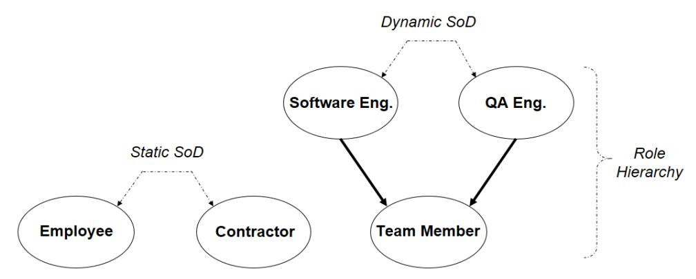

**Figure B.2 – RBAC Policy Configuration**

<span id="page-93-0"></span>In terms of the permissions allocated to each role, only certain basic objects and operations are included in the example for simplicity. The Employee role is assigned permissions to access certain company policy documents that are not privy to the Contractor role. A static SoD constraint prevents a user from being assigned to both roles. New users in either of these roles may initially be assigned to the Team Member role, which would allow them to begin reading over requirements, designs, and other documentation pertaining to on-going projects. Depending on the skill set, a user is eventually authorized to work in the Software Engineer (SE) role only, in the QA Engineer (QAE) role only, or in both roles nonsimultaneously. The SE role allows project code to be produced and modified, while the QAE role allows project code to be written and certified and test cases to be produced and modified. A dynamic SoD constraint prevents a user authorized to work in both the SE and QAE roles from activating both of these roles simultaneously.

For this example, only a single user is discussed. The user in this example is an employee authorized to work as a software engineer on the project team, with no assigned QA engineering responsibilities.

The NGAC equivalent representation of this RBAC policy configuration contains considerably more detail. It encompasses not only the five RBAC roles and role hierarchy relation depicted in Figure B.2, but also the permissions, objects, permission assignment relations, users, and user assignment relations that underlie an RBAC policy. To better explain how the mapping applies, the details of the NGAC representation of the RBAC policy are decomposed into several segments. The first segment is the NGAC representation of roles and role hierarchies (see B.3.3.2). The second segment is the representation of permissions and the permission assignment relation (see B.3.3.3). This is followed by the third segment (see B.3.3.4), which is the representation of users and the user assignment relation. The fourth and final segment is the representation of RBAC SoD constraints (see B.3.3.5).

### **B.3.3.2 Roles and role hierarchy**

Figure B.3 illustrates the first segment of the policy representation in NGAC, which serves as the foundation for the other segments. Three main attribute containers comprise the RBAC policy class: Users, Roles, and Objects. These containers are not essential to the mapping; they are intended as an organizational reference for the reader. Within the Roles container, located at the center of the diagram, are the role-representing attributes for the five RBAC roles. Assignments from the SE and QAE user attributes to that of Team Member represent the equivalent of the role hierarchy relation. The remaining assignments link the Employee, Contractor, and Team Member user attribute containers to the Roles container and complete this segment.

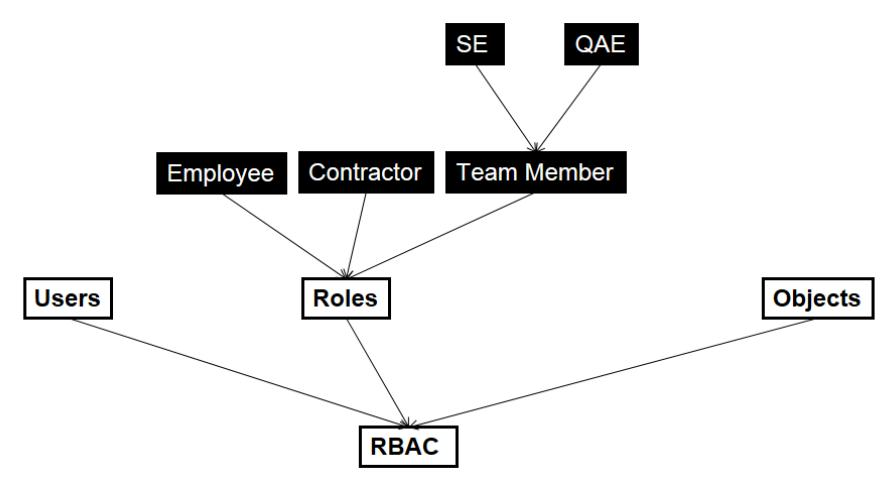

**Figure B.3 – Roles and Role Hierarchy Representation**

## <span id="page-94-0"></span>**B.3.3.3 Permission assignment**

Figure B.4 illustrates the second segment of the policy representation. Several object attributes are specified, which serve as containers for the various categories of information discussed in the RBAC policy description, namely program code (Code), test cases (Tests), code certifications (Certs), documentation (Docs), and company policies (Policies). Associations, represented as arcs from the various role-representing attributes to these containers, assign the authority denoted by the access right set over the containers and their contents. For instance, the association between QAE and Tests grants the QAE role (and any user active within the role) the authority to read (r) and write (w) any objects assigned to Tests. The association also grants the QAE role the same authority over objects assigned to Certs through inheritance. In this fashion, the NGAC association relation is used to realize the RBAC permission assignment relation.

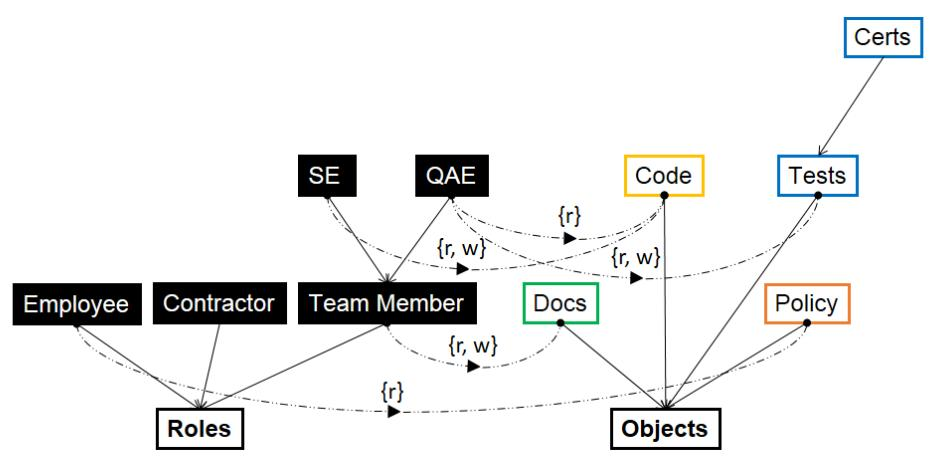

**Figure B.4 – Permission Assignment Representation**

#### <span id="page-94-1"></span>**B.3.3.4 User assignment**

The third segment of the NGAC policy representation is shown in Figure B.5. A single user ui is depicted in the diagram, along with a unique user attribute Ui to which it is assigned. The main purpose of the user attribute is to specify associations that are applicable to the user. As mentioned earlier, user ui needs to be able to activate the Employee, Team Member, and SE roles. Therefore, three associations are needed: between Ui and itself, Ui and Employee, and Ui and Team Member. The first association grants authorization for the user to create or delete an assignment from itself to another user attribute over which it holds authorization to complete the assignment operation. The remaining two associations grant authorization for the user to complete the creation or deletion of an assignment to the Employee and

Team Member attributes, respectively. As before, the associations are represented as downward looping arcs labeled with the appropriate access rights.

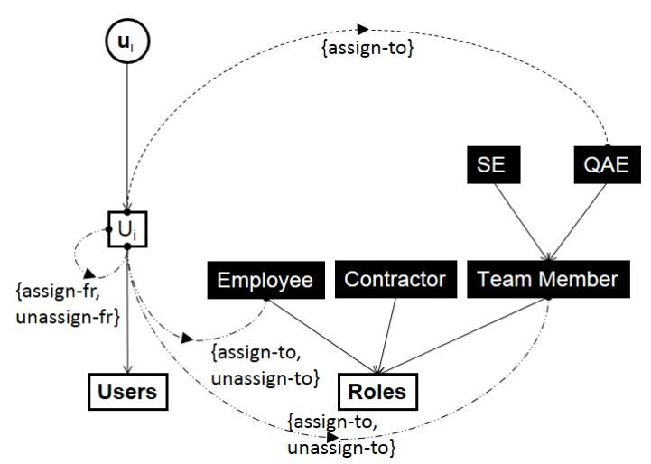

**Figure B.5 – User Assignment Representation**

<span id="page-95-0"></span>The associations essentially serve as the counterpart to the RBAC user assignment relation. With these associations in place, the user can activate any of the three intended roles (i.e., Employee, Team Member, or SE), and additionally the QAE role, by creating an assignment from itself to the corresponding role-representing attribute. To prevent the activation of the QAE role by this user, an attribute prohibition is added to the specification, which overrides any attempts to create an assignment between the user ui and the QAE role. The prohibition is shown as an upward looping arc from the user attribute Ui to the QAE role.

It is the creation of an assignment to a role-representing attribute that allows the user to activate a role and gain the authority assigned to the role. A process launched by the user to operate on its behalf does so under the user's authority, thus allowing the user to operate within the activated role in addition to any other role previously activated by the user. By deleting an existing assignment between itself and the corresponding role-representing attribute, the user can deactivate a role.

### **B.3.3.5 SoD constraints**

The final area to be addressed in the fourth segment are the two RBAC SoD constraints. As noted earlier, obligations can be created to serve as counterparts to the SoD constraints. A pair of obligations are used to prevent any user from being assigned (in the RBAC sense of the word) to both the Employee and Contractor roles by an administrator (not shown). One obligation denies a user from active involvement in an association to the Contractor role via a prohibition, whenever an "assign-to/unassignto" association to the Employee role is created for the user. The other obligation simply reverses the Contractor and Employee roles in the first obligation. Similarly, if and when the association is deleted from either of these roles (e.g., an employee resigns and is hired by a contractor of the company), the prohibition placed on the other role is removed using a pair of complementary obligations. The following two pairs of obligations capture the static SoD constraint:

(x, **any user of attribute** Admin **performs operation** c-assoc **on policy element** Employee, **deny user attribute** *getua***() access rights** assign-to**,** unassign-to **on policy element** Contractor)

(x, **any user of attribute** Admin **performs operation** c-assoc **on policy element** Contractor, **deny user attribute** *getua***() access rights** assign-to**,** unassign-to **on policy element** Employee) (x, **any user of attribute** Admin **performs operation** d-assoc **on policy element** Employee, **delete deny user attribute** *getua***() access rights** assign-to**,** unassign-to **on policy element** Contractor)

(x, **any user of attribute** Admin **performs operation** d-assoc **on policy element** Contractor, **delete deny user attribute** *getua***() access rights** assign-to**,** unassign-to **on policy element** Employee)

The dynamic SoD constraint also requires two pairs of obligations for each role involved in the constraint. In this case, however, it is the creation of an assignment by a user from itself to the roles in question, SE or QAE, which serves as the trigger for the obligation. For this particular user, the SoD constraint has no direct bearing since it is committed exclusively to QAE. However, it is pertinent for any user configured to operate mutually exclusively in the SE and QAE roles. As with the static SOD constraint, enforcement is carried out through the creation and deletion of prohibitions. The following two pairs of obligations capture the dynamic SoD constraint:

(x, **any user of attribute** Users **performs operation** c-assign **on policy element** SE, **deny user** *process\_user***(***getprocessid***()) access right** assign-to **on policy element** QAE)

(x, **any user of attribute** Users **performs operation** c-assign **on policy element** QAE, **deny user** *process\_user***(***getprocessid***()) access right** assign-to **on policy element** SE)

(x, **any user of attribute** Users **performs operation** d-assign **on policy element** SE, **delete deny user** *process\_user***(***getprocessid***()) access right** assign-to **on policy element** QAE)

(x, **any user of attribute** Users **performs operation** d-assign **on policy element** QAE, **delete deny user** *process\_user***(***getprocessid***()) access right** assign-to **on policy element** SE)

These obligations complete the description of one possible mapping between NGAC and the RBAC policy models. The complete policy representation in NGAC for the example RBAC policy is shown in Figure B.6. For illustration purposes, the figure depicts several objects populated within the object containers and also a prohibition between Ui and Contractor, which would have been created when the user was assigned (in the RBAC sense) to the Employee role.

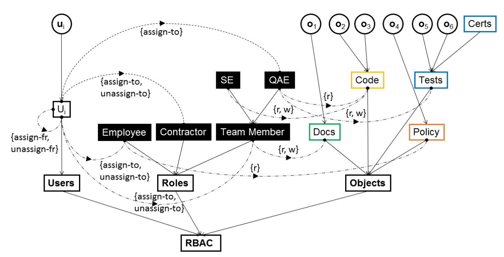

<span id="page-96-0"></span>**Figure B.6 – Complete NGAC Policy Representation**

## <span id="page-97-0"></span>**B.4 Bibliography**

The following publications provide useful background and additional details for understanding the examples of this annex.

**BREW89** David Brewer, Michael Nash, The Chinese Wall Security Policy, *IEEE Symposium on Security and Privacy*, May 1989.

**RBAC04** ANSI INCITS 359-2004, *American National Standard for Information Technology – Role Based Access Control.*

**SAND92** Ravi S. Sandhu, Lattice-Based Enforcement of Chinese Walls, Computers & Security, Volume 11, Number 8, December 1992, pages 753-763.

## **Annex C**

(informative)

## **Policy computations**

## <span id="page-98-1"></span><span id="page-98-0"></span>**C.1 Introduction**

Like other involved computations, the choice of algorithms used to perform the various policy computations required of an implementation can greatly affect performance. The computations at the center of the NGAC framework are the determination of the access rights a user has to objects, the adjudication of an access request from a user, and the display of relevant objects for reviews by a user. Fortunately, efficient algorithms exist to perform key NGAC policy computations. This annex describes in detail an efficient algorithm to calculate the access rights a user has to objects representing resources. The algorithm can also be easily adapted to make various other key policy determinations.[2](#page-98-3)

## <span id="page-98-2"></span>**C.2 Background**

A simple policy is used to illustrate the steps of the basic algorithm. In this example, a savings and loan bank comprised of several branches has the following policy:

- a) Tellers can read and write accounts only for the branches to which they are assigned; and
- b) Loan officers can read and write loans only for the branches to which they are assigned.

A representation of the policy, populated with several users (viz., u1, u2 and u3) and objects (viz., l11, l12, a11 and a21), is shown in Figure C.1. Assignments are depicted as blue or green arrowed lines emanating from an attribute, user or object to another policy element. Associations are depicted as red dashed lines that span two attributes and are labeled with access rights. Two policy classes are in effect: the branch-constraints policy class, which contains attributes, users, and objects linked via blue assignments; and the position-constraints policy class, which contains attributes, users, and objects linked via green assignments.

Associations between policy elements of the branch-constraints policy class allow employees assigned to one or more branches to access only the products that pertain to those branches (i.e., their respective accounts and loans). Associations between policy elements of the position-constraints policy class allow employees assigned to a position to access only the types of assets that pertain to their position.

The algorithm utilizes the Directed Acyclic Graph (DAG) of the assignment relation, illustrated in Figure C.1, as the basis for processing. Each policy element (i.e., a user, object, attribute, and policy class) is a node of the DAG and each assignment is a directed edge between two nodes. The association relation is also depicted in Figure C.1 by the red dashed lines between nodes.

<span id="page-98-3"></span> <sup>2</sup> The algorithm in this annex is based on that described in the following journal article: Peter Mell, James Shook, Richard Harang and Serban Gavrila, *Linear Time Algorithms to Restrict Insider Access using Multi-Policy Access Control Systems*, Journal of Wireless Mobile Networks, Ubiquitous Computing, and Dependable Applications, vol. 8, num. 1, March 2017, pp. 4-25, URL: [http://isyou.info/jowua/papers/jowua-v8n1-1.pdf.](http://isyou.info/jowua/papers/jowua-v8n1-1.pdf)

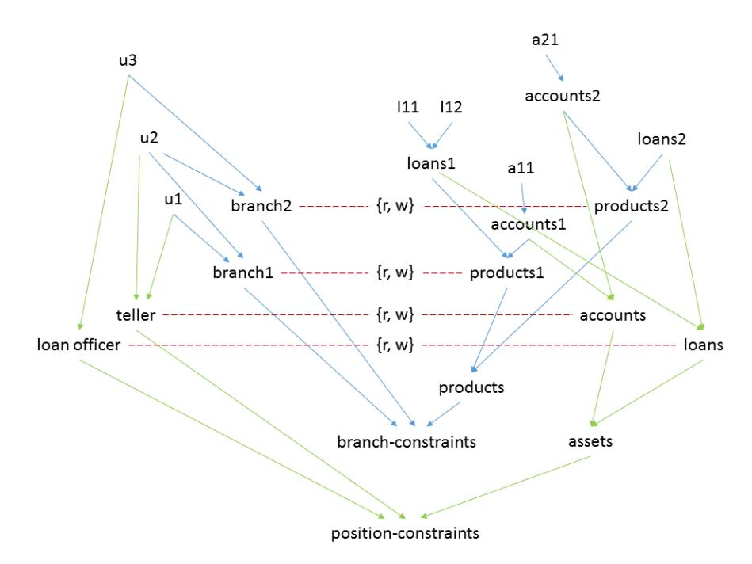

**Figure C.1 – Simple Bank Policy Representation**

<span id="page-99-1"></span>The algorithm's computations entail traversing the assignment relation DAG in various directions. The data structures chosen to represent the graph should be well suited for this purpose. The algorithm, for instance, uses an adjacency list representation for the immediate successors of a node, implemented as a dictionary that maps a key (i.e., a node) to a value (i.e., a list of immediate successors) via a hash, which allows quick traversal of directed paths emanating from a node. A second dictionary, representing the immediate predecessors of a node is also used to allow quick traversal of directed paths leading to a node.

## <span id="page-99-0"></span>**C.3 Algorithm details**

To compute the access rights a user holds over objects, the algorithm traverses the policy graph vertically in both downward and upward directions. A downward direction in the DAG refers to processing from the tail of a node toward defined policy classes, and an upward direction refers to processing from the head of a node toward defined users or objects. The objective in this example is to determine the set of objects accessible to user u1 and the set of access rights authorized to u1 for each of them.

### **C.3.1 Find the source association nodes**

The algorithm begins with the user in question, traversing downward via a breadth-first search to identify all reachable user attribute nodes that are source nodes of an association (i.e., the first term of one or more defined associations) along with the set of associations concerned. From this point on, only the source association nodes and their corresponding associations require further consideration.

Figure C.2 illustrates the source association nodes identified in this example for user u1: **teller** and **branch1**. Each source node involves a single read and write association to a destination node.

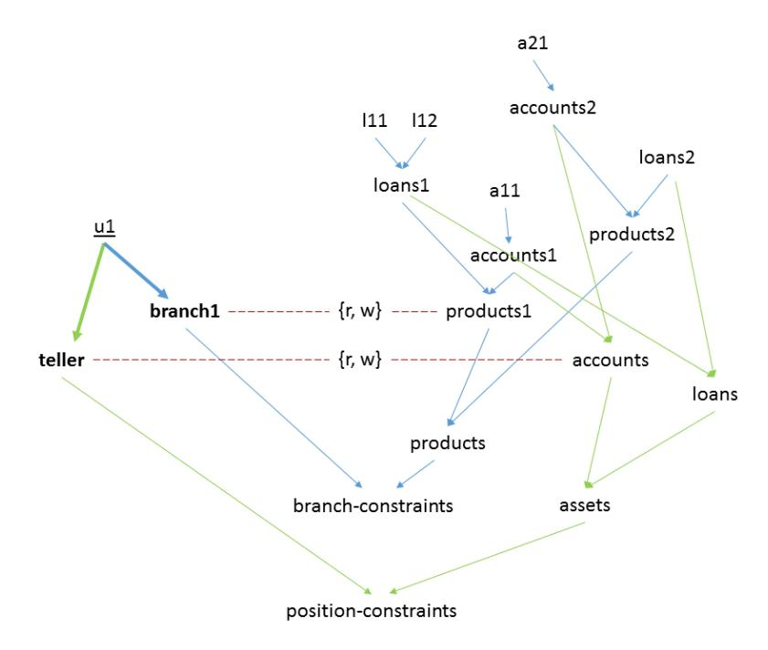

**Figure C.2 – Source Association Nodes**

## <span id="page-100-0"></span>**C.3.2 Find the destination association nodes**

For each association from an identified source association node, the respective destination node of the association (i.e., the third term of the association) is then identified. Each identified destination node (i.e., an object attribute) is labeled with the set of access rights of the association.[3](#page-100-1) The algorithm labels a destination node using a node attribute (i.e., a dictionary with the node as a key), which can be assigned and return various data structures (e.g., a set, list, or dictionary) based on the key provided. In this case, a set of access rights is assigned. Since a destination node may be involved in multiple associations, labeling requires forming the union of the set of access rights of each association that references the destination node.

Figure C.3 illustrates the destination association nodes identified in this example, which would be labeled as follows: **products1** – {r, w} and **accounts** – {r, w}.

<span id="page-100-1"></span>

 <sup>3</sup> While all the destination nodes in this example are object attributes in general, this may not always be the case. Policies can be constructed using associations that involve user attribute destination nodes, which are ignored in this computation since the purpose is to identify accessible objects representing resources. However, this algorithm can be easily altered to address user attributes and users if their accessibility is of interest.

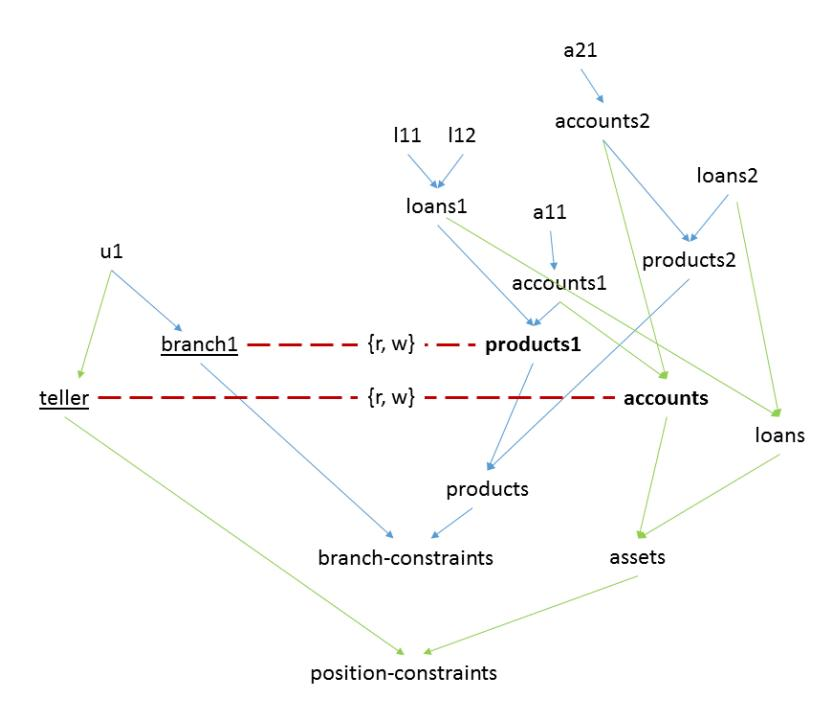

**Figure C.3 – Destination Association Nodes**

## <span id="page-101-0"></span>**C.3.3 Find the objects of interest**

The set of objects of interest for the user can now be identified by performing a reverse-edge, breadthfirst search upward from the set of destination association nodes identified, treating the destination nodes as the first iteration of the search. Any object attribute node that is not on a reverse path from a destination node to an object node can be ignored.

Figure C.4 illustrates the objects of interest identified in this example, which are as follows: **l11**, **l12** (via products1 and loans1), **a11** (via products1 and accounts1 and also accounts and accounts1), **a21** (via accounts and accounts2).

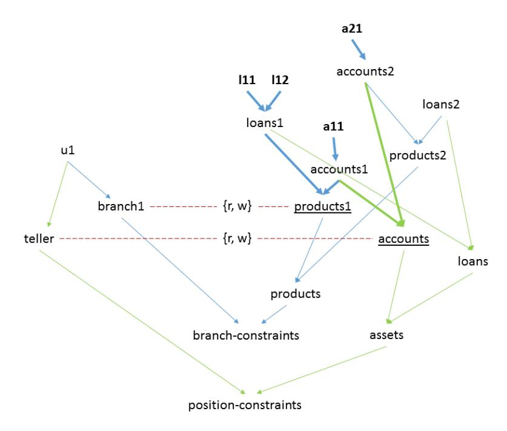

**Figure C.4 – Objects of Interest**

## <span id="page-102-0"></span>**C.3.4 Determine the policy classes that contain an identified object**

The computation of a privilege requires knowledge of the policy classes that contain an object of interest. To make this determination, the algorithm performs a topological ordering of the nodes containing each object of interest using a recursive, depth-first search. When a policy class node is visited, the algorithm retains the policy class identifier and uses it to cumulatively label each of its ancestor nodes as they are subsequently processed such that each node, including the object of interest, eventually records the set of policy class nodes that contain it. The policy class information recorded at an object attribute node is reused when processing the remaining objects of interest in lieu of reprocessing and relabeling the node, which is a critical aspect of the algorithm's performance.

Figures C.5 and C.6, illustrate the traversal of the DAG for two of the four objects of interest in this example: l11 and a11. Note that in the traversal for a11, the processing of certain nodes is skipped, which is indicated by dashed arrows.

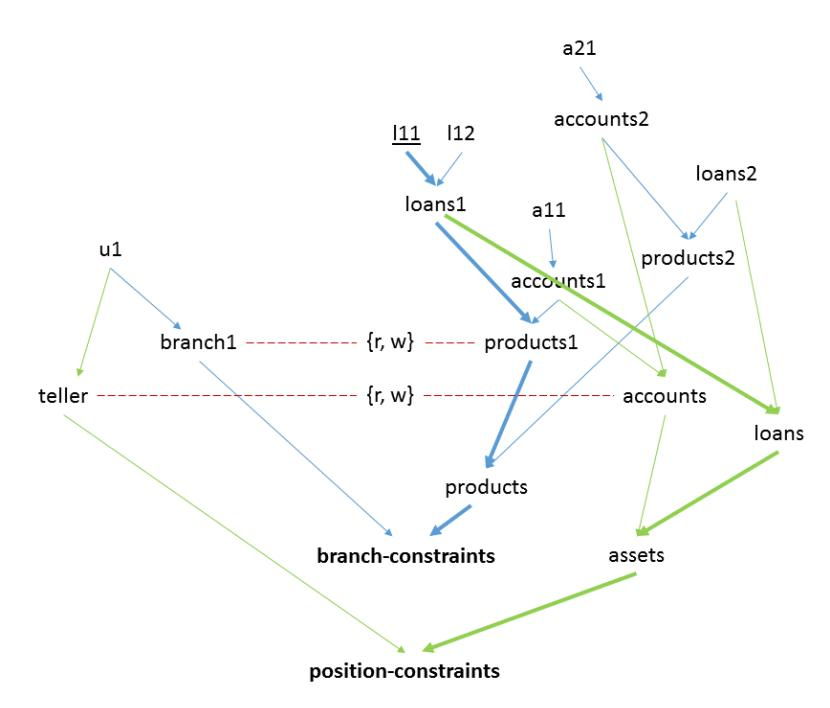

<span id="page-103-0"></span>**Figure C.5 – Depth-First Search from Object l11 to Policy Classes**

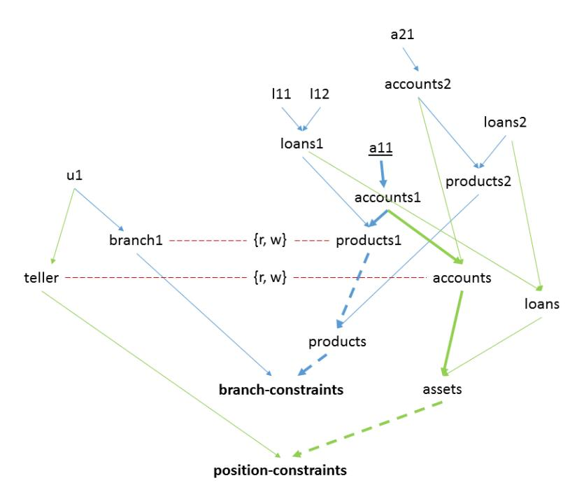

**Figure C.6 – Depth-First Search from Object a11 to Policy Classes**

<span id="page-103-1"></span>The results from this stage of processing indicate that all four objects of interest—l11, a11, l12, and a21— are contained by both the branch-constraints (bc) and product-constraints (pc) policy classes. The policy class labeling assignments to nodes of the DAG are summarized below for l11 and a11 and also for l12 and a21. Each node is prefixed with a pair of integers that indicate the step at which processing began and ended for the node, respectively. For the second, third, and fourth objects of interest on which the depth-first search occurs, some of the nodes encountered are already labeled, allowing the algorithm to avoid reprocessing them.

## **Steps: Node – Policy Class Access Rights** 01/16: l11 – {bc, pc}; 02/15: loans1 – {bc, pc} 03/08: products1 – {bc} {r, w} 04/07: products – {bc} 05/06: **bc** 09/14: loans – {pc} 10/13: assets – {pc} 11/12: **pc** 01/10: a11 – {bc, pc}; 02/09: accounts1 – {bc, pc} 03/04: products1 – {bc} {r, w} skip/-: products – {bc} skip/-: **bc** 05/08: accounts – {pc} {r, w} 06/07: assets – {pc} skip/-: **pc** 01/04: l12 – {bc, pc}; 02/03: loans1 – {bc, pc} skip/-: products1 – {bc} {r, w} … 01/10: a21 – {pc, bc}; 02/09: accounts2 – {pc, bc} 03/08: accounts – {pc} {r, w} skip/-: assets – {pc} … 04/07: products2 – {bc} 05/06: products – {bc} skip/-: **bc**

## **C.3.5 Determine the access rights that pertain to a containing policy class**

When performing the depth-first search described above, additional details about processed nodes can be propagated upward to the object of interest. The algorithm takes advantage of this opportunity to label nodes with additional information concerning access rights.

When the identifier of a policy class node is used to label its ancestor nodes during the depth-first search, the ancestor node can instead be labeled with a mapping from the policy class identifier to the set of prevailing access rights for the ancestor node, which may be the empty set. The prevailing access rights of a node are null unless a reachable destination node has been processed and labeled with a mapping from the policy class node to the access right label previously assigned to the destination node.

The algorithm uses a dictionary for the policy class-to-access rights mapping in which the key is a policy class node and the value is a set of access rights. The behavior of the depth-first search allows the policy class dictionaries to be propagated upward to the object of interest. When processing a node in which two or more successor nodes are labelled with policy class dictionaries, the node is labelled with the union of those dictionaries whose keys are the union of the keys from each successor dictionary and whose values are the union of the values for each identical key from each successor dictionary. The determination of policy class-to-access rights mapping for each object of interest in this example is summarized below.

### Steps: Node - Policy Class Access Rights Policy Class to Access Rights Mapping

```
01/16: I11 - \{bc, pc\};
                                                                                 bc \rightarrow \{r, w\}, pc \rightarrow \{\}
                                                                                 bc \to \{r,\,w\},\,pc \to \{\}
02/15: loans1 – {bc, pc}
03/08: products1 – {bc}
                                                                                 bc \rightarrow \{r, w\}
                                                   {r, w}
04/07: products – {bc}
                                                                                 bc \rightarrow \{\}
05/06: bc
09/14: loans – {pc}
                                                                                 pc \rightarrow \{\}
10/13: assets – {pc}
                                                                                 pc \rightarrow \{\}
11/12: pc
01/10: a11 – {bc, pc};
                                                                                 bc \rightarrow \{r, w\}, pc \rightarrow \{r, w\}
02/09: accounts1 – {bc, pc}
                                                                                 bc \rightarrow \{r, w\}, pc \rightarrow \{r, w\}
03/04: products1 – {bc}
                                                   {r, w}
                                                                                 bc \rightarrow \{r, w\}
skip/-: products – {bc}
                                                                                 bc \rightarrow \{\}
skip/-: bc
05/08: accounts – {pc}
                                                                                 pc \rightarrow \{r, w\}
                                                  {r, w}
06/07: assets – {pc}
                                                                                 pc \rightarrow \{\}
skip/-: pc
                                                                                 bc \rightarrow \{r, w\}, pc \rightarrow \{\}
01/04: 112 - \{bc, pc\};
02/03: loans1 - {bc, pc}
                                                                                 bc \rightarrow \{r, w\}, pc \rightarrow \{\}
skip/-: products1 – {bc}
                                                  {r, w}
                                                                                 bc \rightarrow \{r, w\}
...
01/10: a21 – {pc, bc};
                                                                                 pc \rightarrow \{r, w\}, bc \rightarrow \{\}
02/09: accounts2 – { pc, bc}
                                                                                 pc \rightarrow \{r, w\}, bc \rightarrow \{\}
03/08: accounts – {pc}
                                                                                 pc \rightarrow \{r, w\}
                                                  {r, w}
skip/-: assets - {pc}
                                                                                 pc \rightarrow \{\}
04/07: products2 – {bc}
                                                                                 bc \rightarrow \{\}
05/06: products – {bc}
                                                                                 bc \rightarrow \{\}
skip/-: bc
```

#### C.3.6 Determine the user's access rights for each object of interest

The final step of the algorithm is to determine the access rights authorized for the user using an object's dictionary of policy class to access rights mappings. For each object of interest, compute the intersection of the associated set of access rights of each policy class in its dictionary. The resulting set contains the user's access rights for the object. If no access rights remain, the object cannot be accessed.

The computation for user u1 in the example policy results in r, w access rights for object a11, as illustrated below.

#### Object of Interest Policy Class to Access Rights Mapping Access Rights Authorized

<span id="page-105-0"></span>

| l11 | $bc \rightarrow \{r, w\}, pc \rightarrow \{\}$     | none   |
|-----|----------------------------------------------------|--------|
| a11 | $bc \rightarrow \{r, w\}, pc \rightarrow \{r, w\}$ | {r, w} |
| l12 | $bc \to \{r, w\}, pc \to \{\}$                     | none   |
| a21 | $pc \rightarrow \{r, w\}, bc \rightarrow \{\}$     | none   |

## **C.4 Algorithm variants**

The basic algorithm described above and its search mechanisms can be adjusted to efficiently perform other policy computations. For example, a few simple changes are all that is needed to determine whether a user holds sufficient privileges to perform an operation on an object. First, as soon as the objects of interest are identified, intersect the object in question with the set of objects of interest to form a new set. An empty intersection equates to a deny decision (i.e., no access allowed) and termination of the algorithm. A singleton requires continuation of the algorithm but only with the one object of interest. Second, when the access rights authorized for a user are decided for the single object of interest at the end of the algorithm, determine whether the access rights are sufficient to perform the operation.

In this example policy, for instance, assume the following access request needs to be adjudicated: user: u1, op: read, object: a11. Intersecting a11 with the four objects of interest computed earlier returns the singleton, {a11}. The adjusted algorithm continues with the recursive, depth-first search, topological sort as described earlier but only for the one object of interest, a11. In this case, the algorithm does not skip certain nodes, as described previously, since no other objects of interest that would record information for reuse in the a11 depth-first search are being processed. Nevertheless, the algorithm determines the policy class to access rights mapping for object a11 as before, namely bc → {r, w}, pc → {r, w}. Since read and write resource operations map on a one-to-one basis to r and w access rights, the user's read access request can be granted.

## **Annex D**

(informative)

## **Accommodation of environmental attributes**

## <span id="page-107-1"></span><span id="page-107-0"></span>**D.1 Introduction**

Environmental attributes represent important circumstances or conditions regarding a real system that need to be taken into account within an access control policy. Environmental attributes are different from NGAC user and object attributes, which represent static characteristics and serve as containers for other policy items. Rather, environmental attributes represent dynamic characteristics, such as time of day, date, or threat level, which periodically change and whose values need to be ascertained by some entity (e.g., a system monitor). In other words, environmental attributes are not properties of users or objects. Instead, they represent measurable characteristics of the operational or situational context of the system in which access requests occur and can affect the outcome of requests.

Recall that the purpose of the EPP is to accept event contexts issued by the PEP and PDP and to process them against obligations that have been defined, which in turn triggers the event response for those obligations whose event pattern conditions are satisfied. This annex describes how to utilize the functionality of the EPP to process changes in environmental attributes, such as those pertaining to timerelated events (e.g., shift changes), equipment-related events (e.g., network path failure/restoration), or management-related events (e.g., changes in operational status).

## <span id="page-107-2"></span>**D.2 Approach**

Time is presumably the most prevalent environmental attribute employed in access control policies and can serve as a meaningful example of how NGAC can accommodate policies that require such attributes. As a simple case of a time-related policy condition, consider the situation where management decides that a collection of data should be made unavailable outside of 9-5 weekday business hours. Typically, attribute-based access control models handle this situation by encoding the access condition as a policy statement or rule (e.g., return a permit if the time attribute is between 9 a.m. and 5 p.m. and the day of the week is Monday through Friday), which is used to filter access requests made by users both inside and outside the periods of allowed access. NGAC accommodates such policies differently. Rather than filtering each attempted access with the conditions for authorized access, the policy is adjusted at appropriate times based on those conditions to restrict or allow users' access to the data collection.

The approach to adjusting policy based on changes in the environment requires an instance of a client application (i.e., a process) to monitor the attribute in question. For example, a client application could run as a software daemon to note the times of shift changes, as a network monitor to report changes in equipment status, or as a system management tool to adjust the system threat level. The client application, running under the auspices of an administrator, issues access requests to perform certain environmentally oriented operations. The event contexts of those successfully completed access requests reach the EPP and, in turn, trigger the event response of obligations, which carry out the required policy adjustments.

Applying this approach to an existing policy requires taking into consideration the details of the policy configuration and the policy items of interest. In this example, the steps within NGAC to restrict or allow users' access to the data collection are straightforward and summarized below.

First, the principal administrator would create the two administrative operations, offline and online, and develop a simple client application that employs or embodies a scheduler to enable its execution at 9 a.m. and 5 p.m. on weekdays. Upon execution, the client application would issue access requests that convey offline and online operations accordingly at the appointed hour.

Second, the administrator would establish an obligation that is triggered by the administrative operation, offline, to adjust the policy configuration to countermand the authorization that affected users hold to

access the data collection. For example, the obligation could either create one or more prohibitions that negate users' access to the data collection or brake the chain of assignments from the data collection to a policy class that enables users' access. A complementary obligation, triggered by the administrative operation, online, would also be established to restore the authority of users to access the data collection. Restoration could be done accordingly in this case by rescinding the prohibitions used to negate users' access to the data collection or by reestablishing the change of assignments from the data collection to the policy class affected earlier.

Finally, the principal administrator would either retain the authority to effect the online and offline operations for the data collection or delegate that authority to another user (e.g., the manager of the data collection or a secondary administrator). Note that if authority is delegated, the recipient should have the organizational responsibility for setting the period of availability of the data collection and be trusted to carry out that responsibility.

When the client application is launched, it runs as one of the processes under the authorization of its user. The client application instance would then initiate access requests via a PEP at appropriately scheduled times to place the data collection online or offline. An access request issued by a PEP takes the form (client application process, online or offline operation, sequence of requisite attributes). Upon receipt by the PDP, the access request is processed as any other administration access, triggering the obligation correspondent with the administrative operation. An offline operation triggers the obligation that blocks access to the data collection, while an online operation triggers the obligation that restores access.

## <span id="page-108-0"></span>**D.3 Example policy**

The bank policy from Annex C is used to illustrate the use of an environmental attribute to control access to the data collection. For this simple policy, a new user, u4, is introduced along with two new attributes, hq and data steward, which together represent a headquarters level assignment of u4 as the data manager for the entire organization's data collection of accounts and loans. These policy entities appear as bolded text in the revised policy shown in Figure D.1. Both the hq and data steward attributes have authorization to perform offline and online operations for the products and assets object attributes, respectively, via a pair of associations.

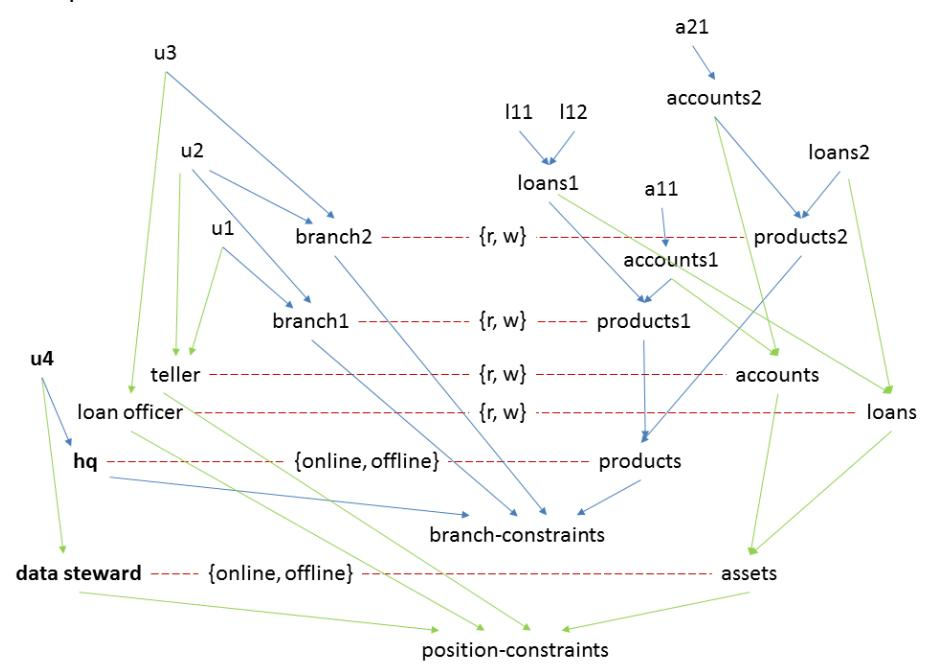

**Figure D.1 – Bank Policy Adjusted for Environmental Attributes**

<span id="page-108-1"></span>For this example, the principal administrator decides that the data steward will be allowed to govern the availability of the account and loan products of a branch selectively by branch. This gives the data steward the flexibility to take into account differences in the time zones of the branches as well as

differences in the hours of operation of a particular branch. To effect this capability, the principal administrator defines pairs of obligations for each branch. The first pair countermands the authority employees of a branch have to read or write the products of the branch using a prohibition, and the second pair removes the prohibition to restore read and write access for the branch. The pairs of obligations for branch1 and branch2 products are given below.

- (x, **any user of attribute** data steward **performs operation** offline **on policy element** products1, **deny user attribute** branch1 **access rights** r**,** w **on policy element** products1)
- (x, **any user of attribute** data steward **performs operation** online **on policy element** products1, **delete deny user attribute** branch1 **access rights** r**,** w **on policy element** products1)
- (x, **any user of attribute** data steward **performs operation** offline **on policy element** products2, **deny user attribute** branch2 **access rights** r**,** w **on policy element** products2)
- (x, **any user of attribute** data steward **performs operation** online **on policy element** products2, **delete deny user attribute** branch2 **access rights** r**,** w **on policy element** products2)

Note that other possibilities exist to express this policy. For example, instead of asserting a deny prohibition to countermand read and write access rights of branch employees and subsequently removing it, the read and write association between branch employees and branch products could have been deleted and restored. Note, too, that other variants of this policy could be easily expressed. For example, with a change in the obligations, the data steward could be given the flexibility to take the accounts and loans of a branch online and offline independently of one another. The data steward could also be authorized by the principal administrator to specify for itself the obligations needed to govern the availability of the data collection. More details about delegation of authority can be found in Annex E.

## **Annex E**

(informative)

## **Delegation of administrative responsibilities**

## <span id="page-110-1"></span><span id="page-110-0"></span>**E.1 Introduction**

Access control of the administration of policy is incorporated directly within the NGAC security model to govern who may edit policy and how they may edit it. That is, policy that governs access to the policy itself is specified in much the same way as policy that governs access to resources. This is enabled by the distinction made in the security model between administrative access rights and resource access rights. A resource access right is simply a traditional right that controls access to a resource (e.g., read and write resources), while an administrative access right controls access to policy items (e.g., create and delete associations). The security model constrains the delegation of administrative access similar to the way it constrains access to resources—namely, through attribute-based relationships.

NGAC relies on the existence of a principal administrator to establish and manage the policy for the entire framework. The principal administrator is a trusted entity with complete authority to perform all administrative commands. In practice, a single authority may be impractical for managing large complex policies. The delegation capability inherent to NGAC can be used to decentralize the administration of access policies. It allows an authority, such as the principal administrator, to delegate all or parts of its own authority or that of someone else to another user that in turn may be allowed to further delegate the authority it was delegated.

Typically, the principal administrator delegates its responsibilities by defining one or more administrative policy domains and selectively allocating authority to subordinate administrators assigned with the responsibility to manage them. A policy domain is a logical grouping of policy items within a policy configuration such that a collection of one or more users are allocated the required authorizations to govern within the defined boundary. The policy domain boundaries may be defined in the context of administrative, business, geographical, and political constraints.

Figure E.1 illustrates an example of decentralization in which policies maintained by NGAC are allocated into distinct subdomains for their efficient management. In this example, the principal administrator establishes a policy domain for two subdomains, designated as Domains X and Y and depicted in the figure by rectangles colored green and dark purple, respectively.

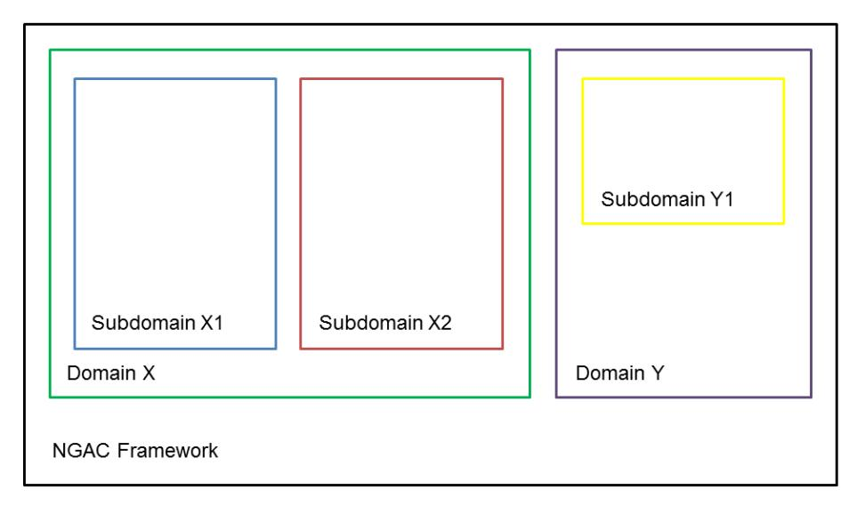

<span id="page-110-2"></span>**Figure E.1 – Policy Domains and Subdomains**

The administrators for each domain have the freedom to manage the entire domain themselves or subdivide it further and offload all or part of their duties to sub-administrators. The administrator for Domain X subsequently subdivides its domain into two subdomains, X1 and X2 (colored blue and redorange, respectively), and assigns sub-administrators to them. The administrator for Domain Y splits off only a portion of its domain into the Y1 subdomain (colored yellow) for a sub-administrator to manage, and it looks after the rest itself.

Delegating administrative responsibilities is an inherent capability of NGAC, achieved by using the basic elements and relations described in this standard. Delegation allows for the coexistence of multiple administrators with measured control over distinct portions of policy such that an interrelated and consistent policy can be defined and managed in a coordinated manner. Delegation of policy allows multiple sources of policy creation and requires that the resultant policies for each partition be formed in a coordinated manner to ensure proper operation.

## <span id="page-111-0"></span>**E.2 Policy domain definition**

The basic principles behind domain definition using basic elements and relations is illustrated with a simple example in Figure E.2. In this example, three levels of administration are depicted within a policy element diagram: the principal administrator (PA) of the NGAC framework, a domain administrator (DA), and two subdomain administrators (SA). The DA and SAs correspond to the administrators of Domain X and Subdomains X1 and X2, respectively, as shown in Figure E.1. The corresponding policy elements are colored accordingly. To keep Figure E.2 intelligible, the policy element diagram is shown unpopulated—no users or objects are assigned to the subdomain attribute containers illustrated.

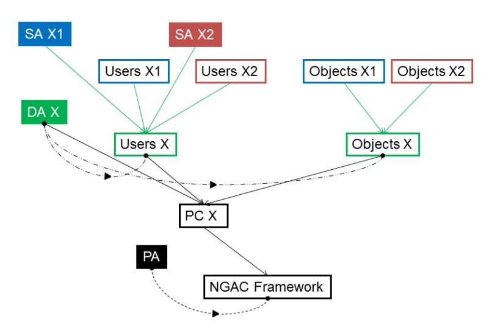

**Figure E.2 – Policy Element Diagram with Multiple Domains**

<span id="page-111-1"></span>The PA, with implicit overall authority for the NGAC framework, creates a policy class, labelled PC X, as the foundation for a new domain X. The PA creates three containers within PC X: DA X, a user attribute for the DA(s) managing the domain (i.e., the user(s) assigned to this attribute by the PA); Users X, a user attribute for the users operating within this domain; and Objects X, an object attribute for objects maintained within this domain. Authority is delegated to DA X via associations (shown as dashed arcs originating from DA X), which allow a designated administrator to create users or other containers and assign them to Users X, to create objects or other containers and assign them to Objects X, and to grant members of Users X access authority over objects and containers within Objects X.

The DA X uses its authorization to subdivide its domain into two subdomains, X1 and X2, and establish administrator(s) for each of them. To accomplish this, the DA creates six new containers, three for each subdomain, within the containers over which it has control (i.e., Users X and Objects X): SA Xi, a user attribute for the SA(s) managing subdomain i; Users Xi, a user attribute for the users operating within

subdomain i; and Objects Xi, an object attribute for objects maintained within subdomain i. The authority assigned to SA Xi via associations (not shown) allows a designated administrator to create users or other containers and assign them to Users Xi, to create objects or other containers and assign them to Objects Xi, and to grant members of Users Xi limited access authority over objects and containers within Objects Xi (i.e., the authority to create and destroy objects and containers and to read from and write to them).

Figure E.3 provides an illustration of the resulting policy element diagram in which containers have been rearranged to more clearly identify the defined domains, similar to that in Figure E.1. Figure E.3 also includes the aforementioned associations (shown as green dashed arcs) used by the DA to delegate authority to the SAs over the containers for the users and objects of their domain. Note that for this simple example, no prohibitions or obligations were needed. At this stage, the DA can continue to define policy domain Y following the principles used for domain X.

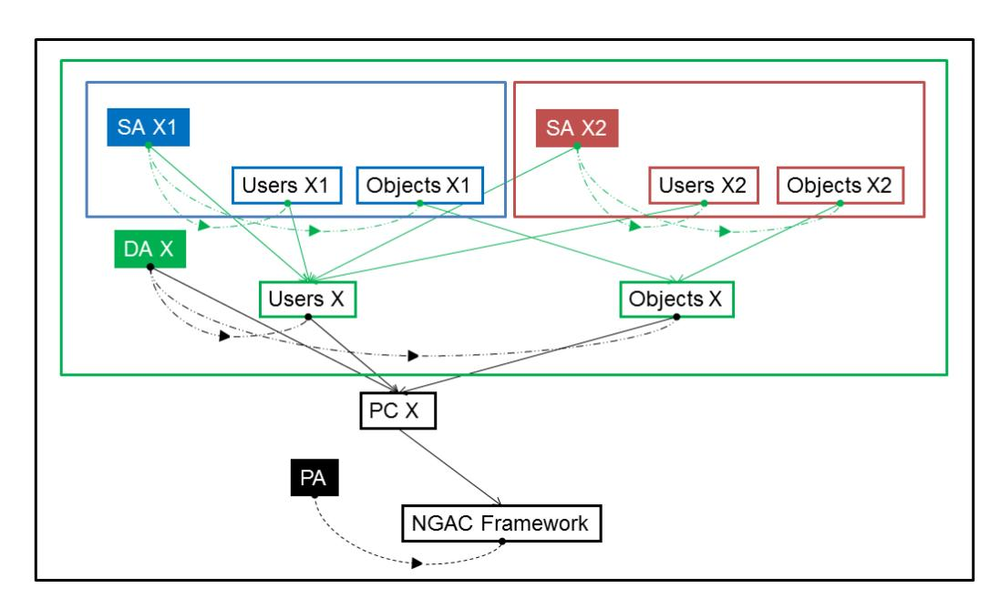

<span id="page-112-0"></span>**Figure E.3 – Policy Element Diagram with Highlighted Domains**