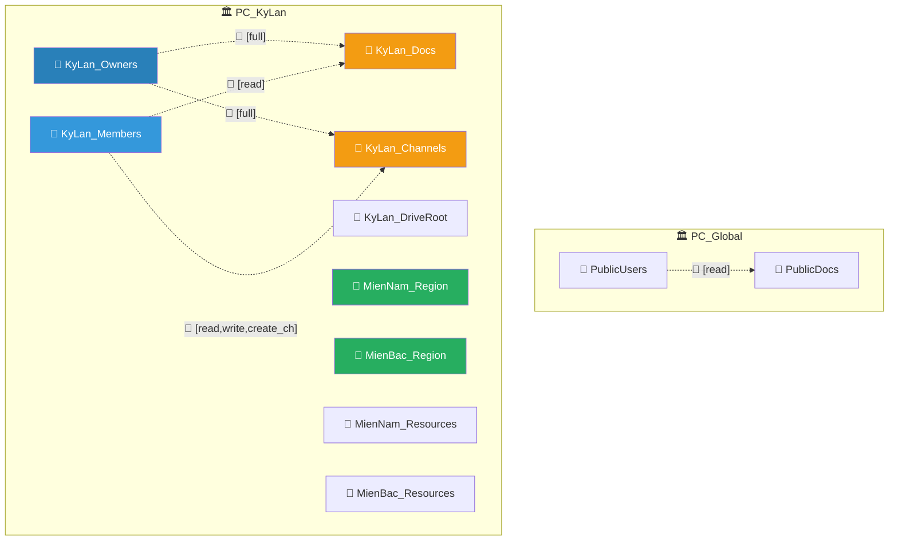
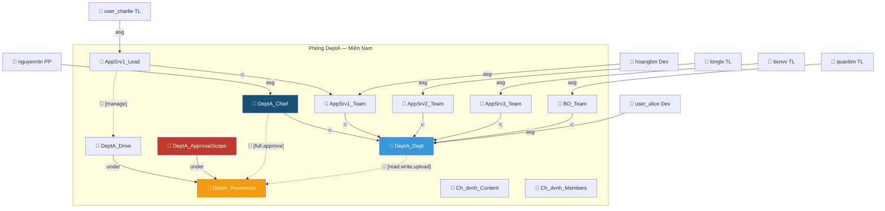
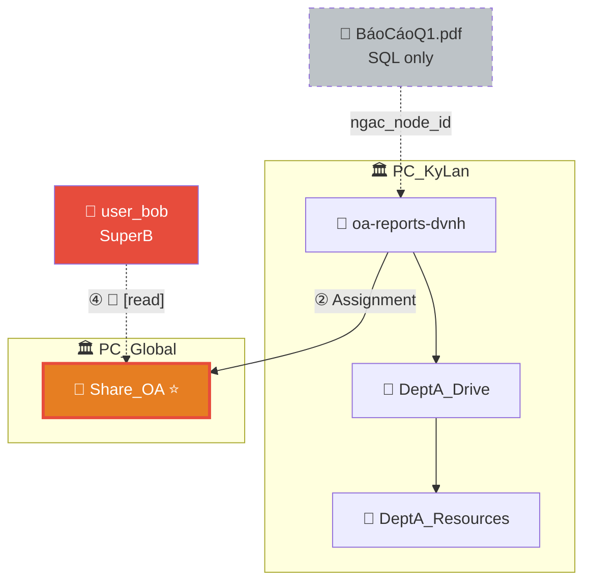
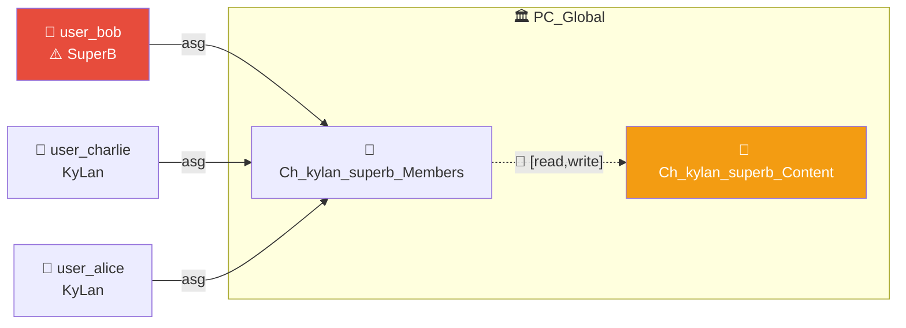
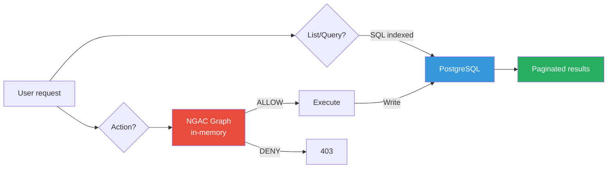
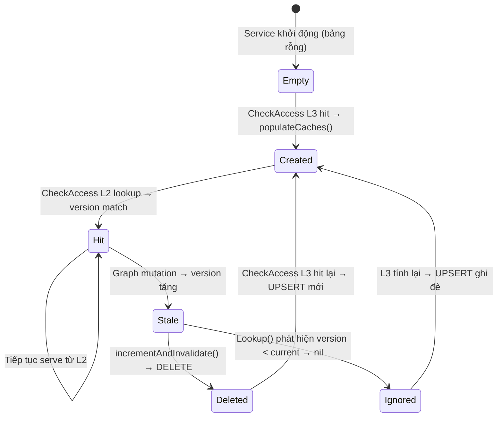
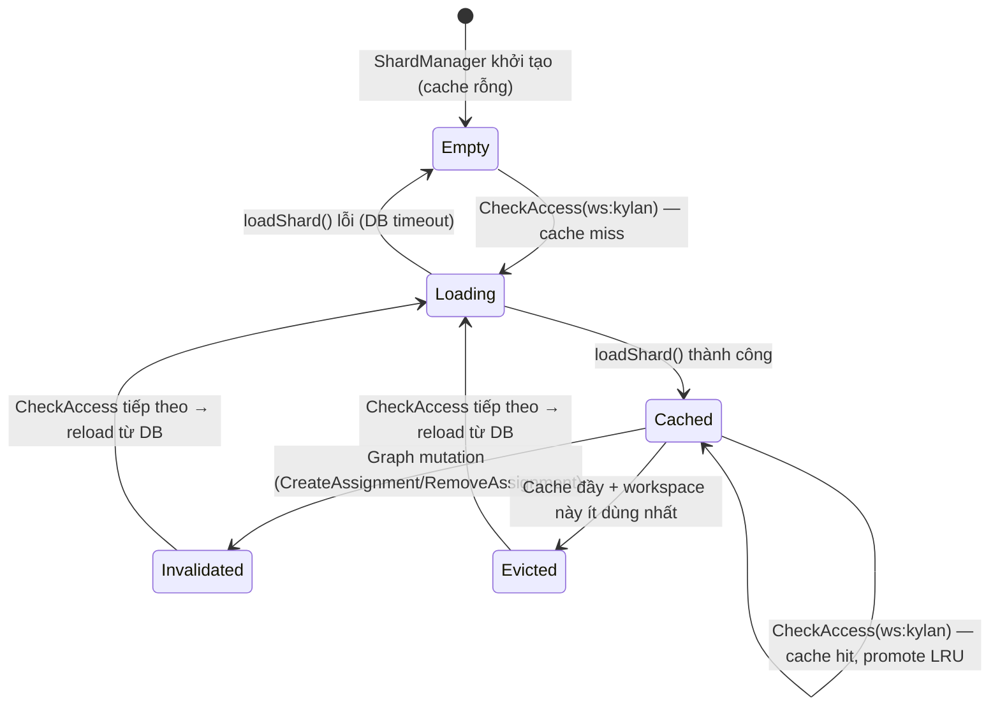
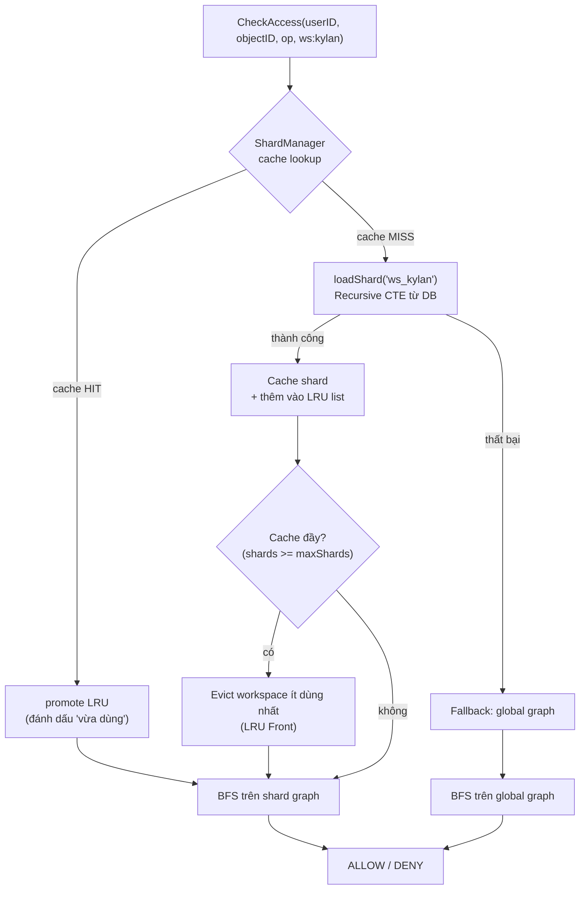
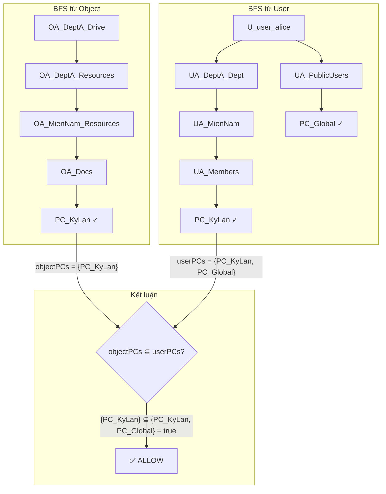
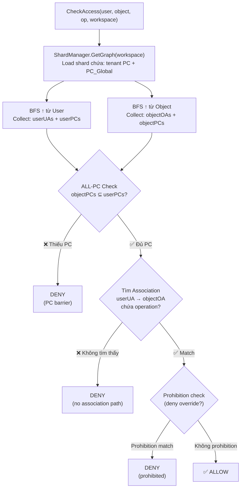

# NGAC Practical Guide — Tài liệu thực chiến

> Tài liệu tham chiếu vận hành NGAC với dữ liệu thật.
> Case study: **KyLan** — 2 khu vực, 6+ phòng ban, 20+ users.
> Cập nhật liên tục khi có câu hỏi mới về bài toán dữ liệu thực.

---

## 1. Khái niệm cốt lõi

### 1.1 Năm loại node

| Type             | Viết tắt | Vai trò                 | Ví dụ                       |
| ---------------- | -------- | ----------------------- | --------------------------- |
| Policy Class     | PC       | Ranh giới cách ly quyền | PC_KyLan, PC_Global         |
| User Attribute   | UA       | Nhóm người / vai trò    | DeptA_Dept, DeptA_Chief       |
| User             | U        | Người dùng cụ thể       | user_alice, user_charlie             |
| Object Attribute | OA       | Nhóm tài nguyên         | DeptA_Drive, Ch_dvnh_Content |
| Object           | O        | Tài nguyên cụ thể       | file.pdf, message           |

### 1.2 Hai loại cạnh

| Cạnh            | Ý nghĩa                             | Ký hiệu      |
| --------------- | ----------------------------------- | ------------ |
| **Assignment**  | Gán vào nhóm cha (containment)      | `──→`        |
| **Association** | Liên kết quyền UA ↔ OA + operations | `══[ops]══→` |

### 1.3 Nguyên tắc intersection

> Quyền chỉ có hiệu lực khi **cả phía user (U → UA)** VÀ **phía tài nguyên (O → OA)** đều dẫn lên **cùng 1 PC**.

Nếu user và resource không cùng PC → **DENY**, dù có Association.

### 1.4 Operations — 8 hằng số cố định

Định nghĩa tại `backend/ngac/ngac_ops.go`:

```
read, write, upload, approve, share, manage, invite, create_channel
```

Operations giữ tính **generic** (động từ). Context được xác định bởi OA target trong Association, không encode vào tên operation.

### 1.5 Graph KHÔNG load Object (O) — CheckAccess trên OA

> [!CAUTION]
> Đây là quyết định kiến trúc quan trọng nhất của hệ thống.

**Evidence:** `backend/services/policy/internal/ngac/pip_store.go:32`

```go
// LoadGraph() chỉ load 4 loại, BỎ QUA 'O'
WHERE node_type IN ('U', 'UA', 'OA', 'PC')
```

**Tức là:** File, message, phiếu phê duyệt, notification — **KHÔNG nằm trong graph**. Chúng chỉ nằm trong PostgreSQL với 1 foreign key trỏ tới OA cha.

#### Cách hoạt động

```
NGAC chuẩn (lý thuyết):              Dự án này (thực tế):
────────────────────────              ──────────────────────
DeptA_Drive (OA)                       DeptA_Drive (OA) ← checkAccess TẠI ĐÂY
├── BaoCao_Q1.pdf (O) ← check ở đây  ├── (file chỉ nằm trong SQL)
├── HopDong_VB.docx (O)              ├── (file chỉ nằm trong SQL)
└── ... 10.000 files (O)              └── (SQL, không phải node)
```

#### Mỗi module checkAccess trên OA nào?

| Module       | Object thật     | CheckAccess target       | Code evidence                         |
| ------------ | --------------- | ------------------------ | ------------------------------------- |
| **Drive**    | file.pdf        | `folder.NGACNodeID` (OA) | `server.go:107` — check OA folder cha |
| **Chat**     | message         | `ch.NGACOaID` (OA)       | `service.go:318` — check OA channel   |
| **Approval** | phiếu phê duyệt | `scope_oa_id` (OA)       | Schema — check OA scope phòng ban     |
| **Asset**    | tài sản         | `asset.NgacNodeID` (OA)  | `asset_server.go:120`                 |

#### Ví dụ cụ thể: user_alice download file từ Drive phòng DeptA

```
1. Frontend: GET /drive/items/{file-id}/download
2. Backend:  SQL → lấy file info, bao gồm ngac_node_id = "oa-dvnh-drive" (OA folder cha)
3. NGAC:     checkAccess("ngac-user_alice", "oa-dvnh-drive", "read")
             → user_alice ∈ DeptA_Dept → DeptA_Dept ══[read]══→ DeptA_Resources
             → DeptA_Drive ⊂ DeptA_Resources → ✅ ALLOW
4. Backend:  Stream file từ MinIO
```

**Không cần tạo NGAC node cho file** → dù Drive có 1 triệu file, graph vẫn chỉ có 1 node OA cho folder.

#### Khi nào CẦN tạo node riêng cho 1 object?

Chỉ khi object đó cần **quyền khác với container cha**. Ví dụ: share 1 file cụ thể cho user ngoài workspace → tạo `Share_OA` wrapper (xem [Section 5.1](#51-share-file-cho-user-cụ-thể)).

#### Tác động đến graph size

| Scenario                        | Có Object nodes       | Không có Object nodes    |
| ------------------------------- | --------------------- | ------------------------ |
| KyLan (200 NV, 20 PB, 1M files) | ~1.000.200 nodes      | ~500 nodes               |
| Memory                          | ~100 MB+              | < 1 MB                   |
| CheckAccess speed               | Chậm (graph lớn)      | Nhanh                    |
| Tradeoff                        | Fine-grained per-file | Cùng folder = cùng quyền |

> **Graph scale theo SỐ NGƯỜI + SỐ PHÒNG BAN, không scale theo số file/message/phiếu.**

### 1.6 Khi nào cần CreateNode khi tạo object mới?

| Tạo object              | CreateNode? | NodeType             | Lý do                                        |
| ----------------------- | ----------- | -------------------- | -------------------------------------------- |
| **Message**             | ❌          | —                    | Kế thừa quyền từ Channel OA                  |
| **File**                | ❌          | —                    | Kế thừa quyền từ Folder OA cha               |
| **Phiếu phê duyệt**     | ❌          | —                    | Dùng `scope_oa_id` của phòng ban             |
| **Notification**        | ❌          | —                    | Không cần phân quyền riêng                   |
| **Folder**              | ✅          | `OA`                 | Container → sub-folder có thể có quyền riêng |
| **Channel**             | ✅          | `OA` + `UA`          | Scope riêng cho content + members            |
| **Department**          | ✅          | `UA` + `OA`          | Nhóm người + nhóm tài nguyên mới             |
| **Share 1 file cụ thể** | ✅          | `OA` (Share wrapper) | Tạo quyền riêng cho object đó                |

#### Nguyên tắc: Chỉ tạo node cho CONTAINER, không tạo cho CONTENT

```
Container (cần node)              Content (không cần node)
──────────────────────            ──────────────────────────
Folder (OA)        ──contains──→  Files (SQL only)
Channel (OA+UA)    ──contains──→  Messages (SQL only)
ApprovalScope (OA) ──contains──→  Phiếu phê duyệt (SQL only)
```

#### Ví dụ: Upload file vs Tạo folder

```
Upload file "baocao.pdf" vào folder DeptA_Drive:
  ① checkAccess(user_alice, DeptA_Drive_OA, "write") → ✅
  ② INSERT INTO drive_items (..., ngac_node_id = "oa-dvnh-drive") ← chỉ SQL
  ③ Upload file lên MinIO
  → File KHÔNG có node riêng. CheckAccess dùng OA của folder cha.

Tạo folder "BáoCáo Q1" trong DeptA_Drive:
  ① checkAccess(user_alice, DeptA_Drive_OA, "write") → ✅
  ② CreateNode("BáoCáo_Q1", OA) → tạo NGAC node mới
  ③ CreateAssignment(BáoCáo_Q1 → DeptA_Drive) → kế thừa quyền
  ④ INSERT INTO drive_items (..., ngac_node_id = node mới)
  → Folder CẦN node vì sub-folder có thể set quyền khác folder cha.
```

#### Khi cần share 1 file cụ thể cho user ngoài?

Tạo **Share_OA wrapper** (đã implement tại `backend/services/drive/internal/grpc/sharing.go:30`):

```
Trước share:                        Sau share:
────────────                        ──────────
DeptA_Drive (OA)                     DeptA_Drive (OA)
└── baocao.pdf (SQL only)           └── baocao.pdf (SQL only)
                                         │
                                    Share_BaoCao (OA) ← node mới!
                                    ├── asg → PC_Global
                                    └── User_B ══[read]══→ Share_BaoCao
```

→ Chỉ khi **share** mới tạo node. Ngày thường file không có node riêng.

> [!IMPORTANT]
> **Quyết định thiết kế (finalized):** File KHÔNG tạo NGAC node. Code hiện tại tại `backend/services/drive/internal/grpc/server.go:266` cần refactor: bỏ `CreateNode(O)`, thay `NGACNodeID` bằng OA ID của folder cha.

---

## 2. Khi nào tạo Policy Class?

### 2.1 Quy tắc quyết định

| Câu hỏi                                          | CÓ → PC mới | KHÔNG → UA/OA |
| ------------------------------------------------ | ----------- | ------------- |
| Cần **cách ly hoàn toàn**?                       | ✅          |               |
| User bên A **không bao giờ** truy cập bên B?     | ✅          |               |
| Admin bên A **không quản lý** được bên B?        | ✅          |               |
| Cần **intersection** (phải thỏa cả 2 điều kiện)? | ✅          |               |

### 2.2 Trong dự án này

| Concept                  | Là PC | Là UA/OA | Lý do                       |
| ------------------------ | ----- | -------- | --------------------------- |
| Workspace / Organization | ✅    | —        | Cách ly hoàn toàn           |
| PC_Global                | ✅    | —        | Cầu nối cross-workspace     |
| Khu vực (Miền Bắc/Nam)   | —     | ✅ UA    | Vẫn thuộc cùng org          |
| Phòng ban                | —     | ✅ UA+OA | Vẫn truy cập tài liệu chung |
| Team                     | —     | ✅ UA    | Sub-group trong phòng ban   |
| Channel                  | —     | ✅ OA+UA | Thuộc workspace             |
| Drive folder             | —     | ✅ OA    | Kế thừa quyền               |

### 2.3 Multi-PC (nâng cao)

Trong hệ thống lớn, 1 tài nguyên có thể thuộc **nhiều PC** đồng thời:

```
Tài liệu "Lương nhân viên EU Q4"
├── thuộc → PC_CompanyA         ← phải là nhân viên cty A
├── thuộc → PC_Confidential     ← VÀ phải có clearance
└── thuộc → PC_GDPR_EU          ← VÀ phải được phép xử lý data EU
```

→ Phải pass **TẤT CẢ** PC mới ALLOW.

---

## 3. Khởi tạo hệ thống

### 3.1 Seed data (chạy 1 lần khi init DB)

```sql
-- 3 node gốc
INSERT INTO ngac_nodes VALUES
  ('pc-global',       'PC_Global',   'PC', '{"scope":"global"}'),
  ('ua-public-users', 'PublicUsers', 'UA', '{}'),
  ('oa-public-docs',  'PublicDocs',  'OA', '{}');

-- Assignments + Association
PublicUsers (UA) → PC_Global
PublicDocs  (OA) → PC_Global
PublicUsers ══[read]══→ PublicDocs
```

### 3.2 Thứ tự bootstrap

```
1. DB init       → Schema + 3 global nodes
2. Policy start  → Load toàn bộ graph vào memory
3. User signup   → Tạo U node + gán PublicUsers
4. Tạo workspace → Tạo PC + cây UA/OA + associations
5. Tạo phòng ban → Mở rộng cây workspace
```

---

## 4. Case Study: KyLan

### 4.1 Cấu trúc tổ chức

```
KyLan (PC_KyLan)
├── Miền Nam (UA: MienNam_Region)
│   ├── Phòng Nội Vụ       → thuynt (TP), linhptt, dungnt
│   ├── Phòng Kinh Doanh
│   │   ├── Team Dự Án      → trangdtt (TL), khanhlh
│   │   ├── Team Marketing   → minhph (TL), thaodt
│   │   └── Team Account Mgr → tuanvm (TL), haint
│   ├── Phòng AI            → ducnm (TP), anhlq, baotq
│   ├── Phòng Hạ Tầng
│   │   ├── Devops           → hungdv (TL), thanhnt
│   │   └── Helpdesk         → namph (TL), quynhlt
│   └── Phòng DeptA
│       ├── Team Appserver 1 → user_charlie (TL), hoangbm
│       ├── Team Appserver 2 → longlx (TL), anhpv
│       ├── Team Appserver 3 → tienvv (TL), dungpq
│       └── Team BO          → quanbm (TL), thupk
│       └── Chung: user_alice (Dev), nguyenntn (PP)
│
├── Miền Bắc (UA: MienBac_Region)
│   ├── Phòng Nội Vụ        → maitt (TP), hoapt
│   ├── Phòng Kinh Doanh    → cuongdd (TP), binhlt, phuongdh
│   ├── Phòng Hạ Tầng       → sonnt (TP), lamtv
│   └── Phòng DeptA
│       ├── Team Appserver 4 → vietdt (TL), khoint
│       └── Team BO Bắc      → thanhtv (TL), linhdp

(TP=Trưởng phòng, PP=Phó phòng, TL=Team Leader)
```

### 4.2 NGAC Graph — Core



### 4.3 Phòng DeptA Miền Nam — Chi tiết



---

## 5. Sharing — Cross-workspace & External

### 5.1 Nguyên tắc core

> **Share KHÔNG phải copy dữ liệu — Share là mở thêm "lối đi" trên đồ thị quyền.**

| Approach                  | Vấn đề                                                        |
| ------------------------- | ------------------------------------------------------------- |
| ❌ Clone row → new record | Đồng bộ tên, size khi sửa. N shares = N copies                |
| ✅ Share_OA wrapper       | 1 file duy nhất, chỉ mở thêm đường NGAC. Thu hồi = xóa 1 node |

### 5.2 Share file cho user cụ thể — Ví dụ KyLan

**Scenario**: `user_alice` share file "BáoCáoQ1.pdf" (nằm trong folder "Reports" của phòng DeptA) cho `user_bob` (SuperB).

#### Bước 1 — Trạng thái trước khi share

```
drive_items:
┌────────────┬────────────────┬──────────┬──────────────────┬─────────────┐
│ id         │ name           │ type     │ ngac_node_id     │ parent_id   │
├────────────┼────────────────┼──────────┼──────────────────┼─────────────┤
│ folder-001 │ Reports        │ folder   │ oa-reports-dvnh  │ root-dvnh   │
│ file-001   │ BáoCáoQ1.pdf   │ file     │ oa-reports-dvnh  │ folder-001  │
│            │                │          │ ↑ kế thừa OA     │             │
└────────────┴────────────────┴──────────┴──────────────────┴─────────────┘

NGAC Graph (chỉ có nodes sau):
  oa-reports-dvnh (OA) → oa-dvnh-drive → oa-dvnh-resources → PC_KyLan
```

> ⚠️ File `file-001` KHÔNG có NGAC node riêng. Nó dùng `oa-reports-dvnh` (OA của folder cha) để checkAccess.

#### Bước 2 — Thực hiện share (5 thao tác)

```
① CreateNode(OA): "Share_BáoCáoQ1_abc123"       → ngac_nodes
② Assignment: oa-reports-dvnh → Share_OA          → ngac_assignments
③ Assignment: Share_OA → PC_Global                → ngac_assignments
④ Association: ngac-user_bob → Share_OA [read]     → ngac_associations
⑤ INSERT INTO drive_shares (metadata)             → drive_shares
```

#### Bước 3 — Dữ liệu DB sau khi share

```sql
-- ① Node mới
INSERT INTO ngac_nodes (id, name, node_type)
VALUES ('oa-share-q1-abc', 'Share_BáoCáoQ1_abc123', 'OA');

-- ② File's folder OA → Share_OA
INSERT INTO ngac_assignments (child_id, parent_id)
VALUES ('oa-reports-dvnh', 'oa-share-q1-abc');

-- ③ Share_OA → PC_Global
INSERT INTO ngac_assignments (child_id, parent_id)
VALUES ('oa-share-q1-abc', 'pc-global');

-- ④ User user_bob có [read] trên Share_OA
INSERT INTO ngac_associations (ua_id, oa_id, operations)
VALUES ('ngac-user_bob', 'oa-share-q1-abc', '{"read"}');

-- ⑤ Metadata record
INSERT INTO drive_shares (id, drive_item_id, share_type, target_ngac_id,
    target_label, operations, ngac_share_oa, created_by)
VALUES ('share-001', 'file-001', 'user', 'ngac-user_bob',
    'user_bob', '{"read"}', 'oa-share-q1-abc', 'ngac-user_alice');
```

**Tổng: 5 records mới. drive_items KHÔNG thay đổi. File KHÔNG bị clone.**

#### Bước 4 — Đồ thị NGAC sau khi share



### 5.3 CheckAccess — 3 loại user

#### Case A: Internal user (user_charlie — cùng DeptA)

```
checkAccess("ngac-user_charlie", "oa-reports-dvnh", "read")

Traversal:
  user_charlie → AppSrv1_Team → DeptA_Dept ──[read,write,upload]──→ DeptA_Resources
  DeptA_Resources ← DeptA_Drive ← oa-reports-dvnh ✅

→ ALLOW (đường workspace bình thường, KHÔNG đi qua Share_OA)
```

#### Case B: External user (user_bob — SuperB, có share)

```
checkAccess("ngac-user_bob", "oa-reports-dvnh", "read")

Traversal:
  ❌ Đường KyLan: user_bob KHÔNG thuộc UA nào của KyLan → DENY
  ✅ Đường share: user_bob ──[read]──→ Share_OA ← oa-reports-dvnh ✅

→ ALLOW (vì có association trực tiếp đến Share_OA)
```

#### Case C: Random user (ducnm — Phòng AI, không share)

```
checkAccess("ngac-ducnm", "oa-reports-dvnh", "read")

Traversal:
  ❌ Đường DeptA: ducnm thuộc AI_Dept, KHÔNG thuộc DeptA_Dept → ko reach DeptA_Resources
  ❌ Đường share: ducnm KHÔNG có association đến Share_OA
  ❌ Đường public: không phải public share

→ DENY
```

### 5.4 Share Public — Khác gì Share User?

**Scenario**: Thay vì share cho user_bob, user_alice share public "BáoCáoQ1.pdf".

| Bước                   | Share User           | Share Public                 |
| ---------------------- | -------------------- | ---------------------------- |
| ① Tạo Share_OA         | Giống                | Giống                        |
| ② File OA → Share_OA   | Giống                | Giống                        |
| ③ Share_OA → PC_Global | Giống                | Giống                        |
| **④ Association**      | `user_bob → Share_OA` | **`PublicUsers → Share_OA`** |
| ⑤ drive_shares         | share_type="user"    | **share_type="public"**      |

```sql
-- Public share: khác ở bước ④
INSERT INTO ngac_associations (ua_id, oa_id, operations)
VALUES ('ua-public-users', 'oa-share-q1-abc', '{"read"}');
--      ↑ PublicUsers UA (mọi user signup đều thuộc UA này)
```

**CheckAccess cho public share**:

```
checkAccess("ngac-any-user", "oa-reports-dvnh", "read")

Traversal:
  any-user → PublicUsers (UA) ──[read]──→ Share_OA ← oa-reports-dvnh ✅

→ ALLOW (BẤT KỲ user đã đăng ký đều có quyền read)
```

### 5.5 Share folder — Kế thừa cho files bên trong

Khi share folder "Reports" (không phải file đơn lẻ):

```
Share_OA gán vào oa-reports-dvnh (folder OA)
→ TẤT CẢ files bên trong folder đều kế thừa quyền
→ Vì files dùng ngac_node_id = oa-reports-dvnh (OA của folder cha)
→ checkAccess trên bất kỳ file nào → đều reach Share_OA qua folder OA
```

**Không cần share từng file.**

### 5.6 Thu hồi Share

```go
// 1. Xóa Share_OA → cascade xóa assignments + associations
DeleteNode("oa-share-q1-abc")

// 2. Xóa metadata
DELETE FROM drive_shares WHERE id = 'share-001'
```

```
NGAC Graph:
  oa-reports-dvnh ──→ Share_OA ← user_bob   ← XÓA HẾT

Kết quả:
  checkAccess("ngac-user_bob", "oa-reports-dvnh", "read") → DENY
  checkAccess("ngac-user_charlie", "oa-reports-dvnh", "read")   → vẫn ALLOW (đường workspace)
```

> [!IMPORTANT]
> Thu hồi share KHÔNG ảnh hưởng user internal. Chỉ cắt đường đi qua Share_OA.

### 5.7 External user — Cross-company chat

User `user_bob` (SuperB) tham gia group "kylan-superb-trao-doi":



> Chat cross-company nằm dưới **PC_Global**, không thuộc PC_KyLan.
> → user_bob chỉ thấy group này, KHÔNG thấy bất kỳ thứ gì của KyLan.

### 5.8 Nguồn code — Sharing

| File                 | Nội dung                                            |
| -------------------- | --------------------------------------------------- |
| `sharing.go:20-106`  | CreateShare — tạo Share_OA, assignment, association |
| `sharing.go:108-118` | RevokeShare — DeleteNode cascade                    |
| `sharing.go:143-176` | GetSharedWithMe — resolve ancestors + query shares  |
| `store.go:357-443`   | InsertShare, ListSharesByItem, ListSharesByTarget   |

---

## 6. Approval Workflow

### 6.1 Dynamic Form Templates

| Template            | Phòng   | Form fields                           | Steps         |
| ------------------- | ------- | ------------------------------------- | ------------- |
| Phê duyệt giao dịch | Nội Vụ  | amount, txn_type, bank, reference     | NV → PP → TP  |
| Phê duyệt mua hàng  | Nội Vụ  | item, quantity, vendor, budget_code   | NV → TP       |
| Nhân sự mới         | Nội Vụ  | position, salary_range, department    | TP → Admin    |
| Mở kết nối mạng     | Hạ Tầng | source_ip, dest_ip, port, protocol    | NV → TL → TP  |
| Cấp quyền server    | DeptA    | server_name, user_account, level      | TL → PP       |
| Deploy production   | DeptA    | service, version, changelog, rollback | Dev → TL → PP |
| Nghỉ phép           | Tất cả  | from_date, to_date, reason, type      | NV → TL/TP    |

### 6.2 NGAC Scope cho Approval

```
DeptA_ApprovalScope (OA) → DeptA_Resources → PC_KyLan

Associations:
  DeptA_Chief     → DeptA_ApprovalScope [approve]  ← PP duyệt
  AppSrv1_Lead   → DeptA_ApprovalScope [approve]  ← TL duyệt step 1
```

---

## 7. Bài toán hiệu năng — Hybrid Pattern

### 7.1 Vấn đề

> "Nếu mọi object đều là NGAC node, làm sao lấy danh sách pending approvals với paging?
> Không lẽ for từng item rồi checkAccess?"

**Đúng — đó là cách SAI.** 10.000 phiếu × checkAccess = 10.000 lần duyệt graph → chết.

### 7.2 Giải pháp: NGAC + Denormalized Tables

```
┌─────────────────────────────────────┐
│  NGAC Graph (in-memory)             │
│  → "User X CÓ QUYỀN làm Y không?" │
│  → Single-point authorization       │
│  → KHÔNG dùng để list/query         │
└─────────────────────────────────────┘
              +
┌─────────────────────────────────────┐
│  Denormalized Tables (PostgreSQL)   │
│  → "Lấy danh sách pending của tôi" │
│  → SQL query + index → O(log n)    │
│  → Paging, filtering, sorting      │
└─────────────────────────────────────┘
```

### 7.3 Bảng `approval_assignments` — chìa khóa

```sql
approval_assignments (
    request_id      UUID,
    step_order      INT,
    user_node_id    TEXT,     -- ← AI cần duyệt
    grant_source    TEXT,     -- ← vì sao (TL, PP, TP)
    status          TEXT,     -- ← pending/approved/rejected
    acted_at        TIMESTAMPTZ
)
```

### 7.4 Flow khi tạo phiếu

```
① Tạo approval_request (lưu scope_oa_id)
② Resolve approvers = dùng NGAC 1 LẦN: "Ai có [approve] trên scope?"
③ Ghi denormalized vào approval_assignments
④ Từ giờ mọi query chỉ cần SQL
```

**Ví dụ: user_alice submit "Deploy production":**

```sql
-- ② Resolve: NGAC query 1 lần
-- Step 1 TL: user_charlie (thuộc AppSrv1_Lead, có [approve])
-- Step 2 PP: nguyenntn (thuộc DeptA_Chief, có [approve])

-- ③ Ghi denormalized
INSERT INTO tenant_kylan.approval_assignments VALUES
  ('aa-001', 'req-001', 1, 'ngac-user_charlie',      'AppSrv1_Lead', 'pending'),
  ('aa-002', 'req-001', 2, 'ngac-nguyenntn',   'DeptA_Chief',   'pending');
```

### 7.5 Query thực tế — KHÔNG cần duyệt graph

**Tab "Chờ tôi duyệt":**

```sql
SELECT r.id, r.template_name, r.form_data_json, r.created_at
FROM approval_assignments a
JOIN approval_requests r ON r.id = a.request_id
WHERE a.user_node_id = 'ngac-user_charlie'
  AND a.status = 'pending'
  AND a.step_order = r.current_step
ORDER BY r.created_at DESC
LIMIT 20 OFFSET 0;
-- → Index hit, O(log n), paging bình thường!
```

**Tab "Lịch sử duyệt":**

```sql
SELECT r.id, r.template_name, a.status, a.acted_at, a.comment
FROM approval_assignments a
JOIN approval_requests r ON r.id = a.request_id
WHERE a.user_node_id = 'ngac-user_charlie'
  AND a.status IN ('approved', 'rejected')
ORDER BY a.acted_at DESC LIMIT 20;
```

**Tab "Phiếu phòng ban":**

```sql
SELECT * FROM approval_requests
WHERE scope_oa_id = 'oa-dvnh-approval-scope'
  AND status = 'pending'
ORDER BY created_at DESC LIMIT 20;
```

### 7.6 Khi nào dùng NGAC vs SQL?

| Hành động             | Dùng gì           | Lý do                  |
| --------------------- | ----------------- | ---------------------- |
| **List** pending      | SQL               | Index + paging         |
| **View** chi tiết     | SQL + checkAccess | Verify quyền           |
| **Approve/Reject**    | checkAccess trước | Guard                  |
| **Tạo phiếu**         | checkAccess scope | Verify thuộc phòng ban |
| **Resolve approvers** | NGAC graph        | 1 lần khi tạo          |

### 7.7 Pattern cho MỌI module

| Module   | List (SQL)                          | Guard (NGAC)              |
| -------- | ----------------------------------- | ------------------------- |
| Approval | `approval_assignments.user_node_id` | checkAccess trước approve |
| Drive    | `drive_items.scope_oa_id` + SQL     | checkAccess trước delete  |
| Chat     | `channel_members.ngac_node_id`      | checkAccess trước send    |
| Messages | `messages.channel_id`               | Đã verify thuộc channel   |

> [!IMPORTANT]
> **NGAC = cổng bảo vệ (guard). SQL = kho dữ liệu (store).**
> Không bao giờ dùng NGAC để list. Không phải mọi object cần là NGAC node.

**Không tạo NGAC node cho:**

- Từng message (kế thừa quyền channel)
- Từng phiếu phê duyệt (dùng scope_oa_id + assignments)
- Từng notification

---

## 8. Thay đổi nhân sự — Reconciliation

### 8.1 Scenario

`nguyenntn` (Phó phòng DeptA) nghỉ hưu → `hoangttt` lên thay.

### 8.2 Tầng 1 — NGAC Graph (tức thì)

```sql
-- Xóa người cũ
DELETE FROM ngac_assignments
WHERE child_id = 'ngac-nguyenntn' AND parent_id = 'ua-dvnh-chief';

-- Thêm người mới
INSERT INTO ngac_assignments (id, child_id, parent_id)
VALUES ('a-new-chief', 'ngac-hoangttt', 'ua-dvnh-chief');
```

→ hoangttt kế thừa TẤT CẢ quyền DeptA_Chief ngay lập tức.

### 8.3 Vấn đề: Denormalized data bị stale

```
approval_assignments:
│ user_node_id     │ grant_source │ status  │
│ ngac-nguyenntn ← │ DeptA_Chief   │ pending │  ← VẪN TRỎ NGƯỜI CŨ!
```

Query `WHERE user_node_id = 'ngac-hoangttt'` → **0 kết quả**.

### 8.4 Tầng 2 — Reconcile pending assignments

```sql
UPDATE tenant_kylan.approval_assignments
SET user_node_id = 'ngac-hoangttt'
WHERE grant_source = 'DeptA_Chief'    -- ← indexed (idx_aa_grant_source)
  AND status = 'pending';
```

→ hoangttt thấy tất cả phiếu pending. ✅

### 8.5 Phiếu đã duyệt — KHÔNG thay đổi

```sql
-- Lịch sử CỦA nguyenntn vẫn nguyên vẹn
SELECT * FROM approval_assignments
WHERE user_node_id = 'ngac-nguyenntn'
  AND status IN ('approved', 'rejected');
-- → "nguyenntn đã duyệt ngày X" — audit trail giữ nguyên
```

### 8.6 Full flow

```
① NGAC:  DELETE/INSERT assignment (2 rows)
② SQL:   UPDATE pending assignments WHERE grant_source (N rows)
③ Audit: INSERT audit_log (1 row)
④ Push:  Notification cho hoangttt "Bạn có N phiếu chờ duyệt"
```

> [!TIP]
> **Trade-off hợp lý**: Thay đổi nhân sự xảy ra vài lần/năm.
> Query list pending xảy ra hàng trăm lần/ngày.
> Reconcile 1 lần → tiết kiệm hàng triệu lần duyệt graph.

---

## 9. Kiến trúc tổng quan



---

## Nguồn code

| File                                                    | Nội dung                         |
| ------------------------------------------------------- | -------------------------------- |
| `backend/ngac/ngac_ops.go`                              | 8 operations cố định             |
| `backend/services/drive/internal/grpc/sharing.go`       | Share/Revoke implementation      |
| `backend/services/drive/internal/grpc/server.go`        | Drive CRUD + checkAccess pattern |
| `backend/services/policy/internal/ngac/pip_store.go`        | LoadGraph — loại trừ node O      |
| `backend/services/workspace/internal/domain/service.go` | Workspace graph creation         |
| `backend/services/auth/internal/domain/service.go`      | User signup + PublicUsers        |
| `data/migrations/007_tenant_schema_approval.sql`        | Approval schema + indexes        |
| `data/migrations/011_departments.sql`                   | Department hierarchy             |
| `data/init.sql`                                         | Seed data + full schema          |

## Tài liệu liên quan

| File                                                | Nội dung                         |
| --------------------------------------------------- | -------------------------------- |
| `.agent/knowledge/ngac/permission-graph.md`         | NGAC model - lý thuyết đồ thị    |
| `.agent/knowledge/ngac/permission-db-mapping.md`    | Mapping DB tables ↔ NGAC nodes   |
| `.agent/knowledge/ngac/permission-check-queries.md` | SQL queries debug quyền          |
| `.agent/knowledge/ngac-flow.md`                     | Luồng xây dựng + kiểm tra đồ thị |

---

## Section 10: Performance & Cache Strategy

### 10.1 Mục tiêu

- CheckAccess phải < 1ms cho cache hit (L1)
- Graph mutation KHÔNG gây cache stampede
- Monitor cache health bằng Prometheus

### 10.2 Kiến trúc 3 tầng cache

```
CheckAccess(userID, objectID, op)
  │
  ├─ L1: Redis (TTL 30s)
  │     Key: ngac:access:{userID}:{objectID}:{op}
  │     Hit → return immediately (~0.1ms)
  │
  ├─ L2: Materialized Access Table (PostgreSQL)
  │     Table: ngac_materialized_access
  │     Version-checked against ngac_graph_version
  │     Hit → populate L1, return (~1ms)
  │
  └─ L3: In-memory Graph BFS / SQL CTE
        Graph traversal: O(depth) BFS
        CTE fallback if graph unavailable
        Hit → populate L2 + L1, return (~5ms)
```

**Code reference**: `policy/internal/grpc/read_server.go` → `ReadServer.CheckAccess()`

### 10.3 Targeted Cache Invalidation (IMPLEMENTED)

**Trước** (full flush):
```
Graph mutation → SCAN "ngac:access:*" → DEL all
```
**Vấn đề**: 1 user thay đổi → 200 users mất cache → cache stampede

**Sau** (targeted):
```
Graph mutation → CacheInvalidator.InvalidateForNodes(nodeIDs...)
  ├─ Node type = U  → xóa keys: ngac:access:{userID}:*
  ├─ Node type = UA → BFS descendants → collect U nodes → xóa per-user
  ├─ Node type = OA → xóa keys: ngac:access:*:{objectID}:*
  ├─ Node type = PC → FULL FLUSH (PC change hiếm, ảnh hưởng toàn bộ)
  └─ Node unknown  → xóa both user + object prefix (safety)
```

**Code reference**: `policy/internal/ngac/epp_cache_invalidator.go` → `CacheInvalidator`

**Ví dụ thực tế — KyLan**:

> **Quy ước tên**: `U_user_diana` = user Diana, `U_user_alice` = user Nguyễn Lê Văn Hoàng.
> Dùng username thực để dễ phân biệt với OA (OA_ws_kylan_KeToan_MN).

```
Scenario: Gán user Thanh (user_diana) vào UA Manager_MN
→ CreateAssignment(child=U_user_diana, parent=UA_manager_mn)

CacheInvalidator:
  1. child = U type → affectedUsers = {U_user_diana}
  2. parent = UA type → GetDescendants(UA_manager_mn) → find U nodes
     → thêm vào affectedUsers: {U_user_diana, U_user_alice, ...}
  3. Redis DEL:
     - ngac:access:U_user_diana:*
     - ngac:access:U_user_alice:*
     - scopes:U_user_diana:*
     - scopes:U_user_alice:*

  ❌ KHÔNG xóa keys của CEO, Manager_MB — cache họ vẫn intact
```

### 10.4 Prometheus Metrics

| Metric | Type | Labels | Mô tả |
|---|---|---|---|
| `ngac_check_access_total` | Counter | `layer` (L1/L2/L3) | Số lượng CheckAccess per layer |
| `ngac_check_access_duration_seconds` | Histogram | `layer` (L1/L2/L3) | Latency per layer |
| `ngac_cache_invalidation_total` | Counter | `scope` (targeted/full) | Invalidation events |
| `ngac_cache_keys_deleted_total` | Counter | — | Tổng keys bị xóa |
| `ngac_graph_node_count` | Gauge | `type` (U/UA/OA/PC) | Số nodes in graph |
| `ngac_graph_association_count` | Gauge | — | Số associations |

**Endpoints**:
- Policy service: `:9090/metrics`
- Policy-read service: `:9091/metrics`

**Code reference**: `policy/internal/metrics/metrics.go`

### 10.5 Invalidation Rules

| Operation | Invalidation | Scope |
|---|---|---|
| CreateAssignment | Targeted (child + parent nodeIDs) | Chỉ affected users/objects |
| RemoveAssignment | Targeted (child + parent nodeIDs) | Chỉ affected users/objects |
| CreateAssociation | Targeted (UA + OA nodeIDs) | Chỉ affected users/objects |
| RemoveAssociation | Targeted (UA + OA nodeIDs) | Chỉ affected users/objects |
| DeleteNode | Targeted (nodeID) | Chỉ node bị xóa |
| LoadGraph | **FULL FLUSH** | Toàn bộ cache |
| PC change | **FULL FLUSH** | PolicyClass ảnh hưởng tất cả |

### 10.6 Scaling Roadmap

| Phase | Trigger | Hành động |
|---|---|---|
| **Phase 1** (DONE ✅) | Current: 200 users | Targeted invalidation + Prometheus metrics |
| **Phase 2** | > 1000 users, cache miss > 30% | Per-workspace version tracking, Redis cluster |
| **Phase 3** | > 5000 users, multi-region | Event-driven invalidation qua Redpanda, per-service local LRU |

### 10.7 Safety Nets

1. **TTL 30s**: Ngay cả khi targeted invalidation miss → cache tự expire trong 30s
2. **L2 version check**: Materialized access table so sánh version trước khi trả kết quả
3. **PC fallback**: PolicyClass change luôn full flush — không risk stale permissions
4. **Unknown node fallback**: Node không tìm thấy trong graph → invalidate cả user lẫn object prefix

### 10.8 Graph Version — Cơ chế phiên bản đồ thị

#### Bảng `ngac_graph_version`

```sql
CREATE TABLE ngac_graph_version (
    scope      TEXT PRIMARY KEY,  -- 'global' hoặc 'ws:{workspace_id}'
    version    BIGINT DEFAULT 0,  -- tăng +1 mỗi mutation
    updated_at TIMESTAMPTZ
);
-- Seed:
INSERT INTO ngac_graph_version (scope, version) VALUES ('global', 0);
```

#### Khi nào version tăng?

| Operation | Tăng? | Lý do |
|---|---|---|
| `CreateAssignment(child, parent)` | ✅ +1 | Thay đổi cấu trúc kế thừa quyền |
| `RemoveAssignment(child, parent)` | ✅ +1 | Thu hồi kế thừa quyền |
| `CreateAssociation(ua, oa)` | ✅ +1 | Cấp quyền mới |
| `RemoveAssociation(ua, oa)` | ✅ +1 | Thu hồi quyền |
| `DeleteNode(nodeID)` | ✅ +1 | Xóa node ảnh hưởng path |
| `LoadGraph()` | ✅ +1 | Reload toàn bộ graph |
| `CreateNode(name, type)` | ❌ | Node rời, chưa gắn vào graph → chưa ảnh hưởng quyền |
| `CheckAccess()` | ❌ | Chỉ đọc, không thay đổi graph |

#### SQL tăng version (atomic)

```sql
INSERT INTO ngac_graph_version (scope, version, updated_at)
VALUES ('global', 1, NOW())
ON CONFLICT (scope) DO UPDATE
  SET version = ngac_graph_version.version + 1, updated_at = NOW()
RETURNING version
```

> **UPSERT + RETURNING** → atomic, không race condition khi nhiều WriteServer cùng mutation.

**Code reference**: `policy/internal/ngac/epp_version.go` → `VersionTracker.Increment()`

#### Ví dụ timeline version

```
T0: Service khởi động, LoadGraph()     → version = 1
T1: CreateAssignment(U_nv1, UA_staff)  → version = 2
T2: CreateAssociation(UA_staff, OA_hr) → version = 3
T3: RemoveAssignment(U_nv1, UA_staff)  → version = 4
T4: CheckAccess(U_nv1, OA_hr, read)   → version KHÔNG tăng (chỉ đọc)
T5: LoadGraph()                        → version = 5
```

### 10.9 L2 Materialized Access — Vòng đời dữ liệu

Bảng `ngac_materialized_access` hoạt động theo mô hình **lazy cache — tạo khi cần, xóa khi graph thay đổi**.

#### Vòng đời 1 row



#### Phase 1: Tạo (populateCaches)

**Trigger**: CheckAccess miss cả L1 và L2 → L3 tính xong → ghi vào L2.

```go
// read_server.go — populateCaches()
currentVersion, _ := s.version.GetVersion(ctx, "global")     // VD: 42
allowed := resp.Decision == "ALLOW"
s.materialized.Store(ctx, userNodeID, objectNodeID, op, allowed, currentVersion)
```

```sql
INSERT INTO ngac_materialized_access
  (user_node_id, object_node_id, operation, decision, graph_version)
VALUES ('U_user_diana', 'OA_ws_kylan_KeToan_MN', 'read', true, 42)
ON CONFLICT (user_node_id, object_node_id, operation)
DO UPDATE SET decision = true, graph_version = 42, computed_at = NOW()
```

#### Phase 2: Đọc (Lookup)

**Trigger**: CheckAccess L1 miss → thử L2.

```go
// materialized.go — Lookup()
cached, err := m.Lookup(ctx, userNodeID, objectNodeID, operation, currentVersion)
// → SELECT decision, graph_version WHERE user + object + op
// → if graph_version < currentVersion → return nil (STALE)
// → if graph_version >= currentVersion → return CachedDecision
```

#### Phase 3: Xóa — 2 cơ chế song song

**Cơ chế A: DELETE chủ động** (khi graph mutation)

```go
// write_server.go — incrementAndInvalidate()
for _, nodeID := range nodeIDs {
    m.InvalidateByUser(ctx, nodeID)    // DELETE WHERE user_node_id = nodeID
    m.InvalidateByObject(ctx, nodeID)  // DELETE WHERE object_node_id = nodeID
}
```

**Cơ chế B: Version stale bị động** (safety net)

```go
// materialized.go — Lookup():44-47
if version < currentVersion {
    return nil, nil  // row vẫn tồn tại nhưng bị bỏ qua
}
```

> Row cũ **không bị xóa** bằng cơ chế B, nhưng bị **ghi đè** khi L3 tính lại:
> `ON CONFLICT ... DO UPDATE SET decision = false, graph_version = 43`

#### Phase 4: Tái tạo

Sau khi bị xóa/stale → CheckAccess tiếp theo sẽ:
1. L1 miss (đã bị xóa)
2. L2 miss (đã bị DELETE hoặc version stale)
3. L3 tính lại → kết quả mới (có thể DENY)
4. `populateCaches()` → UPSERT row mới với `decision=false`, `graph_version=43`

### 10.10 End-to-End Scenario — Thu hồi quyền nhân viên

**Bối cảnh KyLan**: Nhân viên Thanh (`user_diana` — Diana) bị chuyển sang phòng khác → admin xóa assignment khỏi nhóm kế toán.

> **Quy ước tên trong ví dụ**:
> - `U_user_diana` = user Diana (kế toán viên)
> - `U_user_alice` = user Nguyễn Lê Văn Hoàng (nhân viên khác cùng UA)
> - `UA_Staff_KeToan_MN` = nhóm nhân viên kế toán miền Nam
> - `OA_ws_kylan_KeToan_MN` = container tài liệu phòng kế toán MN

#### So sánh Graph: TRƯỚC vs SAU

```
  ┌─────────────────────────────────────┬─────────────────────────────────────┐
  │           TRƯỚC (version=42)        │           SAU (version=43)          │
  ├─────────────────────────────────────┼─────────────────────────────────────┤
  │                                     │                                     │
  │  U_user_diana ──assign──► UA_Staff_KT │  U_user_diana    (rời, không gắn)    │
  │                    ▲                │                                     │
  │  U_user_alice ──assign──┘             │  U_user_alice ──assign──► UA_Staff_KT│
  │                                     │                                     │
  │  UA_Staff_KT ──assign──► UA_NV_MN   │  UA_Staff_KT ──assign──► UA_NV_MN  │
  │  UA_Staff_KT ──assoc(read)──► OA_KT │  UA_Staff_KT ──assoc(read)──► OA_KT│
  │                                     │                                     │
  │  CheckAccess(user_diana, OA_KT, read) │  CheckAccess(user_diana, OA_KT, read)│
  │  → ALLOW ✅                         │  → DENY ❌                          │
  │                                     │                                     │
  │  CheckAccess(user_alice, OA_KT, read) │  CheckAccess(user_alice, OA_KT, read)│
  │  → ALLOW ✅                         │  → ALLOW ✅ (không bị ảnh hưởng)    │
  └─────────────────────────────────────┴─────────────────────────────────────┘

  Thay đổi:
    ╳  REMOVED: U_user_diana ──assign──► UA_Staff_KeToan_MN    ← bị admin xóa
    ✓  GIỮ NGUYÊN: U_user_alice ──assign──► UA_Staff_KeToan_MN
    ✓  GIỮ NGUYÊN: UA_Staff_KeToan_MN ──assoc(read)──► OA_ws_kylan_KeToan_MN
```

#### Timeline chi tiết

```
════════════════════════════════════════════════════════════════
  T0: Trạng thái ban đầu
════════════════════════════════════════════════════════════════

  Graph (có đường từ user_diana đến OA_KeToan):

    U_user_diana ─────assign────► UA_Staff_KeToan_MN ──assign──► UA_NhanVien_MN
    U_user_alice ─────assign──┘         │
                                       ├──assoc(read)──► OA_ws_kylan_KeToan_MN
                                       └──assoc(write)─► OA_ws_kylan_KeToan_MN

  Cache state:
    ┌──────────────┬────────────────────────────┬───────┬──────────┬─────────┐
    │ user_node_id  │ object_node_id             │ op    │ decision │ version │
    ├──────────────┼────────────────────────────┼───────┼──────────┼─────────┤
    │ U_user_diana    │ OA_ws_kylan_KeToan_MN     │ read  │ true     │ 42      │
    │ U_user_alice    │ OA_ws_kylan_KeToan_MN     │ read  │ true     │ 42      │
    └──────────────┴────────────────────────────┴───────┴──────────┴─────────┘

  Redis:
    ngac:access:U_user_diana:OA_ws_kylan_KeToan_MN:read  → ALLOW
    ngac:access:U_user_alice:OA_ws_kylan_KeToan_MN:read  → ALLOW

  ngac_graph_version: scope=global, version=42

════════════════════════════════════════════════════════════════
  T1: Admin gọi RemoveAssignment("U_user_diana", "UA_Staff_KeToan_MN")
════════════════════════════════════════════════════════════════

  Graph thay đổi (╳ = edge bị xóa):

    U_user_diana ──╳──assign──╳──► UA_Staff_KeToan_MN ──assign──► UA_NhanVien_MN
    U_user_alice ─────assign────┘         │
                                         ├──assoc(read)──► OA_ws_kylan_KeToan_MN
                                         └──assoc(write)─► OA_ws_kylan_KeToan_MN

    → U_user_diana giờ là node rời, không thuộc UA nào → KHÔNG CÒN PATH đến OA

  WriteServer.RemoveAssignment():

    1. store.RemoveAssignment()
       → SQL: DELETE FROM ngac_assignments
              WHERE child_id='U_user_diana' AND parent_id='UA_Staff_KeToan_MN'
       → In-memory graph cũng remove edge

    2. incrementAndInvalidate(ctx, "U_user_diana", "UA_Staff_KeToan_MN"):

       a) version.Increment("global") → 42 → 43

       b) materialized.InvalidateByUser("U_user_diana")
          → DELETE WHERE user_node_id = 'U_user_diana'
          → ĐÃ XÓA 1 row ✓

       c) materialized.InvalidateByUser("UA_Staff_KeToan_MN")
          → DELETE WHERE user_node_id = 'UA_Staff_KeToan_MN'
          → 0 rows (UA không phải user)

       d) materialized.InvalidateByObject("U_user_diana")
          → 0 rows (U không phải object)

       e) materialized.InvalidateByObject("UA_Staff_KeToan_MN")
          → 0 rows

       f) cache.InvalidateForNodes("U_user_diana", "UA_Staff_KeToan_MN")
          → U_user_diana = type U → DEL ngac:access:U_user_diana:*        ← xóa key Thanh
          → UA_Staff_KeToan_MN = type UA → GetDescendants()
            → tìm U nodes còn lại: {U_user_alice}
            → DEL ngac:access:U_user_alice:*                            ← xóa key Hoàng (precaution)

    3. publishEvent("remove_assignment", [...]) → Redpanda

  Cache state sau T1:
    ┌──────────────┬────────────────────────────┬───────┬──────────┬─────────┐
    │ user_node_id  │ object_node_id             │ op    │ decision │ version │
    ├──────────────┼────────────────────────────┼───────┼──────────┼─────────┤
    │              │ (bảng rỗng — rows đã bị    │       │          │         │
    │              │  DELETE ở bước b)           │       │          │         │
    └──────────────┴────────────────────────────┴───────┴──────────┴─────────┘

    ⚠️  Lưu ý: Row của U_user_alice CŨNG bị xóa (vì InvalidateByUser xóa theo
    user_node_id, và Thanh là node duy nhất match). Nhưng row của Hoàng vẫn
    tồn tại vì InvalidateByUser("UA_Staff_KeToan_MN") không match.
    → Thực tế: chỉ row U_user_diana bị xóa, row U_user_alice vẫn còn nhưng Redis
    key đã bị DEL (từ bước f) → lần access tiếp Hoàng sẽ hit L2 → warm lại L1.

════════════════════════════════════════════════════════════════
  T2: Thanh mở app → CheckAccess("U_user_diana", "OA_ws_kylan_KeToan_MN", "read")
════════════════════════════════════════════════════════════════

  ReadServer.CheckAccess():
    L1: Redis → MISS (key đã bị DEL ở T1.f)
    L2: Materialized → MISS (row đã bị DELETE ở T1.b)
    L3: BFS Graph traversal:
        → U_user_diana không thuộc UA nào → không có path đến OA
        → DENY

    populateCaches():
      → L2: UPSERT (U_user_diana, OA_ws_kylan_KeToan_MN, read, false, 43)
      → L1: SET ngac:access:U_user_diana:OA_ws_kylan_KeToan_MN:read → DENY

  ✘ Kết quả: Thanh nhận DENY → không thể xem tài liệu kế toán.

════════════════════════════════════════════════════════════════
  T3: Hoàng mở app → CheckAccess("U_user_alice", "OA_ws_kylan_KeToan_MN", "read")
════════════════════════════════════════════════════════════════

  ReadServer.CheckAccess():
    L1: Redis → MISS (key bị DEL ở T1.f — precaution)
    L2: Materialized → HIT! (row U_user_alice vẫn còn, version=42 < 43 → STALE → MISS)
    L3: BFS Graph traversal:
        → U_user_alice ──assign──► UA_Staff_KeToan_MN ──assoc(read)──► OA
        → ALLOW (path vẫn tồn tại!)

    populateCaches():
      → L2: UPSERT (U_user_alice, OA_ws_kylan_KeToan_MN, read, true, 43)
      → L1: SET ngac:access:U_user_alice:OA_ws_kylan_KeToan_MN:read → ALLOW

  ✓ Kết quả: Hoàng vẫn ALLOW → truy cập bình thường, không bị ảnh hưởng.

════════════════════════════════════════════════════════════════
  Trạng thái cuối cùng (ổn định)
════════════════════════════════════════════════════════════════

  Graph (sau khi xóa edge):

    U_user_diana          (rời — không gắn vào UA nào)

    U_user_alice ──assign──► UA_Staff_KeToan_MN ──assign──► UA_NhanVien_MN
                                   │
                                   ├──assoc(read)──► OA_ws_kylan_KeToan_MN
                                   └──assoc(write)─► OA_ws_kylan_KeToan_MN

  L2 (ngac_materialized_access):
    ┌──────────────┬────────────────────────────┬───────┬──────────┬─────────┐
    │ user_node_id  │ object_node_id             │ op    │ decision │ version │
    ├──────────────┼────────────────────────────┼───────┼──────────┼─────────┤
    │ U_user_diana    │ OA_ws_kylan_KeToan_MN     │ read  │ false    │ 43      │
    │ U_user_alice    │ OA_ws_kylan_KeToan_MN     │ read  │ true     │ 43      │
    └──────────────┴────────────────────────────┴───────┴──────────┴─────────┘
     Thanh=DENY (mất quyền)                      Hoàng=ALLOW (giữ nguyên)

  L1 (Redis):
    ngac:access:U_user_diana:OA_ws_kylan_KeToan_MN:read  → DENY  TTL 30s
    ngac:access:U_user_alice:OA_ws_kylan_KeToan_MN:read  → ALLOW TTL 30s

  ngac_graph_version: scope=global, version=43
```

### 10.11 So sánh L1 (Redis) vs L2 (Materialized)

| Đặc điểm | L1: Redis | L2: Materialized (PostgreSQL) |
|---|---|---|
| **Tốc độ** | ~0.1ms | ~1ms |
| **Bền vững** | ❌ Mất khi Redis restart | ✅ Persist trên disk |
| **TTL** | 30 giây | Không TTL, dùng version check |
| **Invalidation** | DEL key theo prefix | DELETE row + version stale |
| **Stale detection** | Không (phụ thuộc TTL) | `graph_version < current` → nil |
| **Cold start** | Rỗng sau restart | Vẫn còn data (nếu version match) |
| **Key format** | `ngac:access:{user}:{object}:{op}` | PK: `(user_node_id, object_node_id, operation)` |
| **Khi nào tạo** | `setRedisCache()` sau L2 hit hoặc L3 | `populateCaches()` sau L3 |
| **Ai xóa** | `CacheInvalidator` | `InvalidateByUser/Object/All` |

**Tại sao cần cả 2?**:
- L1 (Redis) → **fast path** cho repeated access trong 30s
- L2 (Materialized) → **warm cache** sau Redis restart, không cần tính lại từ L3
- L3 (Graph BFS/CTE) → **source of truth**, chỉ chạy khi L1+L2 đều miss

---

## Nguồn code (Cache)

| File | Nội dung |
|---|---|
| `policy/internal/ngac/models.go` | Typed constants (DecisionAllow/Deny, NodeType*, ScopeGlobal, WorkspaceScope) |
| `policy/internal/ngac/epp_cache_invalidator.go` | Targeted invalidation logic + `collectAndDelete()` DRY helper |
| `policy/internal/ngac/epp_version.go` | Graph version tracking |
| `policy/internal/ngac/pdp_decision_cache.go` | Cache key/scope prefix constants (`cacheKeyPrefix`, `scopeKeyPrefix`) |
| `policy/internal/ngac/pdp_decision_engine.go` | PDP Decide() — flattened nesting, extracted methods |
| `policy/internal/ngac/pip_shard_manager.go` | O(1) LRU via `container/list` + index map |
| `policy/internal/ngac/pip_store.go` | PIP Store (LoadGraph, GetGraph — dead code removed) |
| `policy/internal/metrics/metrics.go` | Prometheus metric definitions |
| `policy/internal/grpc/read_server.go` | 3-layer cache CheckAccess + metrics |
| `policy/internal/grpc/write_server.go` | Targeted invalidation on mutations + typed constants |

---

## 11. Tối ưu cấu trúc nội bộ (2026-05-04)

> Các cải tiến **không thay đổi hành vi** — chỉ cải thiện performance, readability, maintainability.

### 11.1 Nguyên tắc tổ chức file — NGAC Tier Naming

Mỗi file trong `policy/internal/ngac/` được đặt tên theo tier NGAC mà nó thuộc về:

| Prefix | Tier | Trách nhiệm | Ví dụ |
|--------|------|-------------|-------|
| `pap_` | Policy Administration Point | Thay đổi graph (tạo/xóa node, assignment, association) | `pap_graph.go`, `pap_store.go` |
| `pdp_` | Policy Decision Point | Quyết định quyền (BFS, cache, CTE fallback) | `pdp_decision_engine.go`, `pdp_access.go` |
| `pip_` | Policy Information Point | Đọc dữ liệu graph (load, shard, materialized) | `pip_store.go`, `pip_shard_manager.go` |
| `epp_` | Event Processing Point | Phản ứng khi graph thay đổi (invalidation, versioning) | `epp_cache_invalidator.go`, `epp_version.go` |
| *(none)* | Shared | Types, constants, helpers dùng chung | `models.go` |

> **Lợi ích**: Mở folder → nhìn prefix → biết ngay trách nhiệm. Không cần đọc code để hiểu file làm gì.

### 11.2 Typed Constants — Một nguồn sự thật

**Vấn đề**: Chuỗi `"ALLOW"`, `"DENY"`, `"global"`, `"ngac:access:"` xuất hiện rải rác ở 7+ files. Nếu cần đổi format → phải grep toàn bộ codebase.

**Giải pháp**: Tập trung tất cả vào `models.go` (decisions, scopes) và `pdp_decision_cache.go` (cache prefixes).

| Loại | Constant | Thay thế cho |
|------|----------|-------------|
| Decision | `DecisionAllow`, `DecisionDeny` | `"ALLOW"`, `"DENY"` |
| Scope | `ScopeGlobal` | `"global"` |
| Scope helper | `WorkspaceScope(wsID)` | `fmt.Sprintf("ws:%s", wsID)` |
| Cache key | `cacheKeyPrefix` | `"ngac:access:"` |
| Cache key | `scopeKeyPrefix` | `"scopes:"` |

> **Quy tắc**: Grep `"ALLOW"` hoặc `"DENY"` trong policy service → chỉ thấy ở `models.go` (nơi định nghĩa constant).

### 11.3 Flow quyết định — Decide() Pipeline

**Vấn đề**: Logic `Decide()` ban đầu lồng 6 tầng if — khó đọc, dễ sai khi thêm logic mới.

**Giải pháp**: Tách thành pipeline 4 bước tuần tự:

```
CheckAccess Request
  │
  ├─ Step 1: resolveGraph()
  │   → Shard (nếu có workspace_id) hoặc global graph
  │
  ├─ Step 2: graph.CheckAccess()
  │   → BFS traversal trong bộ nhớ → ALLOW hoặc DENY
  │
  ├─ Step 3: tryCTEFallback()
  │   → Nếu DENY vì "node not found" → thử CTE SQL
  │   → Nếu CTE thành công → ALLOW + async load shard cho lần sau
  │
  └─ Step 4: checkProhibitions()
      → Nếu ALLOW → kiểm tra deny overrides
      → Prohibition match → đảo thành DENY
```

> **Nguyên tắc**: Mỗi step là 1 method riêng. `Decide()` chỉ là orchestrator — không chứa logic phức tạp.

### 11.4 Shard Manager — Per-Workspace Graph Cache

#### Ý tưởng cốt lõi

Thay vì load toàn bộ graph của tất cả tenant vào 1 bộ nhớ (tốn RAM, chậm khởi động), mỗi workspace chỉ load graph **khi cần** (lazy loading) và giữ trong cache LRU.

```
Trước (1 global graph):
  Service khởi động → load TẤT CẢ nodes từ DB → 1 graph khổng lồ

Sau (per-workspace shard):
  Service khởi động → global graph (fallback)
  CheckAccess(ws:kylan) → cache miss → load chỉ graph KyLan → cache
  CheckAccess(ws:kylan) → cache hit → trả graph ngay
  CheckAccess(ws:fpt)   → cache miss → load chỉ graph FPT → cache
```

#### Flow: Shard Lifecycle



#### Ví dụ KyLan — loadShard() làm gì?

Khi CheckAccess cho workspace KyLan lần đầu, ShardManager chạy quy trình:

```
loadShard("ws_kylan")
  │
  ├─ Step 1: Tìm tenant PC
  │   → SELECT id FROM ngac_nodes WHERE type='PC' AND workspace_id='ws_kylan'
  │   → Kết quả: PC_KyLan
  │
  ├─ Step 2: Tìm PC_Global (luôn include)
  │   → SELECT id FROM ngac_nodes WHERE type='PC' AND scope='global'
  │   → Kết quả: PC_Global
  │
  ├─ Step 3: Recursive CTE — tìm TẤT CẢ nodes thuộc PC_KyLan + PC_Global
  │   → WITH RECURSIVE descendants AS (...)
  │   → Kết quả: ~50 nodes (U, UA, OA thuộc KyLan)
  │   ⚠️ KHÔNG load node O (file/document) — chỉ container (OA)
  │
  ├─ Step 4: Load assignments giữa các nodes trong shard
  │   → SELECT ... FROM ngac_assignments WHERE child AND parent IN (shard nodes)
  │
  └─ Step 5: Load associations (UA → OA + operations)
      → SELECT ... FROM ngac_associations WHERE ua_id IN (shard nodes)
```

**Kết quả**: 1 Graph hoàn chỉnh chỉ chứa dữ liệu KyLan — BFS chạy trên graph nhỏ hơn, nhanh hơn.

#### Flow: CheckAccess qua ShardManager



#### Timeline cụ thể — 3 tenants, maxShards = 2

> Giả sử: KyLan (30 nodes), FPT (25 nodes), Viettel (40 nodes). maxShards = 2.

```
════════════════════════════════════════════════════════════
  T0: ShardManager khởi tạo
════════════════════════════════════════════════════════════

  Cache: [ rỗng ]              LRU: ← (head) ... (tail) →
  Stats: hits=0, misses=0, evictions=0

════════════════════════════════════════════════════════════
  T1: CheckAccess(user_diana, OA_KeToan, read, ws:kylan)
════════════════════════════════════════════════════════════

  Cache lookup: ws_kylan → MISS
  → loadShard("ws_kylan") → CTE → load 30 nodes
  → Cache: { ws_kylan: Graph(30 nodes) }
  → LRU:   ws_kylan
  Stats: hits=0, misses=1

════════════════════════════════════════════════════════════
  T2: CheckAccess(nhanlt, OA_DevOps, read, ws:fpt)
════════════════════════════════════════════════════════════

  Cache lookup: ws_fpt → MISS
  → loadShard("ws_fpt") → CTE → load 25 nodes
  → Cache: { ws_kylan, ws_fpt }
  → LRU:   ws_kylan ⇄ ws_fpt        (fpt ở cuối = mới nhất)
  Stats: hits=0, misses=2

════════════════════════════════════════════════════════════
  T3: CheckAccess(user_diana, OA_KeToan, write, ws:kylan)
════════════════════════════════════════════════════════════

  Cache lookup: ws_kylan → HIT ✓
  → promoteInAccessOrder("ws_kylan") → MoveToBack O(1)
  → LRU:   ws_fpt ⇄ ws_kylan        (kylan chuyển lên cuối = mới nhất)
  Stats: hits=1, misses=2

════════════════════════════════════════════════════════════
  T4: CheckAccess(dungnt, OA_Infra, read, ws:viettel)
════════════════════════════════════════════════════════════

  Cache lookup: ws_viettel → MISS
  Cache đầy! (2 shards = maxShards)
  → evictLRU() → xóa ws_fpt (ở đầu list = ít dùng nhất)

  → loadShard("ws_viettel") → CTE → load 40 nodes
  → Cache: { ws_kylan, ws_viettel }
  → LRU:   ws_kylan ⇄ ws_viettel
  Stats: hits=1, misses=3, evictions=1

  ⚠️ ws_fpt bị evict vì ít dùng nhất.
  Nếu FPT request tiếp → cache miss → reload từ DB.

════════════════════════════════════════════════════════════
  T5: Admin KyLan thêm nhân viên → CreateAssignment()
════════════════════════════════════════════════════════════

  WriteServer:
    1. store.CreateAssignment() → DB + in-memory
    2. shardManager.InvalidateShard("ws_kylan")
       → Xóa shard KyLan khỏi cache + LRU

  → Cache: { ws_viettel }
  → LRU:   ws_viettel
  Stats: hits=1, misses=3, evictions=1

  CheckAccess tiếp theo cho KyLan → MISS → reload shard mới
  (bao gồm assignment vừa tạo)
```

#### Tại sao LRU phải O(1)?

CheckAccess chạy **hàng trăm lần/giây** cho mỗi user action (list files, open folder). Mỗi lần CheckAccess hit shard cache → phải gọi `promoteInAccessOrder()` để LRU biết shard nào "vừa dùng".

| | Slice-based (cũ) | Linked list + map (mới) |
|---|---|---|
| **Promote** | Scan toàn bộ slice tìm vị trí → O(N) | Map lookup → MoveToBack → O(1) |
| **Evict** | Lấy đầu slice → O(1) | Lấy Front() → O(1) |
| **Invalidate** | Scan tìm + xóa → O(N) | Map lookup → Remove → O(1) |
| **N = 1000 shards** | **~1000 ops/access** | **~3 ops/access** |

> **Trade-off**: 4x memory per entry (~64 vs ~16 bytes). Nhưng 1000 shards × 48 bytes chênh = **48KB** — negligible so với mỗi shard chứa hàng chục KB graph data.

#### Khi nào shard bị invalidate?

| Event | Invalidation | Lý do |
|-------|-------------|-------|
| `CreateAssignment` trong workspace X | `InvalidateShard(X)` | Graph thay đổi → shard cũ stale |
| `RemoveAssignment` trong workspace X | `InvalidateShard(X)` | Quyền bị thu hồi |
| `CreateAssociation` trong workspace X | `InvalidateShard(X)` | Permission mới |
| `LoadGraph` (full reload) | `InvalidateAll()` | Toàn bộ graph thay đổi |
| Cache đầy + shard ít dùng | `evictLRU()` | Giải phóng memory |


#### Multi-PC trong 1 Workspace — Shard chứa gì?

Mỗi workspace KyLan tạo ra đúng **1 tenant PC** (`PC_KyLan`). Nhưng hệ thống luôn có `PC_Global` cho shared resources (DMs, public docs, cross-workspace channels).

→ Khi loadShard, **cả 2 PC đều được include** → shard chứa nodes thuộc cả PC_KyLan LẪN PC_Global.

```
loadShard("ws_kylan")
  → pcIDs = [PC_KyLan, PC_Global]
  → Recursive CTE tìm TẤT CẢ nodes reachable từ 2 PC này

Shard KyLan chứa:
  ┌─ PC_KyLan ─────────────────────────────────────────┐
  │  UA_Owners, UA_Members, OA_Docs, OA_Channels       │
  │  UA_DeptA_Dept, OA_DeptA_Drive, UA_AppSrv1_Team      │
  │  U_user_alice, U_user_charlie, U_nguyenntn, ...             │
  └────────────────────────────────────────────────────┘
  ┌─ PC_Global ────────────────────────────────────────┐
  │  UA_PublicUsers, OA_PublicDocs                      │
  │  U_user_alice (cũng thuộc PublicUsers)               │
  │  U_user_bob (external user, chỉ có ở PC_Global)    │
  └────────────────────────────────────────────────────┘
```

#### Quy tắc NIST: ALL-PC Intersection (objectPCs ⊆ userPCs)

Khi CheckAccess chạy BFS trên shard, nó collect **tất cả PC mà user và object reach được**. Quy tắc NIST:

> **ALLOW** khi và chỉ khi: Tất cả PC mà object reach được → user cũng reach được.
> Nói cách khác: `objectPCs ⊆ userPCs`



#### Ví dụ 1: Internal user — 1 PC match đủ

```
user_alice muốn read DeptA_Drive

BFS user:  user_alice → DeptA_Dept → MienNam → Members → PC_KyLan
                     + user_alice → PublicUsers → PC_Global
           → userPCs = {PC_KyLan, PC_Global}

BFS object: DeptA_Drive → DeptA_Resources → MienNam_Resources → Docs → PC_KyLan
           → objectPCs = {PC_KyLan}

Check: {PC_KyLan} ⊆ {PC_KyLan, PC_Global} → ✅ TRUE
Association: DeptA_Dept --[read,write,upload]--> DeptA_Resources → match!
→ ALLOW
```

#### Ví dụ 2: External user — PC_Global bridge

```
user_bob (external) muốn read Share_OA (tài liệu share từ KyLan)

⚠️ Share_OA là OA STANDALONE → chỉ gắn vào PC_Global, KHÔNG gắn vào PC_KyLan
   (Nếu gắn vào cả 2 PC → external user sẽ bị DENY vì thiếu PC_KyLan)

BFS user:  user_bob → PublicUsers → PC_Global
           → userPCs = {PC_Global}

BFS object: Share_OA → PC_Global
           → objectPCs = {PC_Global}

Check: {PC_Global} ⊆ {PC_Global} → ✅ TRUE
Association: PublicUsers --[read]--> Share_OA → match!
→ ALLOW
```

#### Ví dụ 3: External user — bị DENY vì multi-PC violation

```
user_bob (external) muốn read OA_DeptA_Drive (internal resource)

BFS user:  user_bob → PublicUsers → PC_Global
           → userPCs = {PC_Global}

BFS object: DeptA_Drive → DeptA_Resources → ... → Docs → PC_KyLan
           → objectPCs = {PC_KyLan}

Check: {PC_KyLan} ⊆ {PC_Global} → ❌ FALSE (thiếu PC_KyLan!)
→ DENY (không cần kiểm tra association)
```

> [!IMPORTANT]
> **ALL-PC intersection kiểm tra TRƯỚC association matching.** Nếu PC check fail → DENY ngay, không scan associations. Đây là "rào chắn" đầu tiên — đảm bảo tenant isolation ngay cả khi có association nhầm.

#### Flow tổng hợp: Multi-PC + Shard + CheckAccess



#### Tại sao Share_OA phải standalone (chỉ PC_Global)?

Khi KyLan share tài liệu cho user ngoài, hệ thống tạo `Share_OA` mới **chỉ gắn vào PC_Global**:

```
✅ Đúng: Share_OA → PC_Global (standalone)
   → External user (PC_Global only) có thể access
   → Internal user (PC_KyLan + PC_Global) cũng có thể access

❌ Sai: Share_OA → OA_DeptA_Drive → ... → PC_KyLan
   → objectPCs = {PC_KyLan} → external user thiếu PC_KyLan → DENY!
```

> **Nguyên tắc**: Cross-workspace sharing KHÔNG link vào cây tài liệu gốc. Tạo OA standalone dưới PC_Global → user chỉ cần có PC_Global là access được.

### 11.5 DRY Cache Invalidation


**Vấn đề**: 3 vòng lặp giống hệt nhau — mỗi vòng collect Redis keys theo pattern rồi pipeline DEL. Copy-paste khiến maintenance khó.

**Giải pháp**: Gom thành 1 helper `collectAndDelete(ctx, pipe, patterns...)` nhận variadic patterns. Caller chỉ cần liệt kê patterns cần xóa.

### 11.6 Dead Code — Boundary Violation

| Đã xóa | Lý do |
|--------|-------|
| `GetUserByNGACNodeID()` trong PIP Store | Truy vấn bảng `users` — thuộc auth service, không thuộc policy. Callers phải dùng gRPC `auth.AuthService/GetUserByNGACNodeID` |

> **Nguyên tắc**: Policy service chỉ đọc/ghi bảng `ngac_*`. Truy vấn bảng service khác = boundary violation.

### 11.7 File rename map

| Tên cũ | Tên mới |
|--------|---------|
| `store.go` | `pip_store.go` + `pap_store.go` |
| `graph.go` | `pip_graph.go` + `pap_graph.go` |
| `access.go` | `pdp_access.go` |
| `decision_engine.go` | `pdp_decision_engine.go` |
| `decision_cache.go` | `pdp_decision_cache.go` |
| `cache_invalidator.go` | `epp_cache_invalidator.go` |
| `invalidation.go` | `epp_invalidation.go` |
| `version.go` | `epp_version.go` |

---

## Changelog

| Ngày       | Nội dung                                                                                                                                                                                          |
| ---------- | ------------------------------------------------------------------------------------------------------------------------------------------------------------------------------------------------- |
| 2026-05-02 | Khởi tạo: Core concepts, KyLan case study, Hybrid pattern, Reconciliation                                                                                                                         |
| 2026-05-02 | Thêm: Graph không load O, CheckAccess trên OA, CreateNode decision matrix                                                                                                                         |
| 2026-05-02 | Thêm: External user cross-company chat, Approval multi-step workflow                                                                                                                              |
| 2026-05-02 | Finalize: File không tạo node O, chỉ Container mới cần node                                                                                                                                       |
| 2026-05-02 | **BUG FIX**: Xóa CreateNode(O) khỏi CreateFile, CopyItem. Fix DeleteItem/MoveItem không thao tác phantom O node. Xóa dead code CreateNGACFile. Thêm UpdateNGACNodeID cho file move. Build PASS ✅ |
| 2026-05-02 | **Mở rộng Section 5**: Sharing flow chi tiết — KyLan data examples, DB impact (5 SQL), CheckAccess 3 cases, Public vs User share, folder inheritance, revoke flow, code reference                 |
| 2026-05-03 | **Section 10**: Performance & Cache Strategy — Targeted invalidation (CacheInvalidator), Prometheus metrics (6 metrics), 3-layer cache docs, scaling roadmap. Full flush chỉ cho LoadGraph + PC change |
| 2026-05-03 | **Section 10.8-10.11**: Chi tiết Graph Version lifecycle, L2 Materialized vòng đời (lazy cache), End-to-End scenario thu hồi quyền KyLan, So sánh L1 vs L2 |
| 2026-05-04 | **Section 11**: Code Optimization — Typed constants (models.go), Decide() nesting 6→2 levels, O(1) LRU (container/list), DRY collectAndDelete, dead code removal, NGAC tier file naming. Updated all code references |

